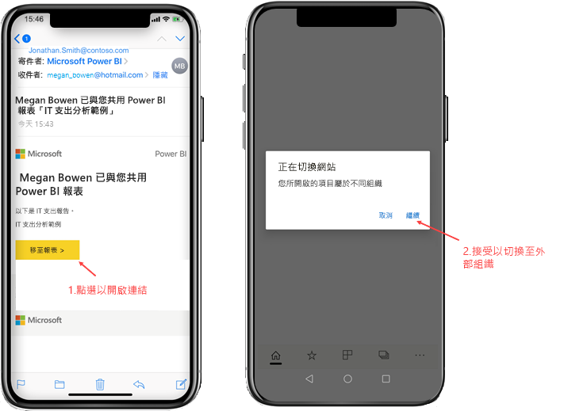
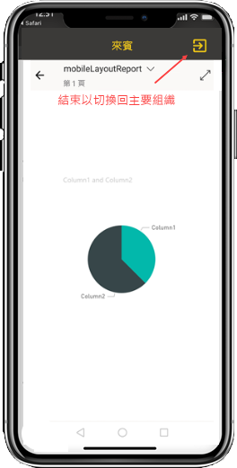
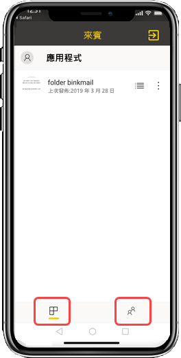

# 檢視從外部組織與您共用的 Power BI 內容

Power BI 會與 Azure Active Directory 企業對企業 (Azure AD B2B) 整合，以便能夠安全地將 Power BI 內容散發給組織外部的來賓使用者。 而外部來賓使用者可以使用 Power BI 行動裝置應用程式，來存取與他們共用的 Power BI 內容。 

適用於：

|  |  |  |  |
|:--- |:--- |:--- |:--- |
| iPhone |iPad |Android 手機 |Android 平板電腦 |

## 存取共用內容

**首先，您需要外部組織的某個人與您共用項目。** 當有人[與您共用項目](../../service-share-dashboards.md)時 (不論是從相同的組織或從外部組織)，您都會收到一封電子郵件，其中包含該共用項目的連結。 在行動裝置中進入該連結，即會開啟 Power BI 行動裝置應用程式。 如果應用程式辨識出項目是從外部組織共用，應用程式就會使用您的身分識別重新連接到該組織。 然後，應用程式會從該組織載入與您共用的所有項目。

> [!NOTE]
> 如果這是以外部來賓使用者身分與您共用的第一個項目，則您必須在瀏覽器中宣告邀請。 您無法在 Power BI 應用程式中宣告邀請。

只要您連線到外部組織，應用程式中就會出現黑色標頭。 此標頭表示您未連線到您的主要組織。 若要連線回您的主要組織，請退出來賓模式。

雖然您需要有 Power BI 成品連結來連線到外部組織，但只要應用程式切換之後，您就可以存取與您共用的所有項目 (而不只是您從電子郵件開啟的項目)。 若要在外部組織中檢視您可以存取的所有項目，請移至應用程式功能表，然後選取 [與我共用]  。 在 [應用程式]  底下，您也可以找到可使用的應用程式。

## 限制

- 使用者必須具有使用中的 Power BI 帳戶和主租用戶。
- 使用者必須先登入其 Power BI 的主租用戶，才能存取從外部租用戶與其共用的內容。
- Azure AD B2B 和 Power BI 行動版不支援條件式存取和其他 Intune 原則。 這表示應用程式只會強制執行主要組織的原則 (如果有的話)。
- 只會從主要組織網站接收推播通知 (即使使用者是以來賓身分連線到外部組織)。 開啟通知會將應用程式重新連線到使用者的主要組織網站。
- 如果使用者關閉應用程式，則在重新開啟時，應用程式會自動連線到使用者的主要組織。
- 連線到外部組織時，會停用某些動作：我的最愛項目、資料警示、註解和共用。
- 連線到外部組織時，離線資料無法使用。
- 如果您的裝置上已安裝公司入口網站應用程式，則必須註冊您的裝置。
