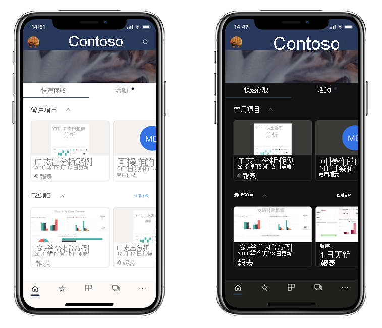
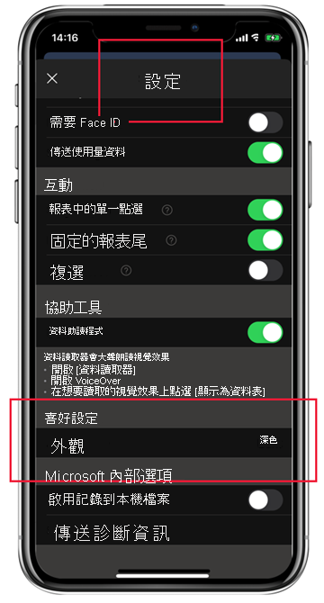

# 深色模式

為了因應個別的檢視喜好設定，適用於 iOS 的 Power BI 行動應用程式同時支援淺色和深色螢幕模式。 深色模式會降低螢幕亮度，讓您能夠更輕鬆地查看內容。

 在深色模式中，所有應用程式體驗都會以深色背景顯示。 不過，Power BI 內容並不會受到影響。 您的報表、儀表板和應用程式一律會按照設計者的意圖來顯示。
 
 根據預設，您的 Power BI 行動應用程式會使用裝置的設定來決定要顯示的螢幕外觀。 如果您的裝置已設定為深色模式，應用程式將會以深色模式顯示。
 
 若要在淺色與深色模式之間切換，或讓裝置設定決定模式，請移至 [設定] > [喜好設定]，然後點選 [外觀] 以選擇您想要的模式。

