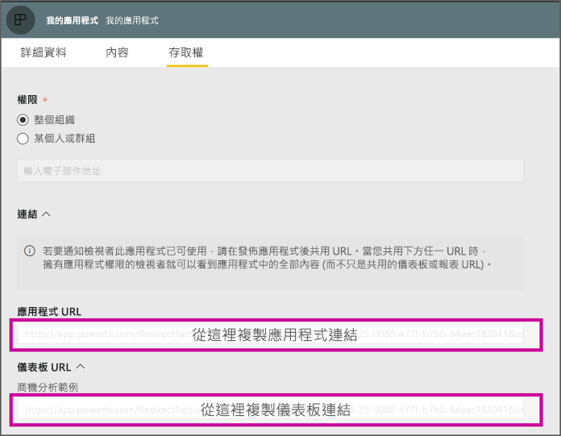

# <a name="create-a-link-to-a-specific-location-in-the-power-bi-mobile-apps"></a>建立 Power BI 行動裝置應用程式中的特定位置連結
您可以使用連結直接存取 Power BI 中的特定項目：報表、儀表板和磚。

在 Power BI 行動版中使用連結的主要案例有兩種： 

* 為了從**應用程式外部**開啟 Power BI，並登入特定內容 (報表/儀表板/應用程式)。 當您想要從其他應用程式開啟 Power BI 行動版時，這通常是整合案例。 
* 為了在 Power BI 內部**巡覽**。 當您想要在 Power BI 中建立自訂導覽時，通常會發生這種情況。


## <a name="use-links-from-outside-of-power-bi"></a>使用 Power BI 外部的連結
當您使用 Power BI 應用程式外部的連結時，您會想要確定應用程式將會開啟該連結，如果裝置上未安裝該應用程式，則向使用者提議進行安裝。 我們建立了一個特殊的連結格式，以便完全支援此功能。 此連結格式會確保裝置使用應用程式來開啟連結，如果裝置上未安裝該應用程式，則會向使用者提議前往商店以取得該應用程式。

連結的開頭應如下所示  
```html
https://app.powerbi.com/Redirect?[**QUERYPARAMS**]
```

> [!IMPORTANT]
> 如果您的內容裝載於特殊資料中心，例如政府、中國等等。連結的開頭應該是正確的 Power BI 位址，例如 `app.powerbigov.us` 或 `app.powerbi.cn`。   
>


**QUERY PARAMS** 如下：
* **action** (強制) = OpenApp / OpenDashboard / OpenTile / OpenReport
* **appId** = 如果您想要開啟屬於應用程式一部分的報表或儀表板 
* **groupObjectId** = 如果您想要開啟屬於工作區 (而非 [我的工作區]) 一部分的報表或儀表板
* **dashboardObjectId** = 儀表板物件識別碼 (如果 action 是 OpenDashboard 或 OpenTile)
* **reportObjectId** = 報表物件識別碼 (如果 action 是 OpenReport)
* **tileObjectId** = 磚物件識別碼 (如果 action 是 OpenTile)
* **reportPage** = 如果您想要開啟特定的報表區段 (如果 action 是 OpenReport)
* **ctid** = 項目組織識別碼 (與 B2B 案例相關。 如果項目屬於使用者的組織，就可以省略此參數)。

**範例：**

* 開啟應用程式連結 
  ```html
  https://app.powerbi.com/Redirect?action=OpenApp&appId=appidguid&ctid=organizationid
  ```

* 開啟屬於應用程式一部分的儀表板 
  ```html
  https://app.powerbi.com/Redirect?action=OpenDashboard&appId=**appidguid**&dashboardObjectId=**dashboardidguid**&ctid=**organizationid**
  ```

* 開啟屬於工作區一部分的報表
  ```html
  https://app.powerbi.com/Redirect?Action=OpenReport&reportObjectId=**reportidguid**&groupObjectId=**groupidguid**&reportPage=**ReportSectionName**
  ```

### <a name="how-to-get-the-right-link-format"></a>如何取得正確的連結格式

#### <a name="links-of-apps-and-items-in-app"></a>應用程式和應用程式中項目的連結

針對**應用程式及屬於應用程式一部分的報表和儀表板**，取得連結最簡單的方法是移至工作區，然後選擇 [更新應用程式]。 這會開啟 [發佈應用程式] 體驗，且在 [存取] 索引標籤中，您會找到 [連結]  區段。 展開該區段，您就會看到應用程式及其所有內容連結的清單，這些連結可用來進行直接存取。



#### <a name="links-of-items-not-in-app"></a>不在應用程式中的項目連結 

對於不屬於應用程式一部分的報表和儀表板，您需要從項目 URL 擷取識別碼。

例如，若要尋找 36 個字元的**儀表板**物件識別碼，請巡覽至 Power BI 服務中的特定儀表板 

```html
https://app.powerbi.com/groups/me/dashboards/**dashboard guid comes here**?ctid=**organization id comes here**`
```

若要尋找 36 個字元的**報表**物件識別碼，請巡覽至 Power BI 服務中的特定報表。
這是來自 [我的工作區] 的報表範例

```html
https://app.powerbi.com/groups/me/reports/**report guid comes here**/ReportSection3?ctid=**organization id comes here**`
```
上述 URL 也包含特定的報表頁面 **"ReportSection3"** 。

這是來自工作區 (而非 [我的工作區]) 的報表範例

```html
https://app.powerbi.com/groups/**groupid comes here**/reports/**reportid comes here**/ReportSection1?ctid=**organizationid comes here**
```

## <a name="use-links-inside-power-bi"></a>使用 Power BI 內部的連結

Power BI 內部連結在行動裝置應用程式中的運作方式，與 Power BI 服務中的方式完全相同。

如果您想要將連結新增至指向另一個 Power BI 項目的報表，只需從瀏覽器網址列複製該項目 URL。 閱讀更多[如何將超連結新增至報表中的文字方塊](https://docs.microsoft.com/power-bi/service-add-hyperlink-to-text-box)相關資訊。

## <a name="use-report-url-with-filter"></a>搭配篩選使用報表 URL
與 Power BI 服務相同，Power BI 行動版應用程式也支援包含篩選查詢參數的報表 URL。 您可以在 Power BI 行動版應用程式中開啟報表，並將其篩選至特定狀態。 例如，此 URL 會開啟銷售報表，並依國家/地區進行篩選

```html
https://app.powerbi.com/groups/me/reports/**report guid comes here**/ReportSection3?ctid=**organization id comes here**&filter=Store/Territory eq 'NC'
```

閱讀更多[如何建置查詢參數來篩選報表](https://docs.microsoft.com/power-bi/service-url-filters)相關資訊。

## <a name="next-steps"></a>後續步驟
您的意見反應可協助我們決定未來要實作的項目，因此別忘了對您想在 Power BI 行動應用程式中看到的其他功能進行投票。 

* [行動裝置的 Power BI 應用程式](mobile-apps-for-mobile-devices.md)
* 請在 Twitter 上關注 @MSPowerBI
* 加入 [Power BI 社群](https://community.powerbi.com/)的交談
* [Power BI 是什麼？](../../fundamentals/power-bi-overview.md)

