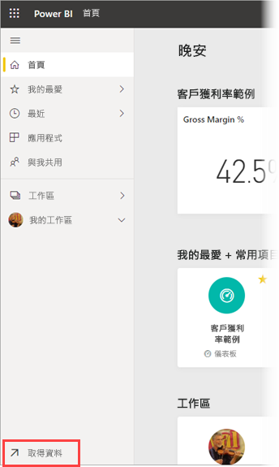
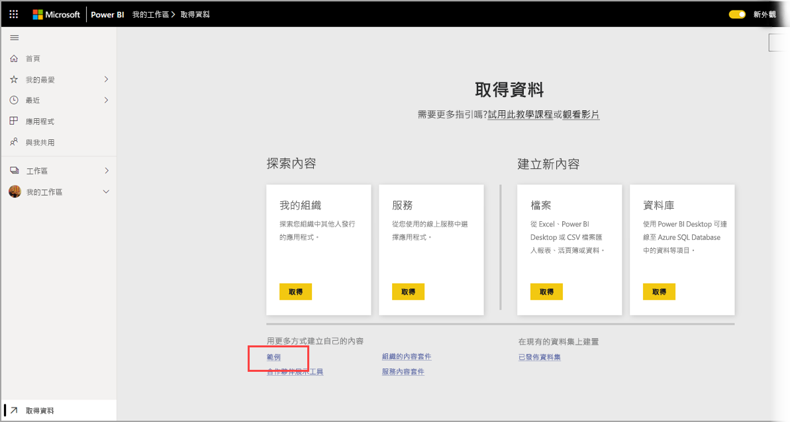

# 將範例下載至 Power BI 服務的 [我的工作區]

這裡提供的部分行動裝置應用程式文件會使用範例資料，以供說明之用。 您可以將範例資料下載到 Power BI 服務帳戶，在您的裝置上跟著做，然後從裝置的 Power BI 行動裝置應用程式中檢視作業。 本文描述如何將範例資料下載到 Power BI 服務帳戶。 

## 必要條件

您必須擁有 Power BI 服務帳戶，才能下載資料。 如果尚未註冊 Power BI，請先[註冊免費試用](https://app.powerbi.com/signupredirect?pbi_source=web)再開始。

## 下載範例

1. 在瀏覽器中開啟 [Power BI 服務](https://app.powerbi.com) 並登入。

2. 選取導覽窗格左下角的 [取得資料]  。 如果隱藏導覽窗格，且您看不到 [取得資料] 連結，請按一下顯示/隱藏導覽窗格圖示  以顯示窗格。  
   
    

3. 在 [取得資料] 頁面上，選取 [範例]  連結。
   
   

4. 選取要下載的範例。 請務必選擇所用教學課程、快速入門或文章呼叫的範例。 選取範例後，請按一下 [連線]  。
  
   ![選擇 [連線]](./media/mobile-apps-download-samples/opportunity-connect.png)
   
5. Power BI 會匯入範例，並將新的儀表板、報表及資料集新增到 [我的工作區]。
   
   
  
您現在隨時可以在自己的行動裝置上檢視範例。

## 後續步驟
* [快速入門](mobile-apps-quickstart-view-dashboard-report.md)
* 有任何問題嗎？ 請查看 [Power BI 社群的 mobile apps](https://go.microsoft.com/fwlink/?linkid=839277) 一節
