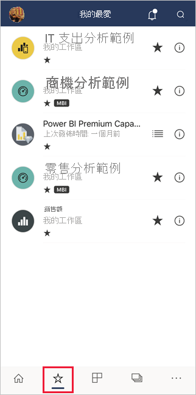
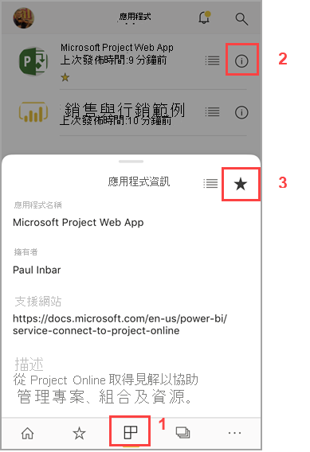
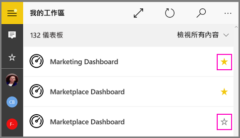

# 在 Power BI 行動應用程式中建立及檢視我的最愛項目
適用於︰

|  |  |  |  |  |
|:--- |:--- |:--- |:--- |:--- |
| iPhone |iPad |Android 手機 |Android 平板電腦 |Windows 10 裝置 |

>[!NOTE]
>**使用 Windows 10 行動裝置版手機**的 Power BI 行動裝置應用程式支援，將於 2021 年 3 月 16 日停止。 [深入了解](https://go.microsoft.com/fwlink/?linkid=2121400)

了解如何在行動應用程式中建立及檢視我的最愛 Power BI 儀表板、報表和應用程式，以及我的最愛內部部署「Power BI 報表伺服器」和 Reporting Services KPI 與報表。

當您在 Power BI 行動裝置應用程式中建立我的最愛項目時，即可在 [Power BI 服務](https://powerbi.com)及所有行動裝置的 [我的最愛] 頁面上看到該項目。

若要查看 [我的最愛] 頁面，請點選導覽列上我的最愛圖示：

您也可以[在 Power BI 服務中將 Power BI 儀表板與應用程式設為我的最愛](../end-user-favorite.md)。 這些項目隨後會出現在行動應用程式的 [我的最愛] 頁面。

您可以在 Power BI 報表伺服器或 Reporting Services 入口網站中，將 KPI 和報表標示為 [我的最愛]，然後在方便的行動裝置資料夾中，檢視它們和 Power BI 的 [我的最愛] 儀表板。

## 將應用程式設為我的最愛
1. 點選底部導覽列上的應用程式圖示，以顯示您的 [應用程式] 頁面。

2. 在 iOS 裝置上，針對您要設為我的最愛的應用程式，點選其名稱右側的資訊按鈕。 在 Android 裝置上，會顯示更多選項(...)，而不是資訊按鈕。 

3. 在開啟的 [應用程式資訊] 區段中點選星號。
   
    
   
    該應用程式現在會與您最愛的其他儀表板、報表和應用程式一起列在 [我的最愛] 頁面上。
   
## 在 iOS 與 Windows 10 行動應用程式中將儀表板或報表設為我的最愛
您可以從儀表板或報表清單，或是從儀表板或報表本身，將 Power BI 儀表板或報表設為我的最愛。

* 在行動應用程式的儀表板或報表清單中，點選名稱旁邊的空心星號 ![[不是我的最愛] 圖示](./././media/mobile-apps-favorites/power-bi-mobile-not-favorite-icon.png). 星號會變成黃色 ![[我的最愛] 圖示](./././media/mobile-apps-favorites/power-bi-mobile-yes-favorite-icon.png).
  
    
* 如果您是在儀表板中，請點選功能區中的空心星號 。 如果您是在報表中，星號則位在**更多選項** (...) 底下。星號會變成黑色 。
  
    ![已選取的 [我的最愛] 圖示](./media/mobile-apps-favorites/power-bi-mobile-favorite-selected.png)

## 在 Android 行動應用程式中將儀表板或報表設為我的最愛
您可以從儀表板或報表清單，或是從儀表板或報表本身，將儀表板或報表設為我的最愛。

* 在行動裝置應用程式的儀表板或報表清單中，點選名稱旁邊垂直的**更多選項** (...)，然後在出現的資訊索引標籤上點選我的最愛星號。
  
    ![Android 的 [我的最愛] 功能表](./media/mobile-apps-favorites/power-bi-android-make-favorite.png)

* 當您在儀表板中時，請點選功能區上的空心星號 ![[不是我的最愛] 圖示](./././media/mobile-apps-favorites/power-bi-mobile-not-favorite-icon.png). 星號會變成暗灰色 ![[我的最愛] 圖示](./media/mobile-apps-favorites/power-bi-android-favorite-icon.png).
  
    ![Android 的 [我的最愛] 星號](./media/mobile-apps-favorites/power-bi-android-favorite-in-dashboard.png)

* 如果您是在報表中，請向下滑動以顯示功能區，並點選**更多選項** (...)，然後向下捲動以尋找空心星號  並加以點選。 星號會變成暗灰色 。
  
    ![Android 的 [我的最愛] 星號](./media/mobile-apps-favorites/power-bi-android-favorite-in-report.png)

## 建立最愛的 Power BI 報表伺服器和 Reporting Services 報表與 KPI
您可以在 Power BI 行動裝置應用程式中，檢視您最愛的 Power BI 報表伺服器和 Reporting Services 報表與 KPI，但無法將它們設成行動裝置應用程式的 [我的最愛]。 [在入口網站中將其標記為 [我的最愛]](../../report-server/tutorial-explore-report-server-web-portal.md#tag-your-favorites)。 

## 後續步驟
* [Power BI 服務中我的最愛儀表板](../end-user-favorite.md) 
* 有問題嗎？ [嘗試在 Power BI 社群提問](https://community.powerbi.com/)

