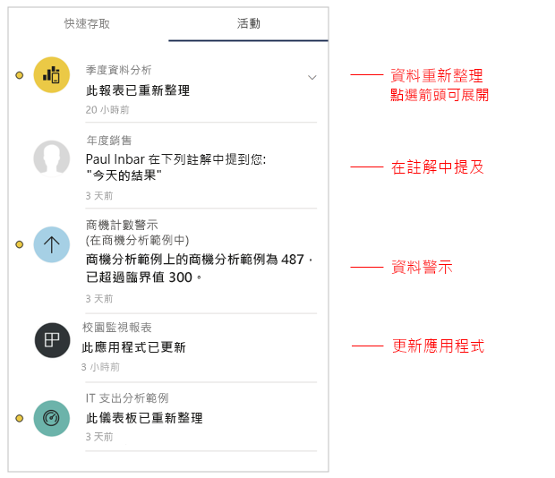
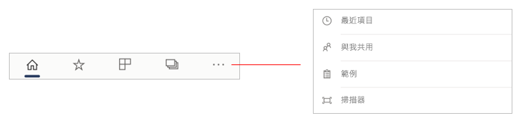
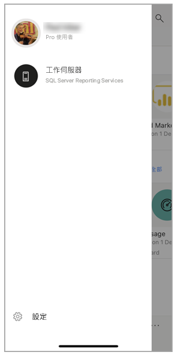
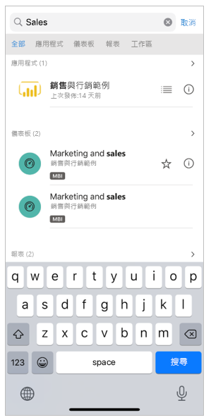

# 行動裝置應用程式 [首頁] 頁面的快速導覽
在本教學課程中，您將熟悉 Power BI 行動裝置應用程式 [首頁] 頁面，以及可讓您快速找到所需內容的導覽輔助工具。

適用於：

|  |  |  |
|:--- |:--- |:--- |
| iPhone | iPad | Android | 

當您開啟 Power BI 行動裝置應用程式時，便會進入 [首頁] 頁面，您可以在其中快速存取最常或最近瀏覽的報表、儀表板及應用程式。 此外，還有可讓您隨時掌握 Power BI 內容最新情況的活動摘要，以及方便您快速找到所需內容的導覽輔助工具。

![行動裝置應用程式 [首頁] 頁面](./media/mobile-apps-home-page/powerbi-mobile-app-home.png)
 
## [快速存取] 索引標籤

[快速存取] 索引標籤會顯示您經常和最近瀏覽的報表、儀表板及應用程式，分組為兩個可折疊的區段。 若要查看較長的最近瀏覽項目清單，請點選 [最近項目] 右側的 [查看全部]  。 

## 活動摘要

活動摘要可協助您追蹤 Power BI 內容的情況。 其中會顯示您的所有最新通知、警示、註解和 @mentions。

摘要中的更新包括：
* **重新整理的資料**：當 [我的最愛] 或 [最近項目] 其中一個報表或儀表板的基礎資料重新整理時。
* **新的註解**：當使用者在 [我的最愛] 或 [最近項目] 內的報表或儀表板中建立註解時，或有人在註解中提及您時。
* **資料警示**：當資料達到您先前在[資料警示](mobile-set-data-alerts-in-the-mobile-apps.md)中設定的閾值時。
* **應用程式更新**：當應用程式建立者將更新發佈至您所使用的應用程式時。

 請點選活動項目以跳至相關位置，以便進一步探索。

系統會彙總活動項目，因此來自相同應用程式或工作區的所有資料更新將會群組在一起。 使用  箭號來展開並查看彙總的項目。 最新的項目一律位於清單頂端。

## 導覽列

在頁面底部，您會找到導覽列。

導覽列可讓您快速存取：

*  **首頁** - 讓您返回首頁。
*  **我的最愛** - 您已標示為[我的最愛](mobile-apps-favorites.md)的報表、儀表板及應用程式。
*  **應用程式** - 您在帳戶中安裝的應用程式。
*  **工作區** - 將內容建立者所建置報表和儀表板保持在一起的工作資料夾。
*  **最近項目** - 您最近檢視過的項目。
*  **與我共用** - 其他人與您共用的項目。
*  **範例** - 您可以用來了解 Power BI 功能的 Power BI 範例。
*  **掃描器**您可以用來作為掃描器來掃描[條碼](mobile-apps-scan-barcode-iphone.md)和 [QR 代碼](mobile-apps-qr-code.md)的裝置相機。

## 標頭

在頁面頂端，標頭會顯示您所在 Power BI 頁面、報表或儀表板的名稱。

標頭提供下列導覽項目：
* **個人資料圖片或頭像** - 開啟側邊面板，您可以在其中[切換 Power BI 服務和報表伺服器帳戶](mobile-app-ssrs-kpis-mobile-on-premises-reports.md)，以及存取 Power BI 行動裝置應用程式設定。

    

* **通知** - 開啟 [[通知] 頁面](mobile-apps-notification-center.md)，您可以在其中檢視和存取通知。 通知鐘上的點表示您有新通知。

    ![[通知] 頁面](./media/mobile-apps-home-page/powerbi-mobile-app-notifications-page.png)

* **搜尋** - 搜尋訂用帳戶中的 Power BI 內容。

    

## 後續步驟
在本教學課程中，您已探索 Power BI 行動裝置應用程式首頁。 請深入了解如何使用 Power BI 行動裝置應用程式。 
* [探索儀表板和報表](mobile-apps-quickstart-view-dashboard-report.md)
* [在 Power BI 行動裝置應用程式中瀏覽報告](mobile-reports-in-the-mobile-apps.md)
