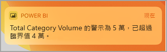
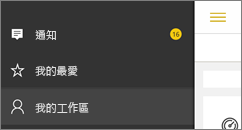
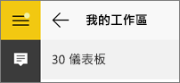
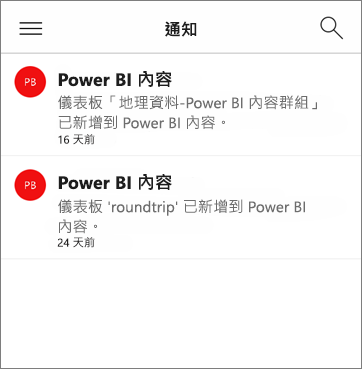

# 取得 Power BI 行動裝置應用程式中的通知
適用於︰

|  |  |  |  |  |
|:--- |:--- |:--- |:--- |:--- |
| iPhone |iPad |Android 手機 |Android 平板電腦 |Windows 10 裝置 |

系統會將 Power BI 體驗的相關資訊，以通知形式傳送到 Power BI 服務或您的行動裝置中。 開啟 [通知] 時，您會看到下列項目的相關訊息摘要循序排列：[您設定的警示](mobile-set-data-alerts-in-the-mobile-apps.md)、與您共用的新儀表板、群組工作區的變更、Power BI 事件及會議的相關資訊等等。

> [!NOTE]
> 第一次使用 iOS 裝置登入 [Power BI 應用程式更新版本](https://powerbi.microsoft.com/mobile/)時，會顯示是否要 Power BI 傳送通知的詢問訊息。 您也可以在裝置的 [設定]  中，設定 Power BI 的通知方式。 
> 
> 

## 檢視行動裝置上的通知
1. 當您在行動裝置上收到通知時，Power BI 預設會發出音效，並顯示通知橫幅。
   
   
   
   或在 iPad 上：
   
   
   
   您可以[變更 Power BI 通知您的方式](mobile-apps-notification-center.md#change-or-turn-off-notifications-on-your-mobile-device)。
2. 如果收到通知，當您使用行動裝置登入 Power BI 時，就會在全域導覽按鈕  (Android) 或**通知**圖示上看到黃點。 
   
   
3. 選取通知圖示  (Windows 10)。
   
    通知會將最新訊息列在頂端，並醒目提示未讀取的訊息。 通知會保留 90 天，除非您將其刪除，或是達到 100 則上限。
   
   
4. 若要關閉通知，請點選並按住，然後選取 [關閉]  。

## 變更或關閉行動裝置上的通知
您可以變更 Power BI 通知您的方式。

1. 在 iOS 裝置中，前往 [設定]   > [通知]  。 
   
    在 Android 手機中，前往 [通知設定]  。
   
    在 Windows 裝置的 [設定]  中，前往 [系統]   > [通知與控制項目]  。
2. 在應用程式清單中，選取 [Power BI]  。 
3. 您可以在此處完全關閉通知，或選擇想要收到的通知。
   
    **使用 iPhone**
   
    ![選擇 [通知]](./media/mobile-apps-notification-center/power-bi-notifications-iphone-settings.png)
   
    **使用 Android 手機**
   
    ![選擇 [通知]](./media/mobile-apps-notification-center/power-bi-notifications-android-settings.png)

    **使用 Windows 10 裝置**

    ![選擇 [通知]](./media/mobile-apps-notification-center/power-bi-notifications-windows10-settings.png)

## 後續步驟
* [Power BI 服務中的資料警示](../../service-set-data-alerts.md)
* [在 iPhone App (Power BI for iOS) 中設定資料警示](mobile-set-data-alerts-in-the-mobile-apps.md)
* [在 Power BI for Windows 10 行動裝置 App 中設定資料警示](mobile-set-data-alerts-in-the-mobile-apps.md)
* 針對行動裝置，[下載最新版本的 Power BI 應用程式](https://powerbi.microsoft.com/mobile/)

