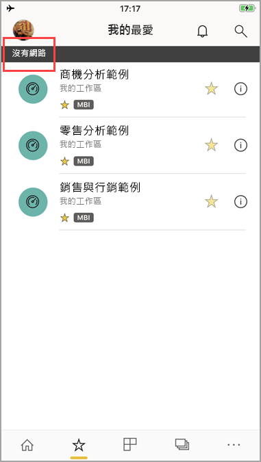

# 在 Power BI 行動裝置應用程式中離線檢視資料
適用於︰

|  |  |  |  |  |
|:--- |:--- |:--- |:--- |:--- |
| iPhone |iPad |Android 手機 |Android 平板電腦 |Windows 10 裝置 |

>[!NOTE]
>**使用 Windows 10 行動裝置版手機**的 Power BI 行動裝置應用程式支援，將於 2021 年 3 月 16 日停止。 [深入了解](/legal/powerbi/powerbi-mobile/power-bi-mobile-app-end-of-support-for-windows-phones)

在行動應用程式中 (而非行動瀏覽器中) 檢視 Power BI 的其中一個優點，就是即使未連接到網路，您仍可以查看資料。 

根據預設，Power BI 經常重新整理，讓您即使在通勤或漫遊時，也能隨時取得貴企業問題的最新解答。

## 當您離線時的資料存取
當您離線時，可存取先前已從行動裝置應用程式存取的儀表板並與其互動。

對於先前從行動裝置應用程式存取的任何 Power BI 報表，您也可以唯讀存取。 您可以查看完整的報表，但不能在其上篩選、交叉篩選、排序或使用交叉分析篩選器。

>[!NOTE]
> 以 DirectQuery 為基礎的報表不會進行快取，且無法在離線時使用。

## 背景的資料重新整理
背景重新整理會使用 Power BI 服務 (而不是資料來源) 上的資料來更新您的最愛儀表板，以及您在過去兩週檢視的儀表板和報表。 如已連線到 Wi-Fi，背景重新整理會每隔 2 小時更新一次。 否則，如果您使用 3G 網路，Power BI 會每隔 24 小時更新內容一次。

例如，您可關閉背景重新整理以避免使用網路。 請檢查您裝置上的設定。

> [!NOTE]
> 您的組織設定 Microsoft Intune MAM 之後，如果您在 iOS 裝置上使用 Power BI 行動裝置應用程式，則背景的資料重新整理會關閉。 下次進入應用程式時，Power BI 會從網路上的 Power BI 服務重新整理資料。
> 
> 深入了解[使用 Microsoft Intune 設定 Power BI 行動裝置應用程式](../../admin/service-admin-mobile-intune.md)。 
> 
> 

## 離線指標
Power BI 提供您何時移入和移出離線模式的清楚指標，以及無法離線使用之遺失儀表板、報表和磚的指標。

## 限制
當您在行動裝置上離線使用 Power BI 時，可能會遇到下列限制︰

* Power BI 可以快取最多 250 MB 的離線資料。
* 某些類型的磚需要連線到伺服器，因此無法離線使用，例如 Bing 地圖磚和一些自訂的磚。
* Power BI 中的整個 Excel 活頁簿無法離線使用。
* 如果您在連線時已檢視過 Reporting Services 行動報表和 KPI，即可離線查看。 它們不會在背景中重新整理， 而是在每次開啟時重新整理。
* 在 Power BI 行動裝置應用程式中，您看不到儲存至 Power BI 報表伺服器的 Power BI Desktop (.pbix) 檔案。 
* 網路離線時，沒有可用的編頁報表 (RDL)。

## 後續步驟
您的意見反應可協助我們決定未來要實作的項目，因此別忘了對您想在 Power BI 行動應用程式中看到的其他功能進行投票。 

* [行動裝置的 Power BI 應用程式](mobile-apps-for-mobile-devices.md)
* 請在 Twitter 上關注 @MSPowerBI
* 加入 [Power BI 社群](https://community.powerbi.com/)的交談
* [Power BI 是什麼？](../../fundamentals/power-bi-overview.md)