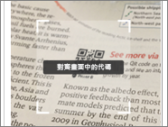
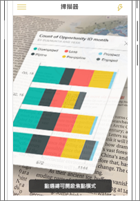
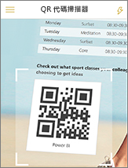
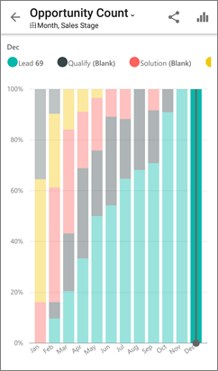

# 從行動裝置掃描 Power BI QR 代碼
適用於︰

|  |  |  |
|:--- |:--- |:--- |:--- |
| iPhone |Android 手機 |Android 平板電腦 |

Power BI 中的 QR 代碼可以將真實世界中的任何項目直接連接到相關的 BI 資訊，而不需要進行瀏覽或搜尋。

假設有位同事針對儀表板中的某份報表或某個磚，[在 Power BI 服務中建立 QR 代碼](../../service-create-qr-code-for-tile.md)，並與您共用儀表板或報表，然後將 QR 代碼放在索引鍵位置 (例如電子郵件或特定項目上)。 

您可以使用 Power BI 應用程式的掃描器，或安裝在手機上的任何其他掃描器，直接從手機掃描 QR 代碼，以立即存取相關的磚或報表。 

如果您的同事尚未與您共用儀表板或報表，您可以直接從行動裝置應用程式要求存取。 

> [!NOTE]
> 您也可以[使用 Power BI for Mixed Reality 應用程式掃描報表 QR 代碼](mobile-mixed-reality-app.md#scan-a-report-qr-code-in-holographic-view)。

## 使用 Power BI 掃描器掃描 iPhone 上的 Power BI QR 代碼
1. 在 Power BI 行動裝置應用程式中，開啟左上方的全域瀏覽功能表 。 
2. 向下捲動並選取 [掃描器]。 
   
    
3. 如果未啟用您的相機，您需要核准 Power BI 應用程式使用相機。 您只需要核准一次。 
4. 將掃描器對準 Power BI QR 代碼。 
   
    
5. 磚或報表會以擴增實境方式暫留在背景上。
   
    
6. 點選報表或磚，以焦點模式開啟它，或返回掃描器。

### 從 iPhone 上的外部掃描器掃描 QR 代碼
1. 從安裝在手機上的任何掃描器，將掃描器對準相關的 Power BI QR 代碼，以立即存取磚或報表。 
2. 如果未安裝 Power BI 應用程式，則會將您重新導向至 iPhone 的 [Apple App Store 進行下載](http://go.microsoft.com/fwlink/?LinkId=522062)。

## 使用 Power BI 掃描器掃描 Android 裝置上的 Power BI QR 代碼
1. 在 Power BI 行動裝置應用程式中，開啟左上方的全域主瀏覽按鈕 。 
2. 向下捲動至 [QR 掃描器] 並加以選取。
   
    
3. 如未啟用相機，您需要核准 Power BI 應用程式使用相機。 您只需要核准一次。 
4. 將掃描器對準 Power BI QR 代碼。 
   
    
5. 此磚或報表會在 Power BI 中自動開啟。
   
    

### 從 Android 裝置上的外部掃描器掃描 QR 代碼
1. 從安裝在 Android 裝置上的任何掃描器，將掃描器對準相關的 Power BI QR 代碼，以立即存取磚或報表。 
2. 如果未安裝 Power BI 應用程式，則會將您重新導向至 [Google Play 進行下載](http://go.microsoft.com/fwlink/?LinkID=544867)。 

## 後續步驟
* 透過行動裝置應用程式[實際連接 Power BI 資料](mobile-apps-data-in-real-world-context.md)
* [為 Power BI 服務的磚建立 QR 代碼](../../service-create-qr-code-for-tile.md)
* [為 Power BI 服務的報表建立 QR 代碼](../../service-create-qr-code-for-report.md)
* 您也可以[使用 Power BI for Mixed Reality 應用程式掃描 QR 代碼](mobile-mixed-reality-app.md)
* 有問題嗎？ [嘗試在 Power BI 社群提問](http://community.powerbi.com/)

