# 快速入門：在 Power BI 行動裝置應用程式中探索儀表板和報表
在此快速入門中，您將探索 Android 手機上 Power BI 行動裝置應用程式中的範例儀表板和報表。 您也可以在其他行動裝置應用程式中按照步驟操作。 

適用於︰

|  |  |  |  |
|:--- |:--- |:--- |:--- |
| iPhone | iPad | Android | Windows 10 |

儀表板是貴公司生命週期和流程的入口網站。 儀表板則是概觀，是用來監控企業目前狀態的單一位置。 報表是資料的互動式檢視，以視覺效果顯示資料的各種發現與見解及需要深入了解的事項。 

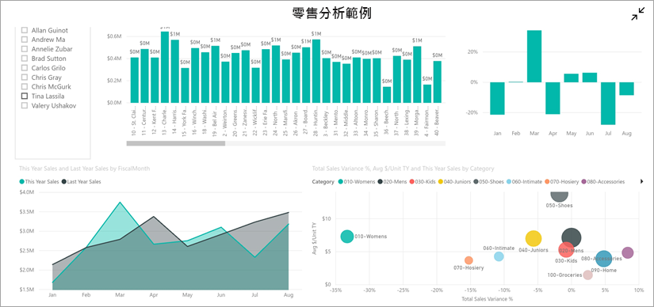

## 先決條件

### 註冊 Power BI
如果您尚未註冊 Power BI，請先進行[免費註冊](https://app.powerbi.com/signupredirect?pbi_source=web)再開始。

### 安裝 Power BI for Android 應用程式
從 Google Play [下載 Power BI for Android 應用程式](http://go.microsoft.com/fwlink/?LinkID=544867)。

Power BI 適用於執行 Android 5.0 作業系統或更新版本的 Android 裝置。 若要檢查您的裝置，請前往 [設定]   > [關於裝置]   > [Android 版本]  。

### 下載「零售分析」範例
快速入門的第一個步驟是下載 Power BI 服務中的零售分析範例。

1. 在瀏覽器 (app.powerbi.com) 中開啟 Power BI 服務，然後登入。

1. 選取全域導覽圖示以開啟左瀏覽窗格。

    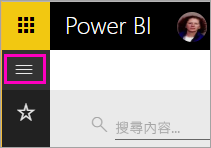

2. 在左瀏覽窗格中，選取 [工作區]   > [我的工作區]  。

    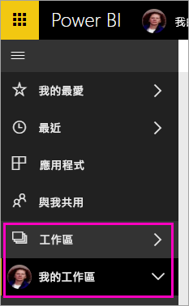

3. 在左下角選取 [取得資料]  。
   
    

3. 在 [取得資料] 頁面上，選取**範例**圖示。
   
   

4. 選取 [零售分析範例]  。
 
    
 
8. 選取 [連接]  。  
  
   ![[零售分析範例] > [連線]。](./media/mobile-apps-quickstart-view-dashboard-report/retail16.png)
   
5. Power BI 會匯入範例，並將新的儀表板、報表及資料集新增到 [我的工作區]。
   
   ![[零售分析範例] 儀表板](./media/mobile-apps-quickstart-view-dashboard-report/power-bi-service-opportunity-sample.png)

好的，您已準備好在 Android 裝置上檢視範例。

## 在您的 Android 裝置上檢視儀表板
1. 在您的 Android 裝置上，開啟 Power BI 應用程式並使用 Power BI 帳戶認證登入，這與您在瀏覽器中的 Power BI 服務中使用的認證相同。

1.  點選左上角的 .

2.  點選 [工作區]   > [我的工作區] 

    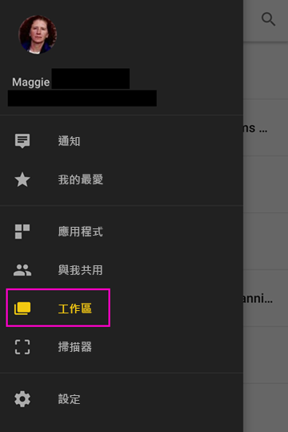

3. 點選 [零售分析範例] 儀表板以開啟它。
 
    ![[我的工作區] 中的儀表板](./media/mobile-apps-quickstart-view-dashboard-report/power-bi-android-quickstart-open-retail.png)
   
    儀表板名稱下的標記 (在此例中為字母 "C") 顯示每個儀表板中資料的分類方式。 深入了解 [Power BI 的資料分類](../../service-data-classification.md)。

    Power BI 儀表板在您的 Android 手機上看起來稍有不同。 所有圖格會以相同的寬度出現，且其排列方式為從上到下逐一排列。

4. 點選標題列中的星號圖示 ![[我的最愛] 星號圖示](./media/mobile-apps-quickstart-view-dashboard-report/power-bi-android-quickstart-favorite-icon.png) 使該儀表板成為我的最愛儀表板。

    當您在行動裝置應用程式中設定我的最愛項目時，它在 Power BI 服務中也會是我的最愛項目，反之亦然。

4. 向下捲動並點選「本年度銷售額，去年的銷售額」區域分布折線圖。

    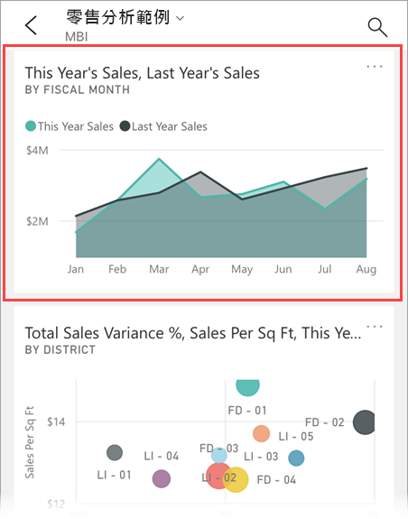

    它會在焦點模式中開啟。

7. 在焦點模式中，點選圖表中的 [4 月]。 您會看到 4 月的值顯示在圖表的頂端。

    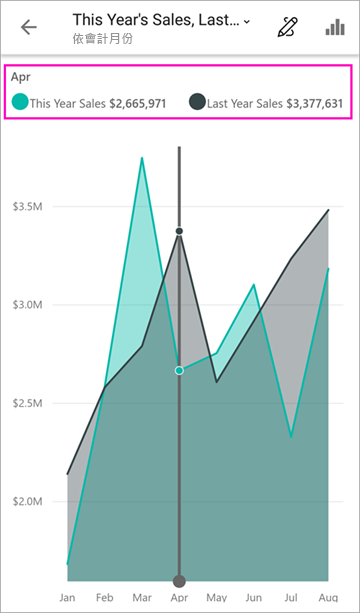

8. 點選右上角的  報表圖示。 以橫向模式開啟與此圖格相關的報表。

    

9. 點選泡泡圖中的黃色「040 - 童裝」泡泡。 請查看它如何醒目提示其他視覺效果中的相關值？ 

    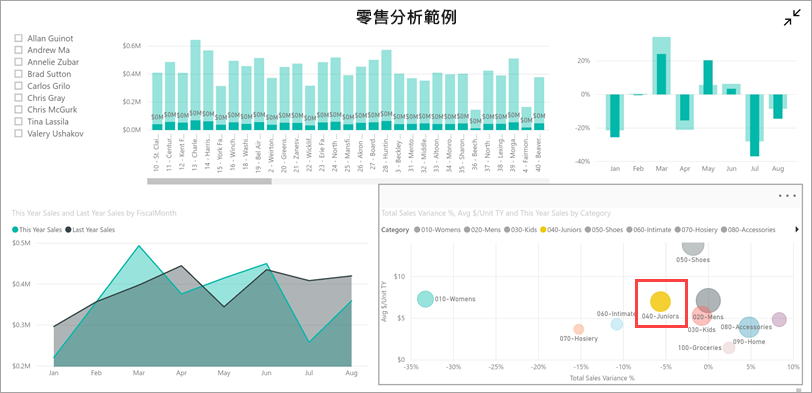

10. 向上滑動以查看底部的工具列，並點選鉛筆圖示。

    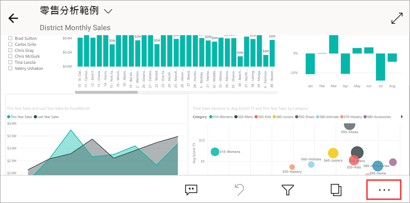

11. 點選 [標註] 工具列中的笑臉圖示，並將一些笑臉加入至您的報表頁面。
 
    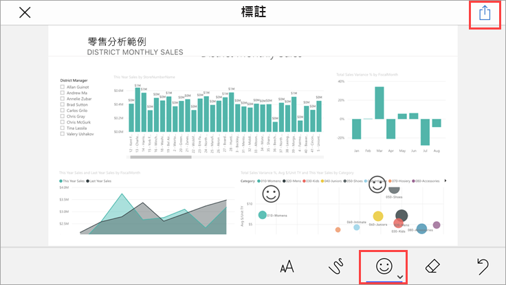

12. 點選右上角的 [共用]  。

1. 請填寫他們的電子郵件地址，並視您的需要加入訊息。  

    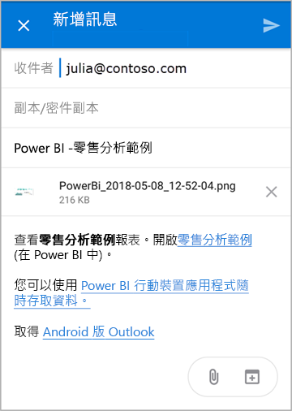

    您可以與組織內外的任何人共用此快照。 如果他們在組織中且擁有自己的 Power BI 帳戶，則也能夠開啟零售分析範例報表。

## 清除資源

完成此快速入門後，您可以根據需求，刪除零售分析範例儀表板、報表和資料集。

1. 開啟 Power BI 服務 (app.powerbi.com) 並登入。

2. 在左瀏覽窗格中，選取 [工作區]   > [我的工作區]  。

    是否注意到表示它是我的最愛項目的黃色星號？

3. 在 [儀表板]  索引標籤上，選取 [零售分析] 儀表板旁邊的垃圾桶**刪除**圖示。

    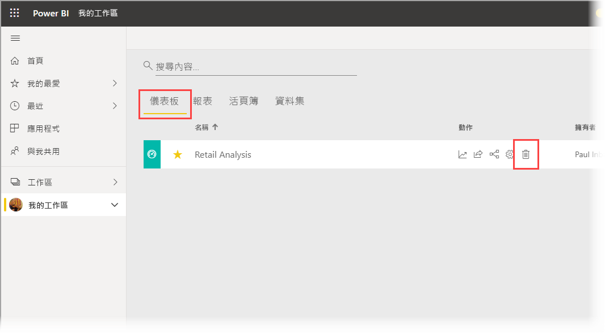

4. 選取 [報表]  索引標籤，然後針對零售分析報表執行相同的動作。

5. 選擇 [資料集]  索引標籤，然後對零售分析資料集執行相同的動作。

## 後續步驟

在此快速入門中，您將探索 Android 裝置上的範例儀表板和報表。 深入了解如何使用 Power BI 服務。 

> [!div class="nextstepaction"]
> [快速入門：瀏覽 Power BI 服務](../end-user-experience.md)

