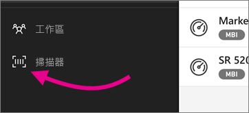

# 使用 iPhone 從 Power BI 行動應用程式掃描條碼
掃描實際的條碼可直接前往 Power BI 行動裝置應用程式中篩選過的 BI 資訊。

假設有同事[在 Power BI Desktop 報表中標記了條碼欄位](../../desktop-mobile-barcodes.md)，然後與您共用報表。 

當您使用 iPhone 的 Power BI 應用程式的掃描器掃描產品條碼時，您就會看到有該條碼的報表 (或報表清單)。 您可以在 iPhone 上開啟該報表，篩選出該條碼。

## 使用 Power BI 掃描器掃描條碼
1. 在 Power BI 行動應用程式中，開啟左上方的主瀏覽功能表 。 
2. 向下捲動並選取 [掃描器]。 
   
    
3. 如果未啟用您的相機，您需要核准 Power BI 應用程式使用相機。 您只需要核准一次。 
4. 將掃描器對準產品的條碼。 
   
    您會看到與條碼相關聯的報表清單。
5. 點選報表名稱在 iPhone 上開啟報表，自動篩選出該條碼。

## 在報表中按其他條碼篩選
在 iPhone 上查看按條碼篩選的報表時，您可能想要用不同的條碼篩選相同的報表。

* 如果條碼圖示有篩選器 ，則篩選器為使用中，且報表已按條碼篩選。 
* 如果圖示不含篩選器 ，則篩選器未使用，且報表未按條碼篩選。 

無論何種狀況，都請點選圖示以開啟有浮動掃描器的小功能表。

* 將掃描器對焦到新項目，將報表的篩選條件變更為不同的條碼值。 
* 選取 \[Clear barcode filter] \(清除條碼篩選) 回到未經篩選的報表。
* 選取 \[Filter by recent barcodes] \(按最近的條碼篩選)，將報表篩選條件變更為目前工作階段內，您掃描過的其中一個條碼。

## 條碼掃描問題
以下是掃描產品條碼時，可能會看到的一些訊息。

### 「無法篩選報表......」
您選擇要篩選的報表，其資料模型基礎不包含此條碼值。 例如，報表不包含產品「礦泉水」。  

### 報表的全部/某些視覺效果不包含任何值
您掃描的條碼值位在模型中，但報表的全部/某些視覺效果不包含此值，因此篩選會傳回空白狀態。 請嘗試查詢其他報表頁面，或在 Power BI Desktop 中編輯報表使其包含此值。 

### 「您似乎沒有任何可供條碼篩選的報表。」
這表示您沒有任何使用條碼的報表。 條碼掃描器只能篩選具有 [條碼] 資料行的報表。  

請確定您或報表擁有者已在 Power BI Desktop 中將資料行標記為 [條碼]。 深入了解[在 Power BI Desktop 中標記條碼欄位](../../desktop-mobile-barcodes.md)

### 「無法篩選報表，此條碼似乎不存在於報表資料中。」
您選擇要篩選的報表，其資料模型基礎不包含此條碼值。 例如，報表不包含產品「礦泉水」。 您可以掃描不同的產品、選擇不同的報表 (如有多份報表可供選擇)，或檢視未經篩選的報表。 

## 後續步驟
* [在 Power BI Desktop 中標記條碼欄位](../../desktop-mobile-barcodes.md)
* [Power BI 的儀表板磚](../../service-dashboard-tiles.md)
* [Power BI 中的儀表板](../../service-dashboards.md)

