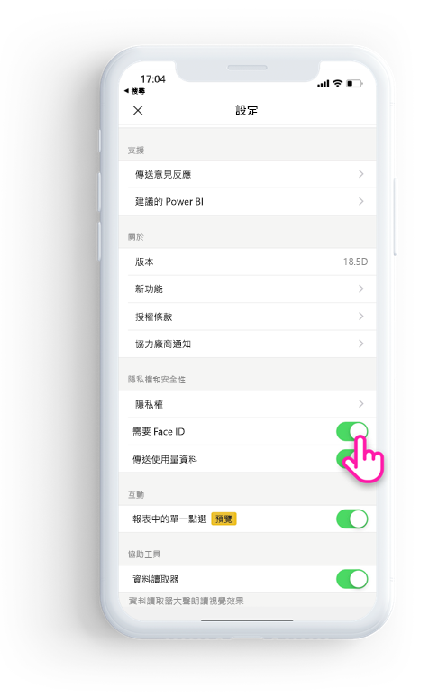
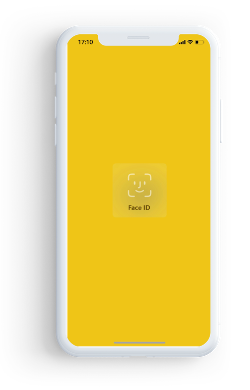

# 使用 Face ID、Touch ID 或密碼保護 Power BI 應用程式 

在許多情況下，Power BI 中受控資料是機密的，必須受到保護，且只能由授權使用者存取。 

Power BI iOS 應用程式可讓您設定額外的識別來保護資料。 當您每次啟動應用程式，或將應用程式從背景帶到前景時，您都必須提供 Face ID、Touch ID 或密碼。

|  |  |
|:--- |:--- |
| iPhone |iPad |

## 在應用程式設定中開啟 Face ID、Touch ID 或密碼

若要在 Power BI 中使用額外的識別，請移至 [隱私權和安全性]  下的應用程式設定。 根據您的裝置功能，您會看到用於開啟 Face ID、Touch ID 或密碼的選項。

一旦開啟這項設定，就會在每次啟動或從背景顯示 Power BI 時，要求您必須提供識別碼，才能存取應用程式。 

根據裝置功能，iOS 會決定要求 Face ID、Touch ID 或密碼。 如果您的裝置支援 Face ID，您必須使用 Face ID。 如果支援 Touch ID，您必須使用 Touch ID。 如果兩者都不支援，您必須提供密碼。

## 使用 MDM 強制執行 Face ID、Touch ID 或密碼

某些組織具有安全性原則與合規性需求，這會強制執行額外的識別，之後才能存取商務敏感性資料。 

Power BI iOS 行動裝置應用程式可讓管理員控制該項設定，方法是從 Microsoft Intune 及其他行動裝置管理 (MDM) 解決方案推送應用程式組態設定。 管理員可以使用應用程式防護原則，為所有使用者或一組使用者開啟這項設定。

|索引鍵  |類型  |描述  |
|---------|---------|---------|
| com.microsoft.powerbi.mobile.ForceDeviceAuthentication | 布林值 | 預設值為 False。  設為 True 時，應用程式會強制使用者使用 Face ID、Touch ID 或密碼識別其身分，之後才能檢視應用程式中的任何 Power BI 資料。 未在裝置上設定 Face ID、Touch ID 或密碼的使用者必須加以設定，才能存取 Power BI。  |

## 後續步驟

[使用 MDM 從遠端設定 Power BI iOS 應用程式](mobile-app-configuration.md)
