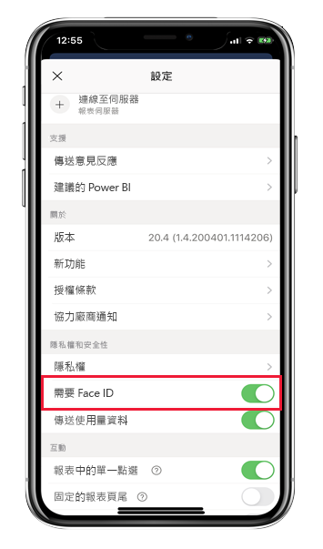
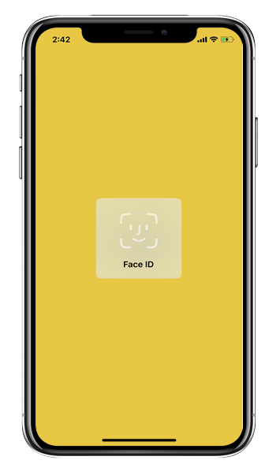
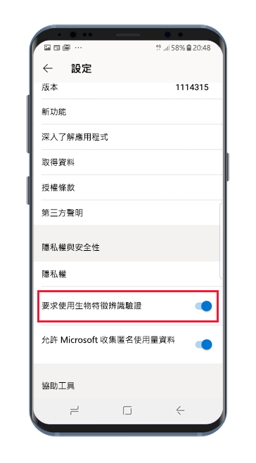
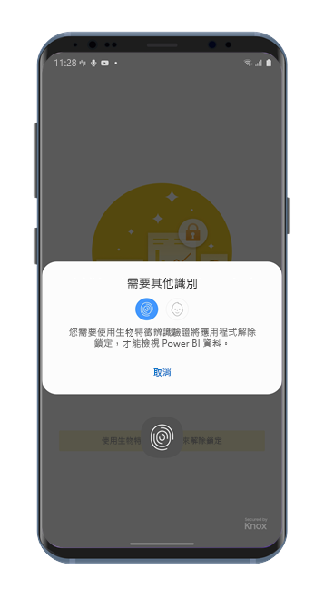

# 使用 Face ID、Touch ID、密碼或生物特徵辨識資料來保護 Power BI 應用程式 

在許多情況下，Power BI 中受控資料是機密的，必須受到保護，且只能由授權使用者存取。 

適用於 iOS 和 Android 的 Power BI 應用程式可供設定額外識別來保護資料。 然後，在應用程式每次啟動或進入前景時，都會需要識別。 在 iOS 上，代表提供 Face ID、Touch ID 或密碼。 在 Android 上，代表提供生物特徵辨識資料 (指紋識別碼)。

適用於：

|  |  |  |  |
|:--- |:--- |:--- |:--- |
|iPhone |iPad |Android 手機 |Android 平板電腦 |

## 在 iOS 上開啟 Face ID、Touch ID 或密碼

若要在適用於 iOS 的 Power BI 行動裝置應用程式中使用額外識別，請移至 [隱私權和安全性]  下的應用程式設定。 您會看到開啟 Face ID、Touch ID 或密碼的選項。 您會看到的選項取決於裝置功能。

開啟這項設定後，在每次啟動應用程式並在前景顯示時，都會要求提供識別碼才能存取應用程式。

系統會要求提供的識別碼類型取決於裝置功能。 如果您的裝置支援 Face ID，您必須使用 Face ID。 如果支援 Touch ID，您必須使用 Touch ID。 如果兩者都不支援，您必須提供密碼。 下圖顯示 Face ID 驗證畫面。

## 在 Android 上開啟生物特徵辨識資料 (指紋識別碼)

若要在適用於 Android 的 Power BI 行動裝置應用程式中使用額外識別，請移至 [隱私權和安全性]  下的應用程式設定。 您會看到開啟生物特徵辨識資料的選項。

開啟這項設定後，在每次啟動應用程式並在前景顯示時，都會要求提供生物特徵辨識資料 (指紋識別碼)，才能存取應用程式。

下圖顯示指紋驗證畫面。

>[!NOTE]
>若要能夠使用行動裝置應用程式的 [Require Biometric Authentification] \(需要生物特徵辨識驗證\) 設定，則必須先在 Android 裝置上設定生物特徵辨識。 如果裝置不支援生物特徵辨識，則將無法使用此行動裝置應用程式設定來安全存取 Power BI 資料。
>
>如果系統管理員已為行動裝置應用程式[遠端開啟安全存取](#mdm-enforcement-of-secure-access-to-your-power-bi-mobile-app)，則必須在裝置上設定生物特徵辨識，才能存取應用程式 (如果尚未這麼做)。 如果裝置不支援生物特徵辨識，則不會受到遠端設定的影響。 存取行動裝置應用程式將會持續不安全。

## MDM 可強制執行對 Power BI 行動裝置應用程式的安全存取。

某些組織具有安全性原則與合規性需求，這會強制執行額外的識別，之後才能存取商務敏感性資料。

為了支援此操作，Power BI 行動裝置應用程式可供系統管理員控制行動裝置應用程式安全存取設定，方法是從 Microsoft Intune 及其他行動裝置管理 (MDM) 解決方案推送應用程式組態設定。 管理員可以使用應用程式防護原則，為所有使用者或一組使用者開啟這項設定。 如需詳細資料，請參閱[使用 MDM 從遠端設定 Power BI 行動裝置應用程式](mobile-app-configuration.md#data-protection-settings-ios-and-android)。

## 後續步驟
* [使用 MDM 從遠端設定 Power BI 行動裝置應用程式](mobile-app-configuration.md)
