# <a name="using-oauth-to-connect-to-power-bi-report-server-and-ssrs"></a>使用 OAuth 連線至 Power BI 報表伺服器和 SSRS

了解如何設定您的環境以使用 Power BI 行動裝置應用程式支援 OAuth 驗證，才能連線至 Power BI 報表伺服器和 SQL Server Reporting Services 2016 或更新版本。

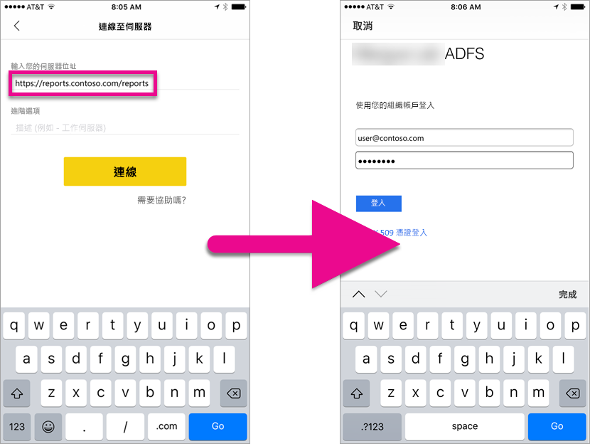

您可以使用 OAuth 連線至 Power BI 報表伺服器和 Reporting Services，以顯示行動報表或 KPI。 Windows Server 2016 提供「Web 應用程式 Proxy (WAP)」角色的一些改善，以允許這種類型的驗證。

   > [!NOTE]
   > 目前尚不支援在檢視裝載於 Power BI 報表伺服器的 Power BI 報表時，使用 WAP 進行驗證。

## <a name="requirements"></a>需求

Web 應用程式 Proxy (WAP) 和 Active Directory Federation Services (ADFS) 伺服器需要 Windows Server 2016。 您不需要有 Windows 2016 功能等級網域。

## <a name="domain-name-services-dns-configuration"></a>網域名稱系統 (DNS) 設定

您需要決定公用 URL 將是 Power BI 行動裝置應用程式將連接的 URL。 例如，它看起來可能如下所示。

```https
https://reports.contoso.com
```

您需要將**報表**的 DNS 記錄指向 Web 應用程式 Proxy (WAP) 伺服器的公用 IP 位址。 您也需要設定 ADFS 伺服器的公用 DNS 記錄。 例如，您可能已使用下列 URL 來設定 ADFS 伺服器。

```https
https://fs.contoso.com
```

您需要將 **fs** 的 DNS 記錄指向 Web 應用程式 Proxy (WAP) 伺服器的公用 IP 位址，因為它將會發行為 WAP 應用程式的一部分。

## <a name="certificates"></a>憑證

您需要設定 WAP 應用程式和 ADFS 伺服器的憑證。 這兩個憑證都必須是行動裝置所辨識之有效憑證授權單位的一部分。

## <a name="reporting-services-configuration"></a>Reporting Services 設定

在 Reporting Services 端上不需要進行太多設定。 我們只需要確定具有有效的服務主體名稱 (SPN) 可啟用適當的 Kerberos 驗證，以及確定啟用 Reporting Services 伺服器進行交涉驗證。

### <a name="service-principal-name-spn"></a>服務主體名稱 (SPN)

SPN 是使用 Kerberos 驗證之服務的唯一識別碼。 您需要確定具有報表伺服器的適當 HTTP SPN。

如需如何設定報表伺服器之適當服務主體名稱 (SPN) 的資訊，請參閱[為報表伺服器註冊服務主體名稱 (SPN)](https://msdn.microsoft.com/library/cc281382.aspx)。

### <a name="enabling-negotiate-authentication"></a>啟用交涉驗證

若要讓報表伺服器使用 Kerberos 驗證，您需要將報表伺服器的驗證類型設定為 RSWindowsNegotiate。 這是在 rsreportserver.config 檔案內完成。

```xml
<AuthenticationTypes>  
    <RSWindowsNegotiate />  
    <RSWindowsKerberos />  
    <RSWindowsNTLM />  
</AuthenticationTypes>
```

如需詳細資訊，請參閱[修改 Reporting Services 設定檔](https://msdn.microsoft.com/library/bb630448.aspx)和[設定報表伺服器上的 Windows 驗證](https://msdn.microsoft.com/library/cc281253.aspx)。

## <a name="active-directory-federation-services-adfs-configuration"></a>Active Directory Federation Services (ADFS) 設定

您需要在環境的 Windows 2016 伺服器上設定 ADFS。 透過伺服器管理員並選取 [管理] 下的 [新增角色及功能] 即可完成。 如需詳細資訊，請參閱 [Active Directory Federation Services](https://technet.microsoft.com/windows-server-docs/identity/active-directory-federation-services)。

### <a name="create-an-application-group"></a>建立應用程式群組

在 [AD FS 管理] 畫面內，您要建立 Reporting Services 的應用程式群組，其包含 Power BI 行動裝置應用程式的資訊。

您可以使用下列步驟來建立應用程式群組。

1. 在 [AD FS 管理] 應用程式內，以滑鼠右鍵按一下 [應用程式群組]，然後選取 [新增應用程式群組…]。

   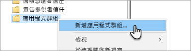

2. 在 [新增應用程式群組精靈] 內，提供應用程式群組的**名稱**，然後選取 [存取 Web API 的原生應用程式]。

   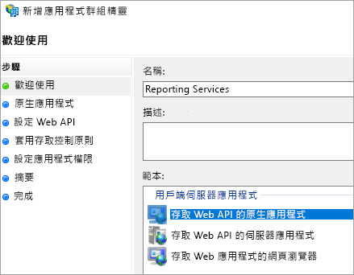

3. 選取 [下一步] 。

4. 提供所新增應用程式的**名稱**。 

5. 自動產生**用戶端識別碼**時，請針對 iOS 和 Android 輸入 484d54fc-b481-4eee-9505-0258a1913020。

6. 您會想要新增下列**重新導向 URL**：

   **Power BI Mobile 的項目 - iOS：**  
   msauth://code/mspbi-adal://com.microsoft.powerbimobile  
   msauth://code/mspbi-adalms://com.microsoft.powerbimobilems  
   mspbi-adal://com.microsoft.powerbimobile  
   mspbi-adalms://com.microsoft.powerbimobilems

   **Android 應用程式只需要下列項目：**  
   urn:ietf:wg:oauth:2.0:oob

   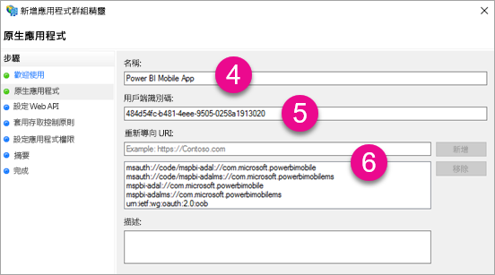
7. 選取 [下一步] 。

8. 提供報表伺服器的 URL。 這是將叫用您 Web 應用程式 Proxy 的外部 URL。 它的格式應該如下。

   > [!NOTE]
   > 此 URL 區分大小寫！

   *https://<url to report server>/reports*

   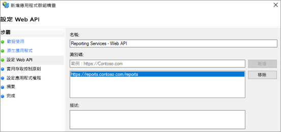
9. 選取 [下一步] 。

10. 選擇符合組織需求的 [存取控制原則]。

    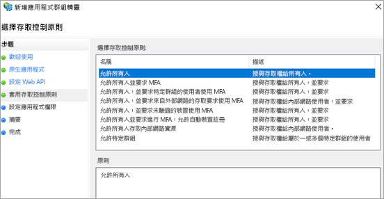

11. 選取 [下一步] 。

12. 選取 [下一步] 。

13. 選取 [下一步] 。

14. 選取 [關閉]。

完成時，您應該會看到應用程式群組的內容，如下所示。

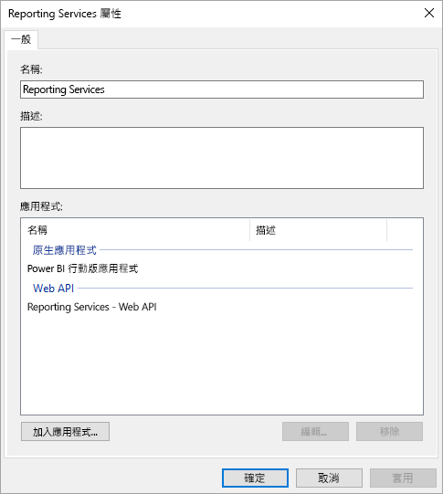

## <a name="web-application-proxy-wap-configuration"></a>Web 應用程式 Proxy (WAP) 設定

您將想要在環境的伺服器上啟用 Windows 角色「Web 應用程式 Proxy」(角色)。 這必須位於 Windows 2016 伺服器上。 如需詳細資訊，請參閱 [Web Application Proxy in Windows Server 2016](https://technet.microsoft.com/windows-server-docs/identity/web-application-proxy/web-application-proxy-windows-server) (Windows Server 2016 中的 Web 應用程式 Proxy) 和 [Publishing Applications using AD FS Preauthentication](https://technet.microsoft.com/windows-server-docs/identity/web-application-proxy/publishing-applications-using-ad-fs-preauthentication#a-namebkmk14apublish-an-application-that-uses-oauth2-such-as-a-windows-store-app) (使用 AD FS 預先驗證發行應用程式)。

### <a name="constrained-delegation-configuration"></a>限制委派設定

若要從 OAuth 驗證轉換為 Windows 驗證，我們需要搭配使用限制委派與通訊協定轉換。 這是 Kerberos 設定的一部分。 我們已經在 Reporting Services 設定內定義 Reporting Services SPN。

我們需要在 Active Directory 內設定 WAP 伺服器電腦帳戶的限制委派。 如果您沒有 Active Directory 的權限，則可能需要使用網域系統管理員。

若要設定限制委派，您將想要執行下列作業。

1. 在已安裝 Active Directory 工具的電腦上，啟動 [Active Directory 使用者和電腦]。

2. 尋找 WAP 伺服器的電腦帳戶。 這預設會是在電腦容器中。

3. 以滑鼠右鍵按一下 WAP 伺服器，並移至 [內容]。

4. 選取 [委派] 索引標籤。

5. 選取 [信任這台電腦，但只委派指定的服務]，然後選取 [使用任何驗證通訊協定]。

   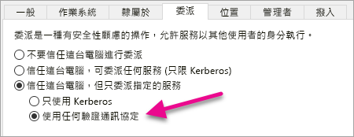

   這會設定此 WAP 伺服器電腦帳戶的限制委派。 接著，我們需要指定允許委派此電腦的服務。

6. 選取 [新增...]\ (位於 [服務] 方塊下)。

   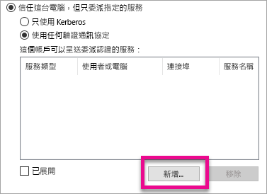

7. 選取 [使用者或電腦...]。

8. 輸入您要用於 Reporting Services 的服務帳戶。 這是您在 Reporting Services 設定內新增 SPN 的帳戶。

9. 選取 Reporting Services 的 SPN，然後選取 [確定]。

   > [!NOTE]
   > 您只能看到 NetBIOS SPN。 它實際會選取 NetBIOS 和 FQDN SPN (如果兩者都存在)。

   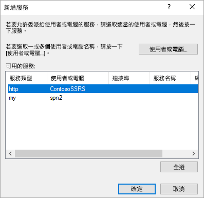

10. 核取 [展開] 核取方塊時，結果應該與下列類似。

    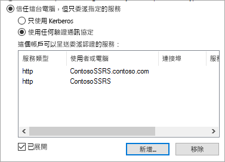

11. 選取 [確定] 。

### <a name="add-wap-application"></a>新增 WAP 應用程式

在 Report Access 管理主控台內發行應用程式時，我們想要透過 PowerShell 建立應用程式。 以下是新增應用程式的命令。

```powershell
Add-WebApplicationProxyApplication -Name "Contoso Reports" -ExternalPreauthentication ADFS -ExternalUrl https://reports.contoso.com/reports/ -ExternalCertificateThumbprint "0ff79c75a725e6f67e3e2db55bdb103efc9acb12" -BackendServerUrl http://ContosoSSRS/reports/ -ADFSRelyingPartyName "Reporting Services - Web API" -BackendServerAuthenticationSPN "http/ContosoSSRS.contoso.com" -UseOAuthAuthentication
```

| 參數 | 註解 |
| --- | --- |
| **ADFSRelyingPartyName** |這是建立為 ADFS 內應用程式群組一部分的 Web API 名稱。 |
| **ExternalCertificateThumbprint** |這是要用於外部使用者的憑證。 此憑證在行動裝置上必須是有效的，並且來自受信任的憑證授權單位。 |
| **BackendServerUrl** |這是從 WAP 伺服器到報表伺服器的 URL。 如果 WAP 伺服器位於 DMZ 中，您可能需要使用完整網域名稱。 請確定您可以在 WAP 伺服器上從網頁瀏覽器叫用這個 URL。 |
| **BackendServerAuthenticationSPN** |這是建立為 Reporting Services 設定一部分的 SPN。 |

### <a name="setting-integrated-authentication-for-the-wap-application"></a>設定 WAP 應用程式的整合式驗證

新增 WAP 應用程式之後，需要設定 BackendServerAuthenticationMode 使用 IntegratedWindowsAuthentication。 若要進行這項設定，您需要來自 WAP 應用程式的識別碼。

```powershell
Get-WebApplicationProxyApplication “Contoso Reports” | fl
```


執行下列命令，使用 WAP 應用程式的識別碼來設定 BackendServerAuthenticationMode。

```powershell
Set-WebApplicationProxyApplication -id 30198C7F-DDE4-0D82-E654-D369A47B1EE5 -BackendServerAuthenticationMode IntegratedWindowsAuthentication
```


## <a name="connecting-with-the-power-bi-mobile-app"></a>與 Power BI 行動裝置應用程式連接

在 Power BI 行動裝置應用程式內，您會想要連接至 Reporting Services 執行個體。 若要這樣做，請提供 WAP 應用程式的**外部 URL**。

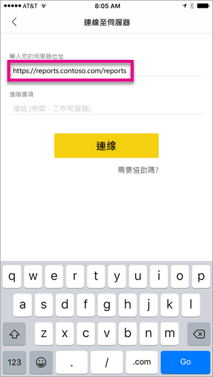

選取 [連接] 時，系統會將您導向至 ADFS 登入頁面。 請輸入您網域的有效認證。

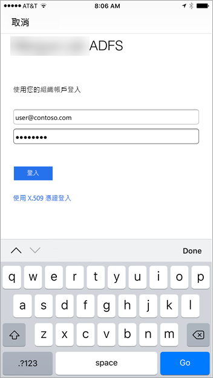

選取 [登入] 後，將會看到來自 Reporting Services 伺服器的項目。


## <a name="multi-factor-authentication"></a>Multi-Factor Authentication

您可以啟用 Multi-Factor Authentication 來啟用環境的額外安全性。 若要深入了解，請參閱 [Configure AD FS 2016 and Azure MFA](https://technet.microsoft.com/windows-server-docs/identity/ad-fs/operations/configure-ad-fs-2016-and-azure-mfa) (設定 AD FS 2016 和 Azure MFA)。

## <a name="troubleshooting"></a>疑難排解

### <a name="you-receive-the-error-failed-to-login-to-ssrs-server-please-verify-server-configuration"></a>您收到「無法登入 SSRS 伺服器」錯誤。 請驗證伺服器設定。

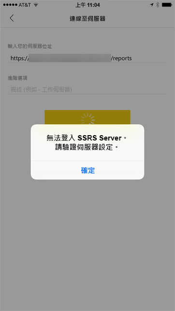

您可以設定 [Fiddler](http://www.telerik.com/fiddler) 作為您行動裝置的 Proxy，來查看提出它的要求有多遠。 若要啟用手機裝置的 Fiddler Proxy，您需要在執行 Fiddler 的電腦上設定 [CertMaker for iOS and Android](http://www.telerik.com/fiddler/add-ons)。 這是 Telerik for Fiddler 的附加元件。

如果使用 Fiddler 時登入成功，您可能會有 WAP 應用程式或 ADFS 伺服器的憑證問題。 您可以使用 [Microsoft Message Analyzer](https://www.microsoft.com/download/details.aspx?id=44226) 這類工具確認憑證是否有效。

## <a name="next-steps"></a>後續步驟

[為報表伺服器註冊服務主體名稱 (SPN)](https://msdn.microsoft.com/library/cc281382.aspx)  
[修改 Reporting Services 設定檔](https://msdn.microsoft.com/library/bb630448.aspx)  
[設定報表伺服器上的 Windows 驗證](https://msdn.microsoft.com/library/cc281253.aspx)  
[Active Directory Federation Services](https://technet.microsoft.com/windows-server-docs/identity/active-directory-federation-services)  
[Web Application Proxy in Windows Server 2016](https://technet.microsoft.com/windows-server-docs/identity/web-application-proxy/web-application-proxy-windows-server) (Windows Server 2016 中的 Web 應用程式 Proxy)  
[Publishing Applications using AD FS Preauthentication](https://technet.microsoft.com/windows-server-docs/identity/web-application-proxy/publishing-applications-using-ad-fs-preauthentication#a-namebkmk14apublish-an-application-that-uses-oauth2-such-as-a-windows-store-app) (使用 AD FS 預先驗證發行應用程式)  
[Configure AD FS 2016 and Azure MFA](https://technet.microsoft.com/windows-server-docs/identity/ad-fs/operations/configure-ad-fs-2016-and-azure-mfa) (設定 AD FS 2016 和 Azure MFA)  
有其他問題嗎？ [試試 Power BI 社群](http://community.powerbi.com/)