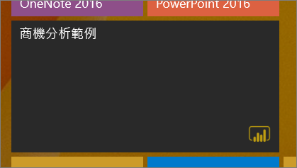
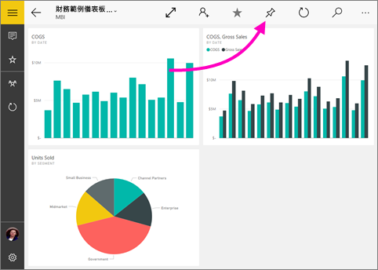
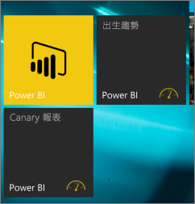

# 從 Power BI 行動裝置應用程式將 Power BI 儀表板釘選到 Windows 10 的開始畫面
您可以從適用於 Windows 10 的 Power BI 行動裝置應用程式，將 Power BI 儀表板釘選到 Windows 的 [開始] 畫面。 它們會變成「動態磚」  。 當您在 [開始] 畫面點選磚時，儀表板便會在適用於 Windows 10 的 Power BI 行動裝置應用程式中開啟。

## 將儀表板釘選到開始畫面成為動態磚
1. 開啟儀表板。
2. 點選 [釘選到開始]  ![[釘選到開始] 圖示](./media/mobile-pin-dashboard-start-screen-windows-10-phone-app/power-bi-windows-10-pin-start-icon.png)。
   
   
   
   前往裝置的開始畫面，以查看動態磚。
   
   

## 後續步驟
* 從 Windows 市集[下載 Power BI for Windows 10 行動裝置應用程式](https://go.microsoft.com/fwlink/?LinkID=526478)  
* [開始使用 Power BI for Windows 10 行動裝置 App](mobile-windows-10-phone-app-get-started.md)  
* [Power BI 是什麼？](../../fundamentals/power-bi-overview.md)
* 有問題嗎？ [嘗試在 Power BI 社群提問](https://community.powerbi.com/)

