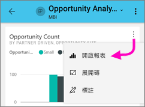
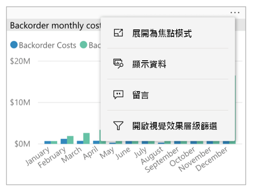
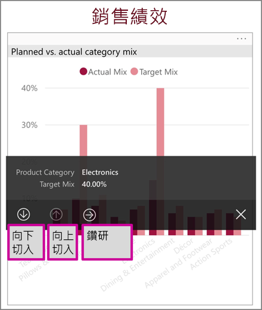
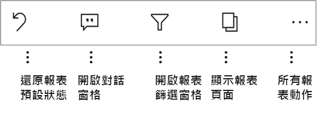
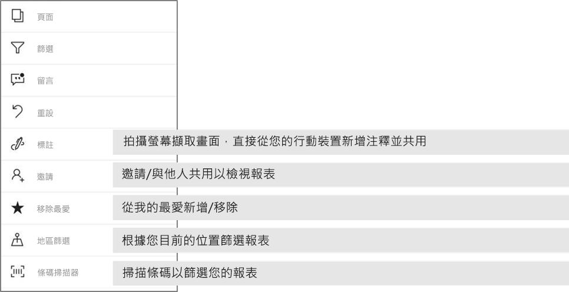

# 探索 Power BI 行動裝置應用程式中的報表
適用於︰

|  |  |  |  |  |
|:--- |:--- |:--- |:--- |:--- |
| iPhone |iPad |Android 手機 |Android 平板電腦 |Windows 10 裝置 |

Power BI 報表是資料的互動式檢視，以視覺效果顯示資料的各種發現與洞見及需要深入了解的事項。 在 Power BI 行動裝置應用程式中檢視報表是三步驟程序中的第三個步驟。

1. [在 Power BI Desktop 中建立報表](../../desktop-report-view.md)。 您甚至還可以在 Power BI Desktop 中[為手機最佳化報表](mobile-apps-view-phone-report.md)。 
2. 將那些報表發行到 Power BI 服務 [(https://powerbi.com)](https://powerbi.com) 或 [Power BI 報表伺服器](../../report-server/get-started.md)。  
3. 然後在 Power BI 行動裝置應用程式中與這些報表互動。

## 在行動裝置應用程式中開啟 Power BI 報表
Power BI 報表會根據您取得的位置，儲存在行動裝置應用程式中的不同位置。 這些報表可能會在 [應用程式]、[與我共用]、[工作區]\(包括 [我的工作區]) 中，或在報表伺服器上。 有時您會經過相關的儀表板才能抵達某個報表，有時會列出這些報表。

在清單和功能表中，您會發現報表名稱旁的圖示可協助您了解此項目是一種報表。 

 

有兩個圖示，在 Power BI 行動裝置應用程式中的報表：

*  表示會以應用程式中的橫向顯示，而且看起來相同效果瀏覽器中的報表。

*  表示具有至少一個電話最佳化的報表頁面上，將會以直向顯示的報表。 

注意：保存您的手機在橫向，您一定會是橫向配置，即使報表頁面有手機版面配置。 

若要從儀表板移至報表，請點選磚右上角的省略符號 （...） >**開啟報表**。
  
  
  
  不是所有的磚都有在報表中開啟的選項。 例如，點選藉由在問與答方塊中提問所建立的磚時不會開啟報表。 
  
## 與報表互動
在應用程式中開啟報表之後，您可以開始使用它。 有許多您可以執行您的報告和其資料的項目。 在報表尾中，您會發現在報表中，並藉由點選和長點選報表，您也可以配量及分析資料中所顯示的資料，您可以執行的動作。

### 使用點選，然後點選 長時間
按一下滑鼠的點選等於。 因此如果您要交叉反白顯示資料點為基礎的報表，請點選該資料點。
點選的交叉分析篩選器值，讓選取的值和該值的切割報表的其餘部分。 點選連結、 按鈕或書籤會啟動它根據作者所定義的動作。

此外，您可能注意到，當您點選 視覺效果，框線會出現。 右上角的框線，沒有省略符號 （...）。點選它將會包含您可以在該視覺效果執行的動作的功能表。

### 工具提示和鑽研動作

當您長時間點選 （點選並按住） 資料點，工具提示會顯示呈現此資料點所代表的值。 

報表作者可以定義階層中的資料和報表頁之間的關聯性。 階層架構，允許向下的鑽研、 向下鑽研和鑽研視覺效果和值的另一個報表頁面。 因此，長時間的值，除了工具提示，請點選相關的向下切入選項將會出現在頁尾中。 

透過鑽研  ，當您點選視覺效果的特定部分時，Power BI 會將您帶往報表中的其他頁面，篩選至您所點選的值。  報表作者可定義一或多個鑽研選項，每項都能將您帶往不同頁面。 在此情況下，您可以選擇想要鑽研的項目。 [上一頁] 按鈕會帶您回到先前的報表頁面。

閱讀更多有關如何[在 Power BI Desktop 中新增鑽研](../../desktop-drillthrough.md)的內容。
   
   > [!IMPORTANT]
   > 在 Power BI 行動裝置應用程式，透過資料格的值，而不是由資料行和資料列標頭，已啟用鑽研矩陣及資料表視覺效果中。
   
   
   
### 在報表尾中使用的動作
整份報表或目前的報表頁面上，報表尾會有您可以執行的動作。 頁尾快速存取最有用的動作，而且所有動作都可以從省略符號 （...） 的存取。

您可以執行頁尾的動作如下：
1) 重設報表篩選和交叉反白顯示選取項目回到其原始狀態。
2) 開啟 [交談] 窗格來檢視或此報表上加入註解。
3) 開啟 [篩選] 窗格，即可檢視及修改目前報表中套用的篩選條件。
4) 列出此報表中的所有頁面。 點選頁面名稱將會載入，並顯示該頁面。
從螢幕邊緣撥動至中心可以完成報表頁之間移動。
5) 檢視所有報表動作。

#### 所有的報表動作
點選...在報表尾選項，將會顯示您可以在報表執行的所有動作。 

某些動作可能會停用，因為它們都取決於特定的報表功能。
例如：
1) **依目前位置篩選**當作者與地理資料分類在報表中的資料才會啟用。 [了解如何識別在報表中的地理資料](https://docs.microsoft.com/power-bi/desktop-mobile-geofiltering)。
2) **掃描條碼篩選報表**報表中的資料集已標記為條碼時，才會啟用。 [您如何在 Power BI Desktop 中標記條碼](https://docs.microsoft.com/power-bi/desktop-mobile-barcodes)。 
3) **邀請**您擁有與其他人共用此報表的權限時，才會啟用。 只有當您是報表擁有者，或提供再次共用權限給擁有者，您將有權限。
4) **標註並共用**可能會停用，如果沒有[Intune 保護原則](https://docs.microsoft.com/intune/app-protection-policies)組織禁止共用 Power BI 行動應用程式中。 

## 後續步驟
* [檢視為您的手機最佳化的 Power BI 報表，並與其互動](mobile-apps-view-phone-report.md)
* [建立為手機最佳化的報表版本](../../desktop-create-phone-report.md)
* 有問題嗎？ [嘗試在 Power BI 社群提問](http://community.powerbi.com/)

