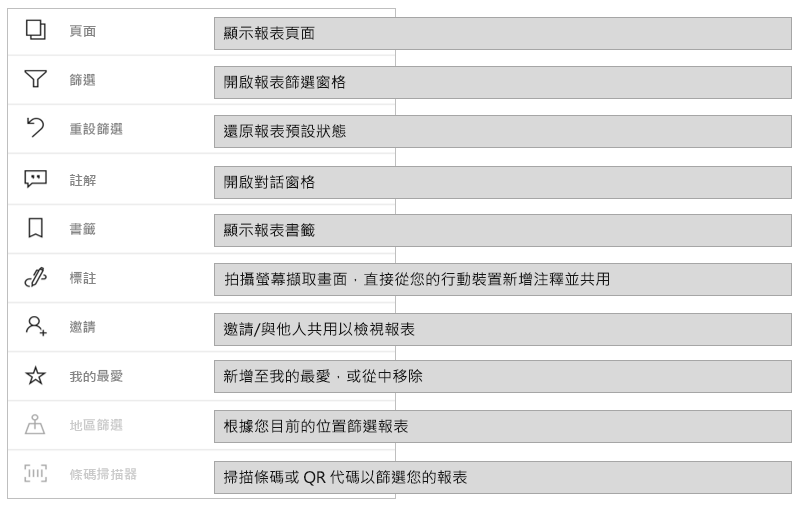
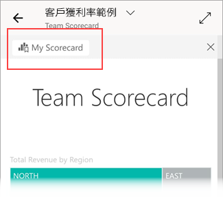

# 探索 Power BI 行動裝置應用程式中的報表
適用於︰

|  |  |  |  |  |
|:---: |:---: |:---: |:---: |:---: |
| iPhone |iPad |Android 手機 |Android 平板電腦 |Windows 10 裝置 |

>[!NOTE]
>**使用 Windows 10 行動裝置版手機**的 Power BI 行動裝置應用程式支援，將於 2021 年 3 月 16 日停止。 [深入了解](https://go.microsoft.com/fwlink/?linkid=2121400)

Power BI 報表是資料的互動式檢視，以視覺效果顯示資料的各種發現與見解。 在 Power BI 行動裝置應用程式中檢視報表是三步驟程序中的第三個步驟：

1. [在 Power BI Desktop 中建立報表](../../create-reports/desktop-report-view.md)。 您甚至還可以在 Power BI Desktop 中[為手機最佳化報表](mobile-apps-view-phone-report.md)。
2. 將那些報表發行到 Power BI 服務 [(https://powerbi.com)](https://powerbi.com) 或 [Power BI 報表伺服器](../../report-server/get-started.md)。  
3. 在 Power BI 行動裝置應用程式中與報表互動。

## 在行動裝置應用程式中開啟 Power BI 報表
Power BI 報表會根據您取得的位置，儲存在行動裝置應用程式中的不同位置。 這些報表可能會在 [應用程式]、[與我共用]、[工作區]\(包括 [我的工作區]) 中，或在報表伺服器上。 有時，您會經過相關的儀表板才能抵達某個報表，有時會列出這些報表。

在清單和功能表中，您可在報表名稱旁邊看到圖示，協助您了解該項目是報表：

![[我的工作區] 中報表](./media/mobile-reports-in-the-mobile-apps/reports-my-workspace.png)

Power BI 行動裝置應用程式中的報表有兩個圖示：

*  表示在應用程式中以橫向顯示的報表。 看起來會與瀏覽器中顯示的外觀相同。

*  表示至少具有一個電話最佳化頁面的報表，以直向顯示。

> [!NOTE]
> 當橫向持握手機時，即使報表頁面為手機版面配置，也一律會以橫向版面配置顯示。

若要從儀表板取得報表，請點選磚右上角的 [更多選項]  (...)，然後點選 [開啟報表]  ：
  
  
  
  不是所有的磚都可以作為報表開啟。 例如，當您在問與答方塊中提問時所建立的磚不會在點選時開啟報表。
  
## 放大資料   
使用捏合手勢放大報表，以更詳細檢查內容。 反捏合以縮小報表。 Android 與 iOS 手機及平板電腦支援捏合縮放。

## 與報表互動
在應用程式中開啟報表之後，您就可以開始使用報表。 您可以對報表及其資料執行許多動作。 在報表頁尾中，您會看到可在報表上執行的動作。 您也可以透過點選和長按報表中顯示的資料來並排顯示資料。

### 點一下與點兩下互動
當您下載 Power BI 行動應用程式時，應用程式會設定為點一下互動。 這表示當點選視覺效果以執行某些動作 (例如選取交叉分析篩選器項目、交叉醒目提示、按一下連結或按鈕等) 時，點選就會選取視覺效果並執行您想要的動作。

如果您想要的話，也可以切換為點兩下互動。 藉由點兩下互動，您可以先點選視覺效果以將其選取，然後再次點選視覺效果以執行您想要的動作。

若要切換為點兩下互動，或切換回點一下互動，請移至[應用程式互動設定](./mobile-app-interaction-settings.md)。

### 資料點選取單一選取與多重選取模式的比較

在報表中，您可以點選資料點加以選取。 您可以選擇要使用單一選取或多重選取模式。 在單一選取模式中，當您點選資料點加以選取時，該選取範圍會取代您先前所做的任何選取範圍。 在多重選取模式中，當您點選資料點加以選取時，您的選取範圍會「新增」至您目前擁有的任何選取範圍，而且所有選取範圍的合併結果會在所有報表的視覺效果中反白顯示。

若要取消選取所選的資料點，只要重新點選即可。

若要在單一選取與多重選取模式之間切換，請移至[應用程式互動設定](./mobile-app-interaction-settings.md)。

### 使用點選和長按
點選等同於按一下滑鼠。 因此，如果您想要根據資料點來交叉醒目提示報表，請點選該資料點。
當您點選交叉分析篩選器的值時，會選取該值，並根據該值來切割報表的其餘部分。
當您點選連結、按鈕或書籤時，會執行報表作者所定義的動作。

您可能已經注意到，當您點選視覺效果時會出現框線。 您會在框線的右上角看到 [更多選項] (...)。如果您點選省略符號，您會看到一個功能表，其中包含可在該視覺效果上執行的動作：

### 工具提示和切入動作
當您長按 (按住不放) 資料點時，會出現一個工具提示，顯示該資料點代表的值：

如果報表作者已設定報表頁面工具提示，則預設工具提示會取代為報表頁面工具提示：

> [!NOTE]
> 裝置必須至少具有 640 像素和 320 像素的檢視區，才能支援報表工具提示。 如果您的裝置較小，則應用程式會顯示預設工具提示。

報表作者可以在報表頁面之間的資料和關聯性中定義階層。 階層可讓您向下切入、向上切入，並從視覺效果和值中鑽研至另一個報表頁面。 因此，當您長按某個值時，除了工具提示之外，相關的切入選項也會顯示在頁尾：

當您點選視覺效果的特定部分，然後點選「鑽研」** 選項時，Power BI 會將您帶往報表中的其他頁面，篩選至您所點選的值。 報表作者可定義一或多個鑽研選項，每項都能將您帶往不同頁面。 在此情況下，您可以選擇想要鑽研的選項。 [上一頁] 按鈕可讓您回到上一頁。

如需詳細資訊，請參閱如何[在 Power BI Desktop 中新增鑽研](../../create-reports/desktop-drillthrough.md)。
   
   > [!IMPORTANT]
   > 在 Power BI 行動裝置應用程式中，矩陣和資料表視覺效果中的切入動作只會透過資料格值而不是資料行和資料列標頭來啟用。
   
   
   
### 使用報表頁尾中的動作
您可以從報表頁尾，對目前報表頁面或整個報表執行數個動作。 頁尾可讓您快速存取一些最常用的動作。 您可以點選 [更多選項]**** (...) 按鈕來存取其他動作：

您可以從頁尾執行這些動作：
* 將報表篩選器與交叉醒目提示的選取範圍重設回其原始狀態。
* 開啟交談窗格以檢視註解或將註解新增至報表。
* 開啟篩選窗格以檢視或修改目前套用至報表的篩選。
* 列出報表中的所有頁面。 點選頁面名稱將會載入並顯示該頁面。
您可以從畫面邊緣往畫面中央撥動，以在報表頁面之間移動。
* 檢視所有報表動作。

#### 所有報表動作
當點選報表頁尾中的 [更多選項]**** (...) 按鈕時，您會看到可在報表上執行的所有動作：

某些動作可能會因相依於特定的報表功能而停用。
例如：

只有在報表中設定 [[書籤]](mobile-reports-in-the-mobile-apps.md#bookmarks)，才會出現 [書籤]****。 可在 Power BI 服務中定義的個人書籤以及報表建立者定義的書籤都會出現。 如果其中一種書籤已定義為預設書籤，報表就會在載入時開啟至該檢視。

如果組織具有禁止從 Power BI 行動裝置應用程式共用的 [Intune 保護原則](https://docs.microsoft.com/intune/app-protection-policies)，則可能會關閉 [標註並共用]****。

只有當您有權與他人共用報表時，才會啟用 [邀請]****。 只有當您是報表的擁有者，或擁有者已授與您再次共用權限時，您才會擁有權限。

如果報表作者使用地理資料來分類報表，則會啟用 [依目前位置篩選]****。 如需詳細資訊，請參閱 [identifying geographical data in a report](https://docs.microsoft.com/power-bi/desktop-mobile-geofiltering) (識別報表中的地理資料)。

只有當您報表中的資料集標記為**條碼**時，才會啟用 [依條碼掃描並篩選報表]****。 如需詳細資訊，請參閱 [tagging barcodes in Power BI Desktop](https://docs.microsoft.com/power-bi/desktop-mobile-barcodes) (在 Power BI Desktop 中標記條碼)。

### 書籤

Power BI 行動裝置應用程式支援報表建立者定義的報表書籤，也支援可在 Power BI 服務中定義的個人書籤。 [書籤] 功能表位在 [[報表動作] 工具列](mobile-reports-in-the-mobile-apps.md#all-report-actions)的 [更多選項]**** (...) 下。

預設的書籤會以特殊圖示來表示。 針對個人書籤，藉由點選所要變更書籤旁的 [更多選項 (...)]****，然後選擇 [設為預設]**** 或 [清除預設值]****，即可設定、取消設定或變更預設設定。

![[書籤] 功能表](./media/mobile-reports-in-the-mobile-apps/power-bi-mobile-report-bookmark-menu.png)

當報表的書籤檢視開啟時，書籤的名稱就會出現在報表頂端。

[深入了解 Power BI 服務的書籤](https://docs.microsoft.com/power-bi/consumer/end-user-bookmarks)。

## 設定報表的體驗
Power BI 行動裝置應用程式有許多設定，可讓您控制報表體驗。 目前，您可以設定
* **與報表視覺效果的互動**：您可以選擇要使用點一下或點兩下互動。
* **資料重新整理方法**：您可以選擇讓重新整理按鈕或下拉動作重新整理報表資料。
* **報表頁尾可見度**：您可以選擇使用一律顯示的停駐頁尾，或是根據您的動作 (例如捲動) 而隱藏和重新顯示的動態頁尾。

如需如何變更這些設定的資訊，請參閱[應用程式互動設定](./mobile-app-interaction-settings.md)。

## 後續步驟
* [檢視為您的手機最佳化的 Power BI 報表，並與其互動](mobile-apps-view-phone-report.md)
* [建立為手機最佳化的報表版本](../../create-reports/desktop-create-phone-report.md)
* 有問題嗎？ [嘗試在 Power BI 社群提問](https://community.powerbi.com/)
