# 在 Power BI 行動裝置應用程式中設定資料警示
適用於︰

|  |  |  |  |  |
|:--- |:--- |:--- |:--- |:--- |
| iPhone |iPad |Android 手機 |Android 平板電腦 |Windows 10 裝置 |

您可以在 Power BI 行動裝置應用程式和 Power BI 服務中的儀表板上設定警示。 警示會在圖格中的資料變更超出您所設定的限制時通知您。 警示適用於只包含單一數字的磚，例如卡片與量測計，但不適用於串流資料。 您可以在行動裝置上設定資料警示，然後在 Power BI 服務中檢視，反之亦然。 即使共用了儀表板或圖格快照集，也只有您才可以查看您設定的資料警示。

如果您有 Power BI Pro 授權，或共用儀表板位在 Premium 容量中，則可以設定圖格的警示。 

> [!WARNING]
> 資料驅動的警示通知會提供資料的相關資訊。 如果您的裝置被偷，建議您前往 Power BI 服務關閉所有資料驅動的警示規則。 
> 
> 深入了解[管理 Power BI 服務中的資料警示](../../create-reports/service-set-data-alerts.md)。
> 
> 

## iPhone 或 iPad 上的資料警示
### 在 iPhone 或 iPad 上設定警示
1. 點選儀表板中的數字磚或量測計磚，在焦點模式中開啟。  
   
   
2. 點選鈴鐺圖示  新增警示。  
3. 點選 [加入警示規則]。
   
   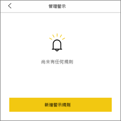
4. 選擇要在高於值或低於值時收到警示，然後設定該值。
   
   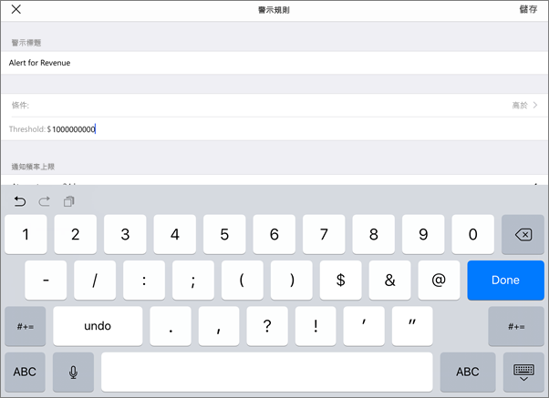
5. 決定要每小時或每天收到一次警示，以及是否要在發出警示的同時，也收到一封電子郵件。
   
   > [!NOTE]
   > 您不會每小時或每天都收到警示，除非資料確實依這個頻率更新。
   > 
   > 
6. 您也可變更警示的標題。
7. 點選 [儲存] 。
8. 同一個磚可同時設定高於臨界值的值及低於臨界值的值。 在 [管理警示] 中，點選 [加入警示規則]。
   
   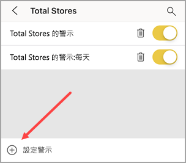

### 在 iPhone 或 iPad 上管理警示
您可以在行動裝置上管理個別的警示，或[在 Power BI 服務中管理所有警示](../../create-reports/service-set-data-alerts.md)。

1. 在儀表板中，點選出現警示的數字磚或量測計磚。  
   
   

2. 點選鈴鐺圖示 .  
3. 點選警示的名稱編輯警示、點選滑桿關閉電子郵件警示，或點選垃圾桶刪除警示。
   
    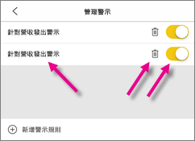

## Android 裝置上的資料警示
### 在 Android 裝置上設定警示
1. 在 Power BI 儀表板中，點選數字磚或量測計磚，以開啟它。  
2. 點選鈴鐺圖示  新增警示。  
   
   
3. 點選加號圖示 (+)。
   
   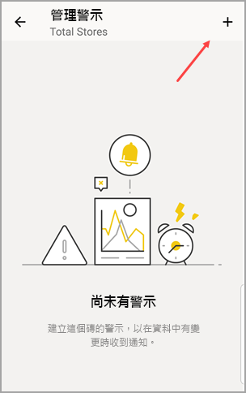
4. 選擇要在高於值或低於值時收到警示，然後輸入該值。
   
   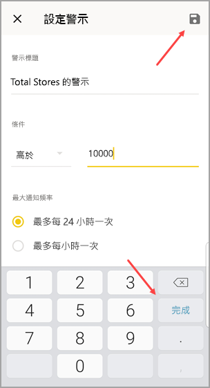
5. 點選 [完成]。
6. 決定要每小時或每天收到一次警示，以及是否要在發出警示的同時，也收到一封電子郵件。
   
   > [!NOTE]
   > 您不會每小時或每天都收到警示，除非資料確實依這個頻率更新。
   > 
   > 
7. 您也可變更警示的標題。
8. 點選 [儲存] 。

### 在 Android 裝置上管理警示
您可以使用 Power BI 行動應用程式管理個別的警示，或[使用 Power BI 服務管理所有的警示](../../create-reports/service-set-data-alerts.md)。

1. 在儀表板中，點選出現警示的卡片磚或量測計磚。  
2. 點選實線鈴鐺圖示 .  
3. 點選警示可變更值或關閉警示。
   
    ![[管理警示] 磚的螢幕擷取畫面，其中顯示新增警示的加號圖示。](media/mobile-set-data-alerts-in-the-mobile-apps/power-bi-android-manage-alerts.png)
4. 點選加號圖示 (+) 將其他警示新增至同一個磚。
5. 若要一併刪除所有警示，請點選垃圾筒圖示 .

## Windows 裝置上的資料警示

>[!NOTE]
>**使用 Windows 10 行動裝置版手機**的 Power BI 行動裝置應用程式支援，將於 2021 年 3 月 16 日停止。 [深入了解](https://go.microsoft.com/fwlink/?linkid=2121400)

### 在 Windows 裝置上設定資料警示
1. 點選儀表板中的數字磚或量測計磚，以開啟該卡片與量測計。  
2. 點選鈴鐺圖示  新增警示。  
   
   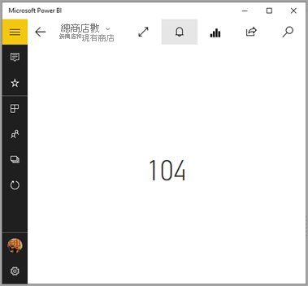
3. 點選加號圖示 (+)。
   
   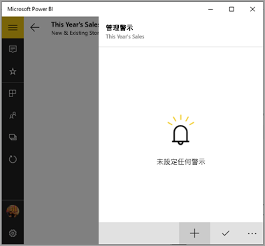
4. 選擇要在高於值或低於值時收到警示，然後輸入該值。
   
   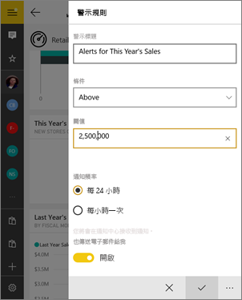
5. 決定要每小時或每天收到一次警示，以及是否要在發出警示的同時，也收到一封電子郵件。
   
   > [!NOTE]
   > 您不會每小時或每天都收到警示，除非資料確實依這個頻率更新。
   > 
   > 
6. 您也可變更警示的標題。
7. 點選核取記號。
8. 同一個磚可同時設定高於臨界值的值及低於臨界值的值。 在 [管理警示] 中點選加號 (+)。
   
   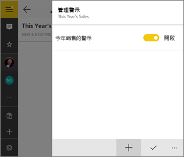

### 在 Windows 裝置上管理警示
您可以使用 Power BI 行動應用程式管理個別的警示，或[使用 Power BI 服務管理所有的警示](../../create-reports/service-set-data-alerts.md)。

1. 在儀表板中，點選出現警示的卡片磚或量測計磚。  
2. 點選鈴鐺圖示 .  
   
   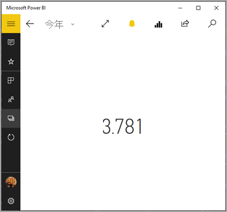
3. 點選警示可變更值或關閉警示。
   
    
4. 若要一併刪除警示，請在警示上按一下滑鼠右鍵，或點住 [> 刪除]。

## 接收警示
您會從行動裝置的 Power BI [通知中心](mobile-apps-notification-center.md)或 Power BI 服務收到警示，以及有人分享新儀表板給您的通知。

雖然有些資料來源的重新整理頻率高於每天，但一般都會將重新整理頻率設為每天。 當儀表板中的資料重新整理時，其中如有任何您正在追蹤的資料達到您所設定的臨界值，將會出現一些連鎖反應。

1. Power BI 會檢查自傳送上個警示之後的經過時間，是否已超過 1 小時或 24 小時 (取決於您選取的選項)。
   
   只要資料超過臨界值，您就會每小時或每 24 小時收到一次警示。
2. 您如有設定傳送電子郵件警示，將會在收件匣中看到類似如下所述的狀況。
   
   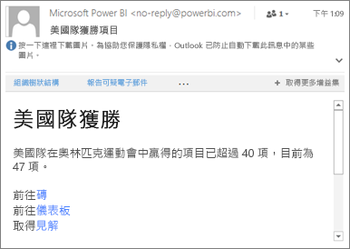
3. Power BI 會將訊息新增至[通知中心](mobile-apps-notification-center.md)，並在 (iOS 和 Android) 標題列的鈴鐺圖示  或 (Windows 10 裝置) 全域導覽按鈕  上新增一個黃點。

4. 點選鈴鐺圖示  或全域導覽按鈕  以[開啟**通知中心**](mobile-apps-notification-center.md)並查看警示詳細資訊。
   
     

> [!NOTE]
> 警示只對重新整理的資料有作用。 當資料重新整理時，Power BI 會檢查該資料有無設定警示。 若資料已達警示臨界值，便會觸發警示。
> 
> 

## 提示與疑難排解
* 警示對於具有日期/時間量值的 Bing 磚或卡片磚無效。
* 警示只適用於數值資料。
* 警示只對重新整理的資料有作用。 警示對於靜態資料毫無作用。
* 警示不適用於包含串流資料的磚。

## 後續步驟
* [使用 Power BI 服務管理您的警示](../../create-reports/service-set-data-alerts.md)
* [Power BI 行動通知中心](mobile-apps-notification-center.md)
* 有問題嗎？ [嘗試在 Power BI 社群提問](https://community.powerbi.com/)
