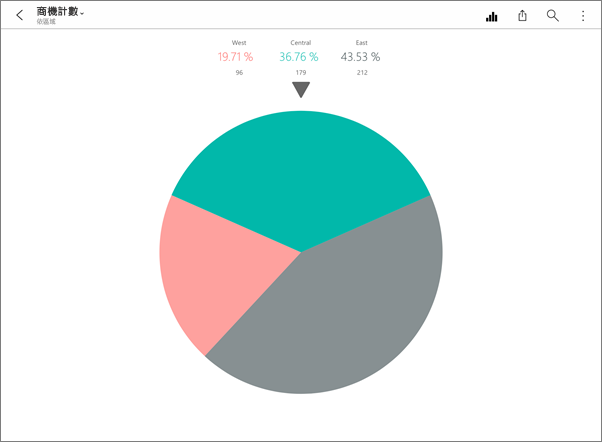
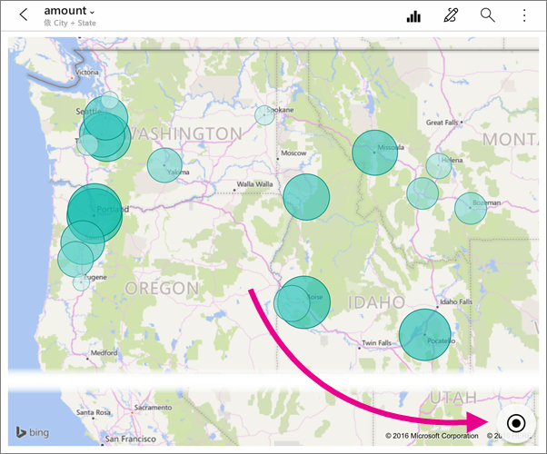
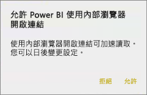
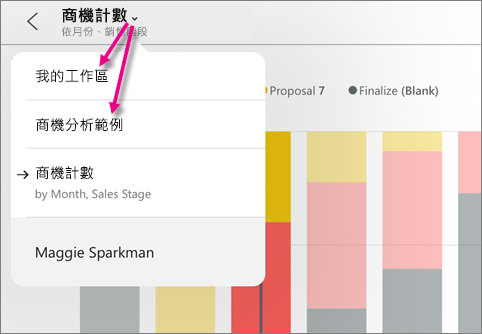
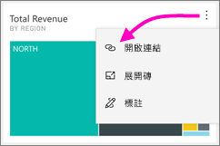
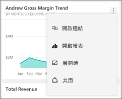
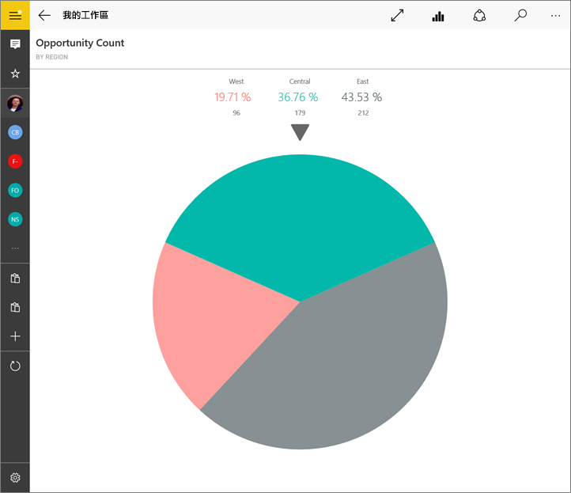
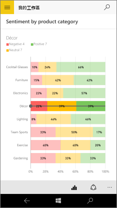

# 探索 Power BI 行動裝置應用程式中的磚
適用於︰

|  |  |  |  |  |
|:--- |:--- |:--- |:--- |:--- |
| iPhone |iPad |Android 手機 |Android 平板電腦 |Windows 10 裝置 |

圖格是釘選到儀表板的即時資料快照集。 其值會隨著資料變更而變更。 **您可以[將磚新增到 Power BI 服務中的儀表板](../end-user-tiles.md)。** 

接著在 Power BI 行動裝置應用程式 中，以焦點模式開啟磚，並與之互動。 您可以開啟含有各類視覺效果的磚，包括以 Bing 和 R 為基礎的磚。

## iOS 應用程式中的磚

1. 開啟 [iOS 行動裝置應用程式中的儀表板](mobile-apps-view-dashboard.md)。
2. 點選圖格。 它會在焦點模式中開啟，更容易檢視及瀏覽圖格資料。 在焦點模式中，您可以︰
   
   在折線圖、橫條圖或直條圖中，點選來檢視視覺效果特定部分的值。
   
    
   
   *例如，此折線圖中選取的是**本年度銷售額**和**去年銷售額**在**八月份**的值。*  
   
   在圓形圖中，點選圓形的配量可在圓形圖上方顯示配量的值。  
   
   
3. 在地圖中，點選**地圖置中**圖示 ，將地圖置中於您目前的所在位置。

   

4. 點選鉛筆圖示  以[標注磚](mobile-annotate-and-share-a-tile-from-the-mobile-apps.md#annotate-and-share-the-tile-report-or-visual)，然後點選共用圖示  以[與其他人共用](mobile-annotate-and-share-a-tile-from-the-mobile-apps.md#annotate-and-share-the-tile-report-or-visual)。

5. [在磚中加入警示](mobile-set-data-alerts-in-the-mobile-apps.md)。 當值高於或低於目標值時，Power BI 會通知您。

6. 有時候，儀表板的建立者已新增磚的連結。 若是如此，當磚處於焦點模式時就會有連結圖示 ︰
   
    
   
    開啟連結即可前往其他 Power BI 儀表板或外部 URL。 您可以[點選連結](../../create-reports/service-dashboard-edit-tile.md#hyperlink)在 Power BI 應用程式內加以開啟。 如果是外部網站，Power BI 會要求您允許該連結。
   
    
   
    在 Power BI 應用程式中開啟連結後，您可以複製該連結，並改以瀏覽器視窗開啟連結。
7. [開啟報表](mobile-reports-in-the-mobile-apps.md)，此為磚的基礎。
8. 若要離開磚焦點模式，請點選磚名稱，然後點選儀表板名稱或 [我的工作區]。
   
    

## Android 手機及平板行動裝置應用程式中的磚
1. 開啟 [Power BI 行動裝置應用程式中的儀表板](mobile-apps-view-dashboard.md)。
2. 點選磚以在焦點模式中開啟，此模式能更容易檢視及瀏覽磚資料。
   
   
   
    在焦點模式中，您可以︰
   
   * 點選圖表以移動折線圖、橫條圖、直線圖或泡泡圖中的列，檢視視覺效果中之特定點的值。  
   * 點選鉛筆圖示  以[標註磚](mobile-annotate-and-share-a-tile-from-the-mobile-apps.md#annotate-and-share-the-tile-report-or-visual)，然後點選共用快照集圖示  以[與其他人共用](mobile-annotate-and-share-a-tile-from-the-mobile-apps.md#annotate-and-share-the-tile-report-or-visual)。
   * 點選開啟報表圖示  在行動裝置應用程式中[檢視報表](mobile-reports-in-the-mobile-apps.md)。
3. 有時候，儀表板的建立者已新增磚的連結。 因此，當您點選垂直省略符號 ( **...** ) 時會看到 [開啟連結]：
   
    
   
    開啟連結即可前往其他 Power BI 儀表板或外部 URL。 您可以[點選連結](../../create-reports/service-dashboard-edit-tile.md#hyperlink)在 Power BI 應用程式內加以開啟。 如果是外部網站，Power BI 會要求您允許該連結。
   
    
   
    在 Power BI 應用程式中開啟連結後，您可以複製該連結，並改以瀏覽器視窗開啟連結。
4. 點選左上角的箭號以關閉磚並返回儀表板。

## Windows 10 行動裝置應用程式中的磚

>[!NOTE]
>**使用 Windows 10 行動裝置版手機**的 Power BI 行動裝置應用程式支援，將於 2021 年 3 月 16 日停止。 [深入了解](https://go.microsoft.com/fwlink/?linkid=2121400)

1. 開啟 [Power BI for Windows 10 行動裝置應用程式中的儀表板](mobile-apps-view-dashboard.md)。
2. 點選磚上的垂直省略符號。 從這裡您可以： 
   
    
   
    [共用磚的快照集](mobile-windows-10-phone-app-get-started.md)。
   
    點選 [開啟報表] 以[檢視基礎報表](mobile-reports-in-the-mobile-apps.md)。
   
    如果報表包含連結的話，請[開啟連結](../../create-reports/service-dashboard-edit-tile.md#hyperlink)。 開啟連結即可前往 Power BI 儀表板或外部 URL。
3. 點選 [展開磚]。 它會在焦點模式中開啟，更容易檢視及瀏覽圖格資料。 在此模式中您可以：
   
   微調圓形圖可在圓形上方顯示配量的值。  
   
   
   
   點選圖表以移動折線圖、橫條圖、直線圖或泡泡圖中的列，檢視視覺效果中之特定點的值。  
   
   
   
   *在此橫條圖中，[裝飾項目] 列的值會顯示在圖表上方。*
   
   點選 [全螢幕] 圖示  在全螢幕模式中開啟磚，此時不會有導覽和功能表列。
   
   > [!NOTE]
   > 您也可以在 Power BI for Windows 10 行動裝置應用程式中，[以全螢幕模式檢視儀表板和報表](mobile-windows-10-app-presentation-mode.md)。
   > 
   > 
   
   在地圖中，點選**地圖置中**圖示 ，將地圖置中於您目前的所在位置。
   
   
   
   點選共用快照集圖示，與他人[共用磚](mobile-windows-10-phone-app-get-started.md)。   
   
   點選開啟報表圖示，以[檢視磚所依據的報表](mobile-reports-in-the-mobile-apps.md)。 
4. 點選返回箭號或 [返回] 按鈕以關閉磚並返回儀表板。

## 後續步驟
* [Power BI 是什麼？](../../fundamentals/power-bi-overview.md)
* 有問題嗎？ [嘗試在 Power BI 社群提問](https://community.powerbi.com/)
