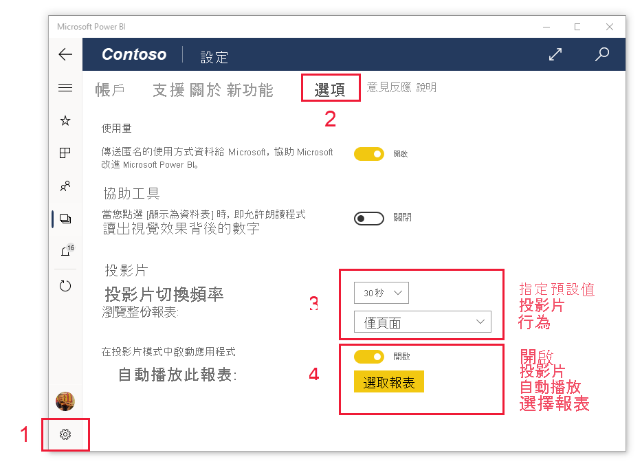

# 在 Surface Hub 和 Windows 10 裝置上，以簡報模式檢視報表和儀表板
您可以在 Windows 10 裝置和 Surface Hub 中，使用簡報模式以全螢幕顯示報表和儀表板。 簡報模式非常適合用來在會議中、在辦公室的專用投影機上顯示 Power BI，或甚至只是充分利用小螢幕上的空間。

在簡報模式中：
* 所有「組件區塊」(例如導覽和功能表列) 都會消失，讓您更容易專注於報表中的資料。
* 動作工具列會變成可用，讓您能夠與資料互動並控制簡報。
* 您可以播放投影片，以自動循環播放頁面、書籤，或頁面與書籤。

>[!NOTE]
>**使用 Windows 10 行動裝置版手機**的 Power BI 行動裝置應用程式支援，將於 2021 年 3 月 16 日停止。 [深入了解](/legal/powerbi/powerbi-mobile/power-bi-mobile-app-end-of-support-for-windows-phones)

## 使用簡報模式
在 Power BI 行動裝置應用程式中，點選**全螢幕**圖示，進入全螢幕模式。
 應用程式組件區塊消失，而動作工具列會出現在螢幕底部或左右兩側 (取決於您的螢幕大小)。

您可以從工具列中點選來執行下列動作：

| 圖示 | 動作 |
|------|--------|
||**回到**上一頁。 長按此圖示，即會顯示階層連結視窗，讓您能夠巡覽至包含報表或儀表板的資料夾。|
||在簡報中**切換頁面**至報表的另一頁。|
||**套用書籤**，以呈現該書籤所擷取之資料的特定檢視。 您可以同時套用個人和報表書籤。|
||當您使用 Surface 手寫筆在報表上進行繪製與標註時，請**選擇筆跡色彩**。|
||**清除筆跡標記**可清除您使用 Surface 手寫筆在報表頁面上繪製與標註的標記。          |
||**重設為預設檢視**，並清除您可能在簡報期間進行的任何篩選、交叉分析篩選器或任何其他資料檢視變更。|
||與同事**共用**簡報檢視的影像。 影像將包含您在簡報期間使用 Surface 畫筆所做的註釋。|
||**重新整理**報表。|
||**播放投影片**、隱藏動作列，以及啟動投影片。 選取器可讓您選擇在頁面、書籤，或頁面與書籤之間自動輪替。 根據預設，投影片每隔 30 秒就會在頁面之間自動輪替一次。 您可以在 [[設定] > [選項]](#slideshow-settings) 中變更這些設定。 請參閱關於投影片的[更多詳細資訊](#slideshows)|
||**結束**簡報模式。|
||**搜尋** Power BI 中的其他成品。|

您可以卸除工具列，並將其拖放到螢幕上的任一處。 使用大型的螢幕時，若您希望專注於報表中的特定區域，且需要工具隨時在旁預備，此功能就很實用。 只要將手指放在工具列上，將其撥動到報表畫布中即可。

## 投影片

您可以播放投影片，以自動循環播放您的簡報。 您可以設定投影片，以循環播放頁面、書籤，或頁面與書籤。

當您選取動作工具列上的 [播放] 按鈕時，投影片就會開始。 控制器隨即出現，可讓您暫停投影片或變更播放的內容：頁面、書籤，或頁面與書籤。

 控制器會顯示目前顯示之檢視的名稱 (頁面，或書籤與頁面)。 在上圖中，我們在名為 **Sales** \(銷售\) 的報表中看到該控制器，我們目前正在 [Sales Performance] \(銷售績效\) 頁面上檢視 [Asia Pacific] \(亞太地區\) 書籤。

根據預設，投影片只會以每隔 30 秒的速率循環播放頁面。 您可以在[投影片放映設定](#slideshow-settings)中變更預設行為。

### 在啟動時自動播放投影片

您可以設定 Power BI 行動裝置應用程式，在應用程式啟動時自動開始播放投影片。 此選項有助於建立類似 kiosk 的體驗，無須任何手動操作，即可在公用顯示中執行報表。 如需設定自動播放報表的詳細資訊，請參閱[投影片設定](#slideshow-settings)。

### 投影片設定

根據預設，投影片只會以每隔 30 秒的速率循環播放頁面。 您可以移至 [設定] > [選項] 變更此預設行為，如下所示。 您也可以開啟自動播放，並選擇要播放的報表。

1. 選取設定圖示。

1. 開啟 [選項] 索引標籤。

1. 如有需要，請變更投影片循環播放 (頁面、書簽或兩者都有) 以及投影片轉換頻率的預設設定。

1. 若您想要在應用程式啟動時自動開始播放報表，請開啟切換並選擇 [選取報表]。 您就能夠搜尋有權存取的報表。

## 後續步驟
* [從 Power BI 服務以全螢幕模式顯示儀表板和報表](../end-user-focus.md)
* 有問題嗎？ [嘗試在 Power BI 社群提問](https://community.powerbi.com/)