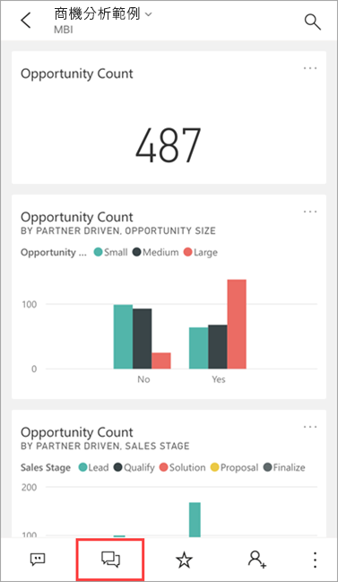
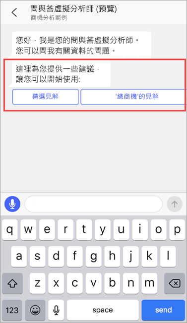
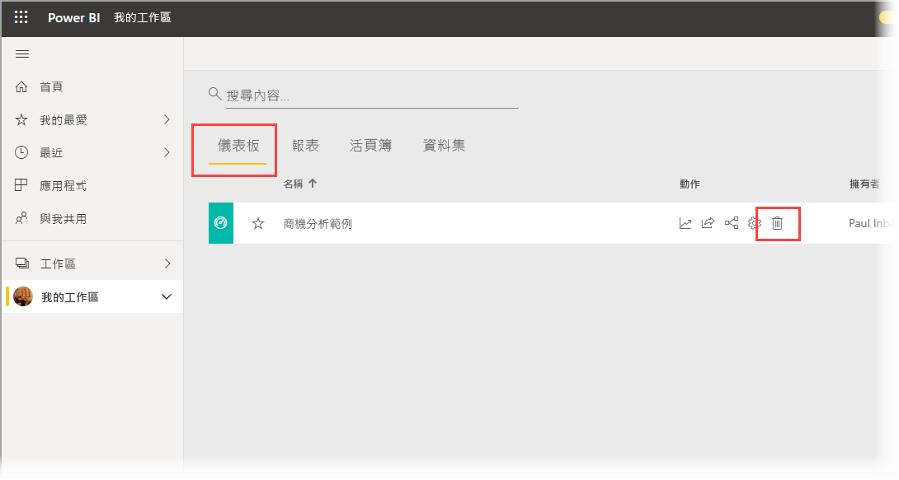
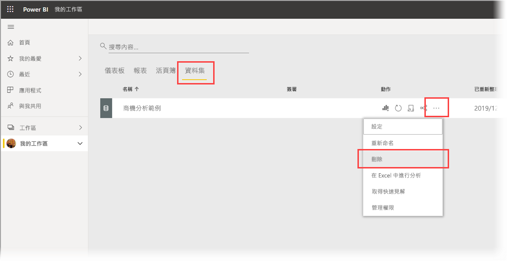

# 教學課程：使用 Power BI iOS 應用程式中的問與答虛擬分析師，詢問有關您資料的問題

如果您想要了解資料，最簡單的方法就是用自己的文字來詢問相關問題。 在此教學課程中，您可以在 iPad 或 iPhone 上使用 Microsoft Power BI 行動裝置應用程式的問與答虛擬分析師來詢問範例資料相關問題，並檢視有關的精選見解。 

適用於︰

|  |  |
|:--- |:--- |
| iPhone |iPad |

問與答虛擬分析師是交談式 BI 體驗，可存取 [Power BI 服務](https://powerbi.com)中中最基本的問與答資料。 它提供了資料見解，而您可以輸入或使用您自己的問題。

在此教學課程中，您需要：

> [!div class="checklist"]
> * 安裝 iOS 版 Power BI 行動裝置應用程式
> * 下載 Power BI 範例儀表板和報表
> * 請查看行動裝置應用程式建議哪些精選見解

## 必要條件

* **註冊 Power BI**：如果您尚未註冊 Power BI，請先進行[免費註冊](https://app.powerbi.com/signupredirect?pbi_source=web)再開始。
* **安裝 iOS 版 Power BI 應用程式**：從 Apple App Store [下載 iOS 應用程式](https://apps.apple.com/app/microsoft-power-bi/id929738808)至 iPad、iPhone 或 iPod Touch。 下列版本支援 iOS 版 Power BI 應用程式：
  * iPad (iOS 11 或更新版本)。
  * iPhone 5 與後續機種 (iOS 11 或更新版本)。 
  * iPod Touch (iOS 11 或更新版本)。
* **下載範例資料**：第一個步驟是將**商機分析範例**下載至 Power BI 服務。 如需如何執行此作業的說明，請參閱[將範例下載至 Power BI 服務的 [我的工作區]](./mobile-apps-download-samples.md)。

完成先決條件並下載範例資料後，您就可以隨時在 iOS 裝置上檢視這些範例。

## 試試精選深入解析
1. 在您的 iPhone 或 iPad 上，開啟 Power BI 應用程式並使用 Power BI 帳戶認證登入，這與您在瀏覽器中的 Power BI 服務中使用的認證相同。

2. 在首頁導覽列上，點選**工作區**圖示。

    ![開啟 [我的工作區]](./media/tutorial-mobile-apps-ios-qna/power-bi-qna-open-myworkspace.png)

3. 當 [工作區] 頁面開啟時，點選 [我的工作區]  ，然後點選開啟 [商機分析範例]  儀表板來將其開啟。

3. 在 [商機分析範例] 儀表板上，點選 [動作] 功能表上的問與答虛擬分析師圖示。

    

    問與答虛擬分析師提供了一些開始使用的建議。

    

3. 點選 [精選深入解析]  。

4. 問與答虛擬分析師建議了一些深入解析。 向右捲動並點選 [深入解析 2]  。

    

   問與答虛擬分析師會顯示深入解析 2。

    

5. 點選圖表以使用焦點模式開啟。

    

6. 點選左上角的箭號，可返回問與答虛擬分析師體驗。

## 清除資源

當您完成教學課程時，就可以刪除 [商機分析範例] 儀表板、報表和資料集。

1. 開啟 Power BI 服務 ([Power BI 服務](https://app.powerbi.com)) 並登入。

2. 在導覽窗格中，選取 [我的工作區]  。

3. 按一下 [儀表板] 索引標籤，然後按一下 [商機分析範例] 行上的垃圾桶。

    

    現在選取 [報表] 索引標籤，然後執行相同動作。

4. 現在選取 [資料集] 索引標籤，按一下 [更多選項]  (...)，然後選擇 [刪除]  。

    

## 後續步驟

您已嘗試過 iOS 版 Power BI 行動裝置應用程式中的問與答虛擬助理。 深入了解 Power BI 服務的問與答。
> [!div class="nextstepaction"]
> [Power BI 服務中的問與答](../end-user-q-and-a.md)