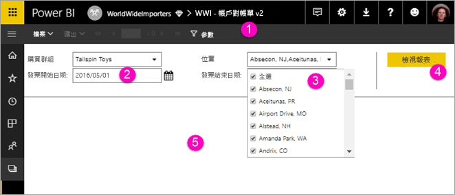

# 使用 Power BI 服務檢視編頁報表的參數

您將在此文章中了解如何使用 Power BI 服務與編頁報表的參數互動。  報表參數提供篩選報表資料的方式。 參數會提供一份可用值清單，您可以選擇一或多個值。 有時參數有預設值，有時候必須先選擇一個值，才會看到報表。  

當您檢視具有參數的報表時，報表檢視器工具列會顯示每個參數，讓您以互動方式指定值。 下圖顯示報表的參數區域，其中包含 [購買群組]  、[位置]  、[開始日期]  ，以及 [到期日期]  的參數。  

## Power BI 服務中的參數窗格

  
1.  **參數窗格** 報表檢視器工具列會顯示提示，例如 「已要求」，或每個參數的預設值。    
  
2.  **發票開始/結束日期參數** 兩個資料參數都有預設值。 若要變更日期，請在文字方塊中輸入日期，或在行事曆中選擇日期。  
  
3.  **位置參數** 位置參數已設定為允許您選取一個、多個，或所有的值。 
  
4.  **檢視報表**  輸入或變更參數值之後，請按一下 [檢視報表]  以執行報表。 

5. **預設值** 如果所有參數都有預設值，報表會在第一次檢視時自動執行。 這份報表中的某些參數沒有預設值，所以您必須在選取值之後才能看到報表。  

## 後續步驟

[Power BI 服務中的編頁報表](end-user-paginated-report.md)
