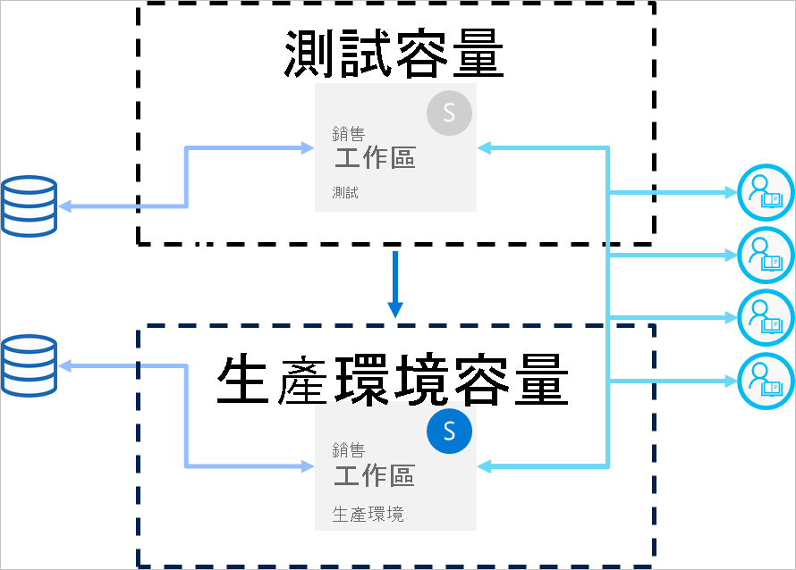

# 部署管線最佳做法 (預覽)

此文章為在內容整個生命週期中管理其內容的 BI 建立者提供指導方針。 其著重於利用部署管線來作為 BI 內容生命週期管理工具。

此文章分為四個小節：

* **內容準備** - 準備您的內容以進行生命週期管理。

* **開發** - 了解在部署管線開發階段建立內容的最佳方式。

* **測試** - 了解如何使用部署管線測試階段來測試您的環境。

* **生產** - 當您的內容可供取用時，利用部署管線生產階段。

## 內容準備

準備您的內容，以在其整個生命週期內持續管理。 在執行下列任何動作之前，請務必先檢閱此節中的資訊：

* 將您的內容發行到生產環境

* 針對特定工作區開始使用部署管線

* 發佈您的作品

### 將每個工作區視為完整的分析套件

在理想的情況下，工作區應該包含組織中一個層面 (例如部門、業務單位、專案或類別) 的完整觀點。 這可讓管理不同使用者的權限變得更輕鬆，並允許根據已計畫排程來控制整個工作區的內容發行。  

如果您使用[集中式資料集](../connect-data/service-datasets-across-workspaces.md)供整個組織使用，我們建議您建立兩種類型的工作區：

* **模型化和資料工作區** - 這些工作區將會包含所有集中式資料集

* **報表工作區** - 這些工作區將會包含所有相依的報表與儀表板

### 規劃您的權限模型

部署管線是 Power BI 物件，其有自己的[權限](deployment-pipelines-process.md#permissions)。 此外，管線包含具有自己權限的工作區。

若要實作安全且簡單的工作流程，請規劃誰可以存取管線的每個部分。 需要考量的一些注意事項為：

* 誰應該具有管線的存取權？

* 具有管線存取權的使用者在每個階段中應可以執行哪些作業？

* 誰在測試階段中檢閱內容？

* 測試階段檢閱者是否應該有權存取管線？

* 誰會監督生產階段的部署？

* 您要指派哪一個工作區？

* 您要將工作區指派至哪個階段？

* 您需要變更您所指派之工作區的權限嗎？

### 將不同階段連線到不同資料庫

生產資料庫應一律穩定且可用。 最好不要使用 BI 建立者針對其開發或測試資料集所產生的查詢加以多載。 針對開發和測試建立個別資料庫。 這有助於保護生產資料，而且不會以整個生產資料量多載開發資料庫，這可能會使系統變慢。

>[!NOTE]
>如果您的組織使用[共用集中式資料集](../connect-data/service-datasets-share.md)，您可以略過此建議。

### 在您的模型中使用參數

由於您無法在 Power BI 服務中編輯資料集資料來源，因此建議使用[參數](https://docs.microsoft.com/power-query/power-query-query-parameters) \(英文\) 來儲存連線詳細資料 (例如執行個體名稱與資料庫名稱)，而不是使用靜態連接字串。 這可讓您透過 Power BI 服務入口網站管理連線，或在稍後的階段[使用 API](https://docs.microsoft.com/rest/api/power-bi/datasets/updateparametersingroup) \(英文\)。

在部署管線中，您可以設定參數規則，針對開發、測試和生產階段設定特定值。

如果您不使用連接字串的參數，您可以定義資料來源規則，來為給定的資料集指定連接字串。 不過，在部署管線中，並非所有資料來源都支援此功能。 若要確認您可以設定資料來源的規則，請參閱[資料集規則限制](deployment-pipelines-get-started.md#dataset-rule-limitations)。

參數有其他用途，例如變更查詢、篩選，以及在報表中顯示的文字。

## 開發

此節提供使用部署管線開發階段的指導方針。

### 使用 Power BI Desktop 來編輯您的報表與資料集

請考慮將 Power BI Desktop 作為您的本機開發環境。 Power BI Desktop 可讓您嘗試、探索及檢閱報表與資料集的更新。 完成工作之後，您可以將新版本上傳至開發階段。 基於下列原因，建議您在 Desktop (而不是在 Power BI 服務) 中編輯 .pbix 檔案：

* 如果所有變更都是在相同工具上進行，則在相同 .pbix 檔案上與其他建立者共同作業比較容易。

 * 進行線上變更、下載 .pbix 檔案，然後再上傳一次，這會建立重複的報表與資料集。

* 您可以使用版本控制，讓 .pbix 檔案保持在最新狀態。

### .pbix 檔案的版本控制

如果您想要管理報表與資料集的版本歷程記錄，請使用 [Power BI 與 OneDrive 的自動同步處理](../connect-data/service-connect-to-files-in-app-workspace-onedrive-for-business.md)。 這會讓您的檔案保持更新為最新版本。 如果需要，其也可讓您取得較舊的版本。

>[!NOTE]
>只針對部署管線開發階段中的 .pbix 檔案使用與 OneDrive (或任何其他存放庫) 的自動同步處理。 請勿將 .pbix 檔案同步處理至部署管線測試與生產階段。 這會導致在整個管線部署內容時發生問題。

### 將模型開發和報表與儀表板開發分開

針對企業規模部署，建議您將資料集開發與報表與儀表板開發分開。 若只要將變更升級至報表或資料集，請使用部署管線選擇性部署選項。  

這個方法應該從 Power BI Desktop 開始，方法是為資料集與報表建立個別的 .pbix 檔案。 例如，您可以建立資料集 .pbix 檔案，並將其上傳至開發階段。 之後，您的報表作者可以只為報表建立新的 .pbix，並使用即時連線[將其連線到已發行的資料集](../connect-data/service-datasets-discover-across-workspaces.md)。 此技術可讓不同的建立者個別處理模型與視覺效果，並將其部署到生產環境。

若使用[共用資料集](../connect-data/service-datasets-share.md)，您也可以跨工作區使用此方法。

### 使用 XMLA 讀取/寫入功能來管理您的模型

將模型開發和報表與儀表板開發分開，可讓您使用原始檔控制、合併差異變更和自動化程序等進階功能。 這些變更應該在開發階段完成，讓完成的內容可以部署到測試與生產階段。 這可讓變更在部署到生產階段之前，與其他相依項目進行整合程序。

您可以使用 XMLA r/w 功能，透過在外部工作區中管理[共用資料集](../connect-data/service-datasets-share.md)，以將模型開發和視覺化分開。 共用資料集可以連線到在多個管線中管理之各種工作區中的多個報表。

## 測試

此節提供使用部署管線測試階段的指導方針。

### 模擬您的生產環境

除了確認新報表或儀表板看起來正常之外，也請務必了解從使用者的觀點來看，其是如何執行。 部署管線測試階段，可讓您模擬實際生產環境以供測試之用。

請確定在您的測試環境中，已解決這三個因素：

* 資料量

* 使用量

* 與生產環境中類似的容量

測試時，您可以使用與生產階段相同的容量。 不過，在負載測試期間，這可能會使生產環境不穩定。 若要避免不穩定的生產環境，請在資源中使用與生產容量類似的另一個容量來進行測試。 若要避免額外的成本，您可以使用 [Azure A 容量](../developer/embedded/azure-pbie-create-capacity.md)，以僅支付測試期間的費用。

### 使用資料集規則搭配實際資料來源

如果您使用測試階段來模擬實際資料使用方式，建議您將開發與測試資料來源分開。 開發資料庫應該相對較小，而測試資料庫應該盡可能類似生產資料庫。 使用[資料來源規則](deployment-pipelines-get-started.md#step-4---create-dataset-rules)來切換測試階段中的資料來源。

如果您在測試階段中使用生產資料來源，則控制從資料來源匯入的資料量會很有用。 若要這樣做，請在 Power BI Desktop 中，將參數新增至您的資料來源查詢。 使用參數規則來控制已匯入資料的數量，或編輯參數的值。
如果您不想要多載您的容量，也可以使用此方法。

### 測量效能

當您模擬生產階段時，[檢查報表負載和互動](../guidance/monitor-report-performance.md)，並找出您所做的變更是否會對其造成影響。

您也需要[監視容量的負載](../admin/service-admin-premium-monitor-capacity.md)，讓您可以在極端負載達到生產環境之前先予以攔截。  

>[!NOTE]
>建議您在將更新部署至生產階段之後，再次監視容量負載。

### 檢查相關項目

資料集或報表的變更可能會影響相關時間。 在測試期間，請確認您的變更不會影響或中斷現有項目的效能，這可能相依於所更新的項目。

您可以使用工作區[歷程檢視](../collaborate-share/service-data-lineage.md)，輕鬆地找到相關項目。

### 測試應用程式

如果您要透過應用程式將內容散發給使用者，請在應用程式進入生產環境之前，先檢閱其新版本。 由於每個部署管線階段都有自己的工作區，因此您可以針對開發與測試階段，輕鬆地發佈及更新應用程式。 這將會讓您從終端使用者的觀點來測試應用程式。

>[!IMPORTANT]
>部署程序不包含更新應用程式內容或設定。 若要將變更套用到內容或設定，您必須在必要的管線階段手動更新應用程式。

## 生產

此節提供部署管線生產階段的指導方針。

### 管理可以部署到生產環境的人員

因為部署到生產環境時應謹慎處理，所以最好只讓特定人員管理這種敏感作業。 不過，您可能想要使特定工作區的所有 BI 建立者都能夠存取管線。 這可以使用生產[工作區權限](deployment-pipelines-process.md#permissions)來管理。  

若要在階段之間部署內容，使用者必須擁有這兩個階段的成員或系統管理員權限。 請確定只有您想要部署到生產環境的人員，才會擁有生產工作區權限。 其他使用者可以擁有生產工作區參與者或檢視人員角色。 他們將會能夠從管線內查看內容，但無法部署。

此外，您應該只針對屬於內容建立程序一部分的使用者啟用管線權限，以限制對管線的存取權。

### 設定規則以確保生產階段的可用性

[資料集規則](deployment-pipelines-get-started.md#step-4---create-dataset-rules)是確保生產環境中的資料一律已連線且可供使用者使用的強大方式。 套用資料集規則後，可以執行部署，同時確保終端使用者將會在沒有擾亂的情況下看見相關資訊。

請確定您為資料集內定義的資料來源與參數設定了生產資料集規則。

### 更新生產應用程式

管線中的部署會更新工作區內容，但不會自動更新相關聯的應用程式。 如果您使用應用程式進行內容發佈，請記得在部署至生產環境之後更新應用程式，讓終端使用者能夠立即使用最新版本。  

### 快速修正內容

如果生產環境中有需要快速修正的錯誤 (Bug)，請不要將新版 .pbix 直接上傳至生產階段，或在 Power BI 服務中進行線上變更。 當那些階段中已經有內容時，不可能回溯部署到測試與開發階段。 此外，部署修正程式而不先進行測試是不好的做法。 因此，處理這個問題的正確方式是在開發階段中實作修正程式，並將其推送至其餘的部署管線階段。 這可讓您在將修正程式部署至生產環境之前，先檢查其是否正常運作。 在整個管線部署只需要幾分鐘的時間。

## 後續步驟

>[!div class="nextstepaction"]
>[部署管線簡介](deployment-pipelines-overview.md)

>[!div class="nextstepaction"]
>[開始使用部署管線](deployment-pipelines-get-started.md)

>[!div class="nextstepaction"]
>[了解部署管線程序](deployment-pipelines-process.md)

>[!div class="nextstepaction"]
>[部署管線疑難排解](deployment-pipelines-troubleshooting.md)
