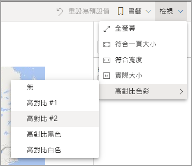

# 使用協助工具功能來取用 Power BI 報表
Power BI 有許多內建功能，可協助行動不便人士更輕鬆地取用 Power BI 報表並與其互動。 這些工具可協助使用者從報表中取得的資訊，與未使用輔助技術的人員相同。

閱讀本文時，需要知道幾個字詞：

* **焦點**是滑鼠在頁面上的位置。 焦點通常是以物件周圍的藍色框線來表示。
* **畫布**是報表的頁面區域。

下列各節描述可用來取用 Power BI 報表的協助工具。

## 鍵盤導覽

當啟動 Power BI Desktop 或 Power BI 服務時，只要按下 **Tab** 鍵，右上角就會出現工具提示。 標題為 [如何搭配使用 Power BI 與螢幕助讀程式的提示]  的連結可引導您前往本文，提供如何使用協助工具來取用報表的相關資訊。 按一下 [跳至主要內容]  連結會將您帶至報表畫布。

按 **?** 即會開啟一個對話方塊，其中包含 Power BI 中最常用的鍵盤快速鍵。 若要查看 Power BI 中可用鍵盤快速鍵的完整清單，您可以巡覽至對話方塊底部的連結，該連結會將您帶至有關[鍵盤快速鍵](desktop-accessibility-keyboard-shortcuts.md)的 Power BI 文件。

![[鍵盤快速鍵] 對話方塊](media/desktop-accessibility/accessibility-consuming-tools-03.png)

您可以使用 **CTRL + F6**，在報表頁面索引標籤之間或指定報表頁面上的物件之間切換焦點。 當焦點在載入的報表頁面時，請使用 **TAB** 鍵將焦點移至頁面上的每個物件，包括所有文字方塊、影像、圖形和圖表。 

一般來說，使用 **Enter** 選取或輸入以及使用 **Esc** 結束是 Power BI 中的常見命令。

### 視覺效果的鍵盤導覽

許多 Power BI 報表建立者都會建置包含大量資料的報表。 當在視覺效果中移動時，使用 Tab 鍵瀏覽視覺效果的每個元素可能會很麻煩。 視覺效果鍵盤導覽已經設計為具有三個層級的階層。 下列各段落會描述這三個層級。

若要巡覽第一個層級，當巡覽至視覺效果時，請按 **Ctrl + 向右鍵**以進入該視覺效果。 進入該視覺效果之後，您可以按 **Tab** 鍵來循環切換視覺效果的主要區域。 您可以循環切換的主要區域為資料繪圖區域、軸類別 (若適用於視覺效果) 和圖例 (若視覺效果具有圖例)。

下列 .gif 顯示使用者如何循環切換視覺效果的第一個層級：

第二個階層層級是進入視覺效果的其中一個主要區域 (資料繪圖區域、X 軸類別、圖例)。 當取用報表時，可以移至其中一個主要區域，然後在視覺效果的該區段中循環切換資料點或類別。 決定要進一步探索的區域之後，您可以按 **Enter** 鍵以循環切換該特定區域。

如果您要選取數列中的所有資料點，請巡覽至圖例，然後按 **Enter**。 進入圖例後，您可以按 **Tab** 鍵以在圖例中巡覽不同的類別。 請按 **Enter** 來選取特定數列。

如果您要選取特定資料點，請巡覽至資料繪圖區域，然後按 **Enter**。 進入資料繪圖區域後，您可以按 **Tab** 來巡覽資料點。 如果視覺效果有多個數列，則可以按**向上鍵**或**向下鍵**來跳至不同數列中的資料點。

如果要選取類別軸中的所有資料點，請巡覽至軸標籤，然後按 **Enter**。 進入軸標籤後，您可以按 **Tab** 來巡覽標籤名稱。 請按 **Enter** 來選取標籤名稱。

如果已巡覽至圖層，您可以按 **Esc** 來跳出該圖層。 下列 .gif 顯示使用者可以如何進入和結束視覺效果的層級，並選取資料點、X 軸類別標籤，跳至不同的數列，然後選取數列中的所有資料點。

如果您發現自己在使用鍵盤時無法巡覽至物件或視覺效果，這可能是因為報表作者已決定要從定位順序中隱藏該物件。 報表作者通常會從定位順序中隱藏裝飾性物件。 如果發現無法以邏輯方式使用 Tab 鍵瀏覽報表，您應該洽詢報表作者。 報表作者可以設定物件和視覺效果的定位順序。

### 交叉分析篩選器的鍵盤導覽

交叉分析篩選器也有內建的協助工具功能。 當選取交叉分析篩選器時，若要調整交叉分析篩選器的值，請使用 **Ctrl + 向右鍵**，在交叉分析篩選器內的各種控制項之間移動。 例如，當你一開始按下 **CTRL + 向右鍵**時，焦點會位在橡皮擦上。 接著，按下**空格鍵**則相當於按一下橡皮擦按鈕，其會清除交叉分析篩選器上的所有值。

您可以透過按 **Tab** 鍵，在交叉分析篩選器的控制項之間移動。在橡皮擦上時按 **Tab** 鍵會移到下拉式按鈕。 再按一次 **TAB** 鍵，則會移動到第一個交叉分析篩選器的值 (若交叉分析篩選器有多個值的話，例如一個範圍)。

### 切換頁面

當焦點在報表頁面索引標籤時，請使用 **TAB** 鍵或**方向**鍵將焦點從一個報表頁面移至下一個報表頁面。 螢幕助讀程式會讀出報表頁面的標題，以及其是否處於選取狀態。 若要載入焦點目前所在的報表頁面，請使用 **Enter** 鍵或 **空格鍵**。

### 存取視覺效果標頭
當您在視覺效果之間巡覽時，您可以按 **ALT + SHIFT + F10** 將焦點移至視覺效果標題。 視覺效果標題包含各種選項，包括排序、匯出圖表後的資料，以及焦點模式。 您在視覺效果標頭中所看到圖示將取決於報表作者決定要顯示的選項。

## 螢幕助讀程式

當檢視報表時，最好將掃描模式關閉。 Power BI 的處理方式應該更像是應用程式而不像文件，因此已設定自訂導覽，讓您更容易進行巡覽。 若使用螢幕助讀程式搭配 Power BI Desktop，則還應該在開啟 Power BI Desktop 之前，先確定螢幕助讀程式已開啟。

巡覽物件時，螢幕助讀程式會讀取物件的類型和標題 (如果有的話)。 若報表作者有提供的話，螢幕助讀程式也會讀取該物件 (替代文字) 的描述。

### 顯示資料
您可以按 **ALT + SHIFT + F11** 來表示 [顯示資料]  視窗的無障礙版本。 這個視窗可讓您在 HTML 表格中探索視覺效果中使用的資料，並使用您平常搭配螢幕助讀程式使用的相同鍵盤快速鍵。

[顯示資料]  是一種 HTML 資料表，只有透過此鍵盤快速鍵才可供螢幕助讀程式存取。 如果從視覺效果標頭中的選項開啟 [顯示資料]  ，則會顯示與螢幕助讀程式「不」  相容的資料表。  當透過鍵盤快速鍵使用 [顯示資料]  時，請開啟掃描模式，以利用螢幕助讀程式提供的所有快速鍵。

若要結束 [顯示資料]  檢視並返回報表，請按 **Esc**。

## 高對比模式

Power BI 服務會嘗試偵測針對 Windows 選取的高對比設定。 該偵測之有效性和正確性取決於顯示 Power BI 服務的瀏覽器。 如果您想要在 Power BI 服務中手動設定佈景主題，可選取 [檢視] > [高對比色彩]  ，然後選取您想要套用至報表的佈景主題。

## 後續步驟

Power BI 協助工具的文章集合如下：

* [Power BI 中的協助工具概觀](desktop-accessibility-overview.md) 
* [建立具協助功能的 Power BI 報表](desktop-accessibility-creating-reports.md) 
* [使用協助工具來建立 Power BI 報表](desktop-accessibility-creating-tools.md)
* [Power BI 報表的協助工具鍵盤快速鍵](desktop-accessibility-keyboard-shortcuts.md)
* [報表協助工具檢查清單](desktop-accessibility-creating-reports.md#report-accessibility-checklist)
