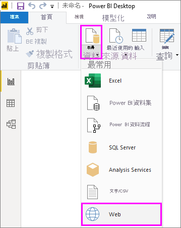

# 在 Power BI Desktop 中從範例新增資料行
透過在 Power Query 編輯器中「從範例新增資料行」  ，您只要為新的資料行提供一或多個範例值，就可以將資料行新增至資料模型。 您可以從選取範圍建立新的資料行範例，或根據資料表中所有現有的資料行來提供輸入。

使用「從範例新增資料行」  可讓您快速且輕鬆地建立新資料行，且非常適合用於下列情況：

- 您知道想要的新資料行資料，但不確定哪種轉換或轉換的集合能得出該資料。
- 您已經知道需要哪種轉換，但不確定在 UI 中選取哪個項目可以進行轉換。
- 您完全了解在 *M* 語言中使用「自訂資料行」  運算式所需要的轉換，但在 UI 中無法使用其中一或多個運算式。

從範例新增資料行既容易又簡單。 接下來幾節將示範其簡易程度。

## 從範例新增資料行

若要從維基百科取得範例資料，請從 Power BI Desktop 功能區的 [常用]  索引標籤中選取 [取得資料]   > [Web]  。 

在出現的對話方塊中貼上下列 URL，然後選取 [確定]  ： 

*https:\//wikipedia.org/wiki/List_of_states_and_territories_of_the_United_States*

在 [導覽器]  對話方塊中，選取 [States of the United States of America] \(美國州別和領地列表\)  資料表，然後選取 [轉換資料]  。 該資料表會隨即在 Power Query 編輯器中開啟。

或者，若要從 Power BI Desktop 開啟已載入的資料，請從功能區的 [常用]  索引標籤中，選取 [編輯查詢]  。 該資料會隨即在 Power Query 編輯器中開啟。 

![從 Power BI Desktop 選取 [編輯查詢]](media/desktop-add-column-from-example/add-column-from-example_05.png)

在 Power Query 編輯器中開啟範例資料之後，請選取功能區上的 [新增資料行]  索引標籤，然後選取 [來自範例的資料行]  。 選取**來自範例的資料行**圖示本身，從所有現有的資料行建立資料行，或是選取下拉式箭號，在 [來自所有資料行]  或 [來自選取項目]  之間進行選擇。 在此逐步解說中，請使用 [來自所有資料行]  。

![選取 [從範例新增資料行]](media/desktop-add-column-from-example/add-column-from-example_03.png)

## [從範例新增資料行] 窗格
當您選取 [新增資料行]   > [從範例]  時，隨即會在資料表頂端開啟 [從範例新增資料行]  窗格。 新的 [資料行 1]  會出現在現有資料行右側 (您可能需要捲動才能看到所有資料行)。 當您在 [資料行 1]  的空白儲存格中輸入範例值時，Power BI 會建立規則和轉換以符合您的範例，並使用這些項目來填滿資料行的其餘部分。

請注意，[來自範例的資料行]  也會顯示為 [查詢設定]  窗格中 [套用的步驟]  。 一如往常，Power Query 編輯器會記錄轉換步驟，並依序將其套用至查詢。

![[從範例新增資料行] 窗格](media/desktop-add-column-from-example/add-column-from-example_04.png)

當您在新資料行中鍵入範例時，Power BI 會根據其所建立轉換來顯示資料行其餘部分外觀的預覽。 例如，如果您在第一個資料列中鍵入 **Alabama**，它會對應到資料表第一個資料行中的 *Alabama* 值。 當您按下 Enter 時，Power BI 即會根據第一個資料行的值填入新資料行其餘部分，並將資料行命名為 **Name & postal abbreviation[12] - Copy** (名稱與郵遞區號縮寫[12] - 複本)。

現在，請移至新資料行的 **Massachusetts[E]** (麻塞諸塞州[E])資料列，並刪除該字串的 **[E]** 部分。 Power BI 會偵測到變更，並使用此範例建立轉換。 Power BI 會在 [從範例新增資料行]  窗格中描述轉換，並將資料行重新命名為 **Text Before Delimiter** (分隔符號前的文字)。 

Power Query 編輯器會在您持續提供範例的同時，新增到轉換。 當您完成時，請選取 [確定]  認可變更。 

您可以按兩下資料行標題，或以滑鼠右鍵按一下新資料行，然後選取 [重新命名]  ，將新資料行重新命名為想要的任何名稱。 

請觀看這段影片，以了解使用範例資料來源，**從範例新增資料行**的實際運作： 

[Power BI Desktop:Add Column From Examples](https://www.youtube.com/watch?v=-ykbVW9wQfw) (Power BI Desktop：從範例新增資料行)。 

## 支援的轉換清單
使用 [從範例新增資料行]  時，可以使用許多但不是全部的轉換。 下列清單顯示支援的轉換：

**一般**

- 條件資料行

**參考**
  
- 特定資料行的參考，包括修剪、清除及大小寫轉換

**文字轉換**

- 合併 (支援結合常值字串與整個資料行值)
- 取代
- 長度
- 擷取   
  - 前幾個字元
  - 後幾個字元
  - 範圍
  - 分隔符號前的文字
  - 分隔符號後的文字
  - 分隔符號之間的文字
  - 長度
  - 移除字元
  - 保留字元

> [!NOTE]
> 所有「文字」  轉換皆考量到欄位值可能需要的修剪、清除或套用大小寫轉換。

**日期轉換**

- 日
- 週中的日
- 星期幾名稱
- 年中的日
- Month
- 月份名稱
- 年中的季度
- 月中的週
- 年中的週
- 年
- 年齡
- 年初
- 年底
- 月初
- 月底
- 季初
- 月中日數
- 季末
- 一週開始
- 一週結束
- 月中的日
- 一日開始
- 一日結束

**時間轉換**

- Hour
- 分鐘
- Second  
- 當地時間

> [!NOTE]
> ：請留意，所有「日期」  和「時間」  轉換都可能必須將資料行值轉換為「日期」  或「時間」  ，或「日期時間」  。

**數字轉換** 

- 絕對值
- 反餘弦值
- 反正弦值
- 反正切值
- 轉換成數字
- 餘弦值
- Cube
- 除
- 指數
- 階乘
- 整除
- 是偶數
- 是奇數
- 自然對數
- 以 10 為底數的對數
- 模數
- 乘
- 向下四捨五入
- 向上四捨五入
- 符號
- 正弦值
- 平方根
- 平方
- 減
- 加總
- 正切值
- 建立貯體/範圍

