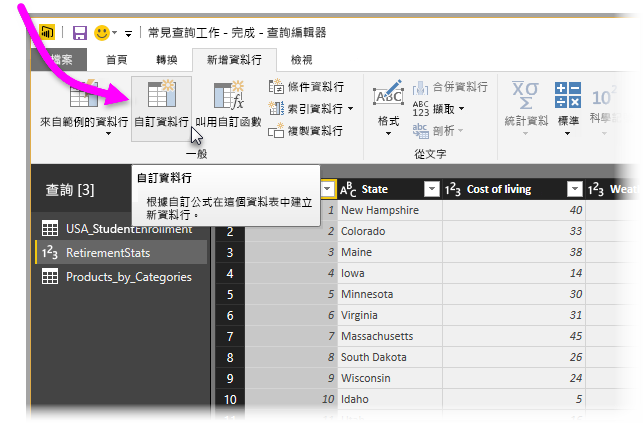

# 在 Power BI Desktop 中新增自訂資料行

在 Power BI Desktop 中，您可以使用查詢編輯器，輕鬆將資料的新自訂資料行新增至模型。 使用查詢編輯器，您可以建立自訂資料行並為其重新命名來建立定義自訂資料行的 [PowerQuery M 公式查詢](https://docs.microsoft.com/powerquery-m/quick-tour-of-the-power-query-m-formula-language)。 PowerQuery M 公式查詢有[完整的函式參考內容集](https://docs.microsoft.com/powerquery-m/power-query-m-function-reference)。 

當您在查詢編輯器中建立自訂資料行時，Power BI Desktop 會在查詢的 [查詢設定]  中，將其新增為 [套用的步驟]  。 您可以隨時進行變更、移動或修改。

![[新增自訂資料行] 頁面](media/desktop-add-custom-column/add-custom-column_01.png)

## 使用查詢編輯器新增自訂資料行

若要開始建立自訂資料行，請遵循下列步驟：

1. 啟動 Power BI Desktop 並載入一些資料。

2. 從功能區的 [首頁]  索引標籤，選取 [編輯查詢]  ，然後從功能表選取 [編輯查詢]  。

   ![選取 [編輯查詢]](media/desktop-add-custom-column/add-column-from-example_02.png)

   [查詢編輯器]  視窗隨即出現。 

2. 從功能區的 [新增資料行]  索引標籤，選取 [自訂資料行]  。

   

   [新增自訂資料行]  視窗隨即出現。

## [新增自訂資料行] 視窗

[新增自訂資料行]  視窗具有下列功能： 
- 可用的資料行清單，位於右側的 [可用的資料行]  清單中。

- 自訂資料行的初始名稱，位於 [新資料行名稱]  方塊中。 您可以重新命名此資料行。

- [PowerQuery M 公式查詢](https://docs.microsoft.com/powerquery-m/power-query-m-function-reference)，位於 [自訂資料行公式]  方塊中。 您可以建置用來定義新自訂資料行的公式來建立這些查詢。 

   ![[新增自訂資料行] 頁面](media/desktop-add-custom-column/add-custom-column_03.png)

## 為您的自訂資料行建立公式

1. 從右側的 [可用的資料行]  清單選取資料行，然後選取清單下方的 [插入]  將其新增至自訂資料行公式。 您也可以在清單中按兩下來新增資料行。

2. 當您輸入公式並建置資料行時，請注意 [新增自訂資料行]  視窗底部的指標。 

   如果沒有任何錯誤，您會看到綠色的核取記號，以及「未偵測到任何語法錯誤」  訊息。

   ![[新增自訂資料行] 頁面上的成功語法核取記號](media/desktop-add-custom-column/add-custom-column_04.png)

   如果發生語法錯誤，您會看到黃色的警告圖示，以及公式中錯誤發生位置的連結。

   ![[新增自訂資料行] 頁面上的錯誤](media/desktop-add-custom-column/add-custom-column_05.png)

3. 選取 [確定]  。 

   Power BI Desktop 會將自訂資料行新增至模型，並在 [查詢設定]  中將 [已新增自訂]  步驟新增至查詢的 [套用的步驟]  清單。

   ![將自訂資料行新增至 [查詢設定]](media/desktop-add-custom-column/add-custom-column_06.png)

4. 若要修改您的自訂資料行，請在 [套用的步驟]  清單中，按兩下 [已新增自訂]  步驟。 

   [新增自訂資料行]  視窗隨即出現，並顯示您所建立的自訂資料行公式。

## 在自訂資料行使用進階編輯器

建立查詢之後，您也可以使用 [進階編輯器]  來修改查詢的任何步驟。 若要這樣做，請遵循下列步驟進行︰

1. 在 [查詢編輯器]  視窗中，選取功能區上的 [檢視]  索引標籤。 

2. 選取 [進階編輯器]  。

   [進階編輯器]  頁面隨即出現，可讓您完整控制查詢。 

   ![[進階編輯器] 頁面](media/desktop-add-custom-column/add-custom-column_07.png)

   
## 後續步驟

- 您可以透過其他方式來建立自訂資料行，例如依據您提供給查詢編輯器的範例來建立資料行。 如需詳細資訊，請參閱[在 Power BI Desktop 中從範例新增資料行](desktop-add-column-from-example.md)。

- 如需 Power Query M 參考資訊，請參閱 [Power Query M 函式參考](/powerquery-m/power-query-m-function-reference)。

