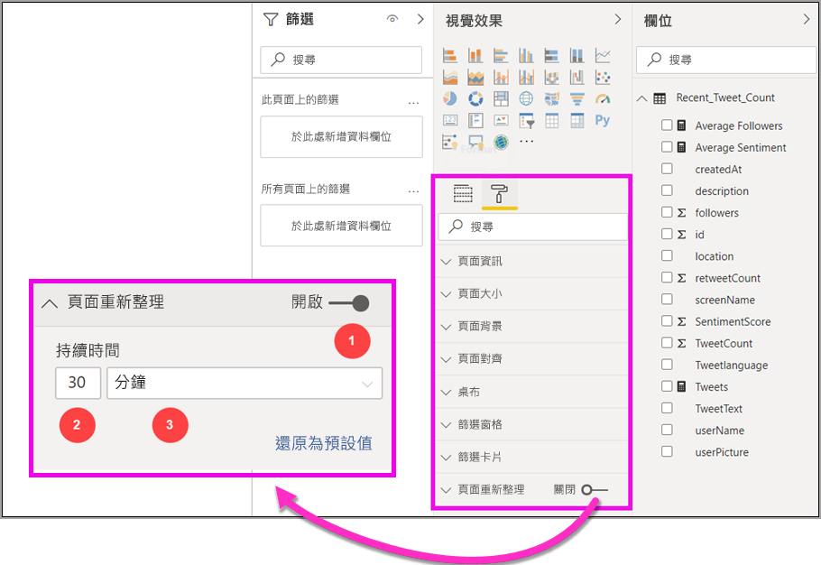
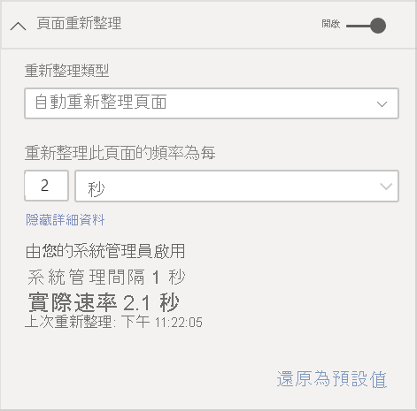
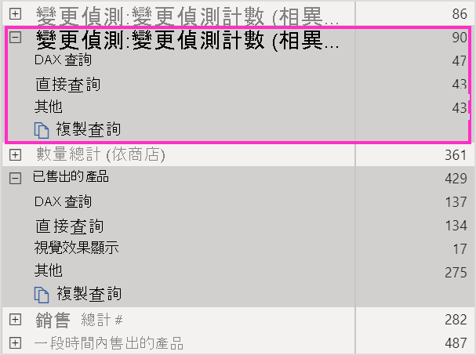
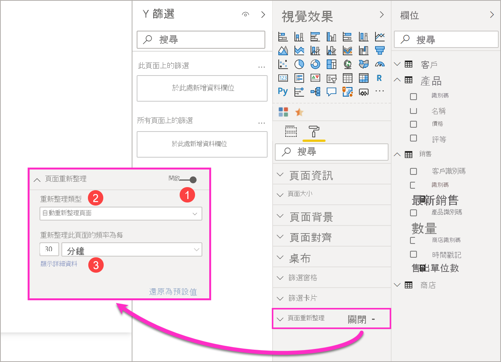
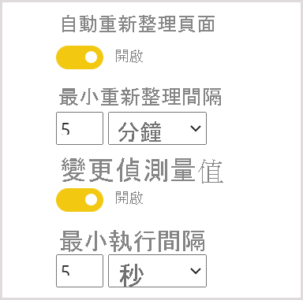

# Power BI 的自動重新整理頁面

監視重大事件時，請務必在來源資料更新後立即重新整理資料。 例如，在製造業中，知道機器何時運作不正常或即將運作不正常非常重要。 如果在監視社交媒體情緒之類的信號，您會想要在發生突然變更時便立刻知道。

Power BI 中的自動重新整理頁面功能，可讓您作用中的報表頁面以預先定義的步調，查詢 [DirectQuery 來源](../connect-data/desktop-directquery-about.md)的新資料。

## 重新整理類型

使用自動重新整理頁面時，有兩種重新整理類型可用：固定間隔與變更偵測。

### 固定間隔

此重新整理類型可讓您根據常數間隔 (例如一秒或五分鐘)，更新報表頁面中的所有視覺效果。 當到達該特定間隔時，該頁面中的所有視覺效果都會將更新查詢傳送至資料來源，並據以更新。

### 變更偵測

此重新整理類型可讓您根據偵測到的資料變更，而不是特定的重新整理間隔，來重新整理頁面上的視覺效果。 具體而言，此量值會輪詢您 [DirectQuery 來源](../connect-data/desktop-directquery-about.md)的變更。 除了定義量值之外，您也必須選取 Power BI Desktop 檢查變更的頻率。 發佈至服務時，只有屬於 Premium 容量的工作區才支援此重新整理類型。

## 使用 Power BI Desktop 的自動重新整理頁面來撰寫報表

自動重新整理頁面僅適用於 [DirectQuery 來源](../connect-data/desktop-directquery-about.md)，所以只有當您連線至 DirectQuery 資料來源時才可以使用。 此限制適用於兩種自動重新整理頁面類型。

若要使用 Power BI Desktop 的自動重新整理頁面，請選取您想要啟用自動重新整理頁面的報表頁面。 在 [視覺效果] 窗格中，選取 [格式化] 按鈕 (油漆滾筒)，然後在窗格底部附近尋找 [頁面重新整理] 區段。

1. 開啟或關閉頁面重新整理。
2. 重新整理類型
3. 輸入與資訊 (依重新整理類型而定)

只有當您連線至 [DirectQuery 來源](../connect-data/desktop-directquery-about.md)時，才能使用 [頁面重新整理] 卡。 若要啟用自動重新整理頁面，切換開關必須位於「開啟」位置。 所需的輸入與所提供的資訊，將取決於選取的重新整理類型。

### 固定間隔設定

選取 [自動頁面重新整理] 作為重新整理類型時，您必須提供所需的重新整理間隔。 預設值為 30 分鐘。 (最小重新整理間隔保留為一秒)。您的報表將會在您設定的間隔開始重新整理。

當按一下 [顯示詳細資料] 時，Power BI 將提供進一步的資訊：

- 當您的系統管理員啟用此功能 (僅限登入您的 Power BI 帳戶時)
- 當您的系統管理員允許最小間隔 (僅限登入您的 Power BI 帳戶時)
- 重新整理的實際速率 (通常比您選取的間隔長)
- 上次重新整理時間

### 變更偵測設定

當選取 [變更偵測] 作為重新整理類型時，您會看到**新增變更偵測**的連結。 您也可以從功能區的 [模型] 索引標籤存取 [變更偵測] 視窗。 然後按一下 [頁面重新整理] 區段上的**變更偵測**圖示。 最後，您可以用滑鼠右鍵按一下或選取 [值] 中任何值旁的下拉式箭號，然後從功能表選取 [變更偵測]。

![[變更偵測] 卡](media/desktop-automatic-page-refresh/automatic-page-refresh-03.png)

開啟視窗之後，您會看到 [量值類型] 選項，您可以在此選取現有的量值，或從頭開始建立新的量值。 當選取現有的量值時，您只要從欄位清單中選取想要的量值，或將其拖放至 [Choose existing measure] \(選擇現有量值\) 區段。 建立新量值時，您可以 [選擇計算] 計數、計數相異、最小值、最大值與總計間的量值。 例如，您可以使用計數相異來計算客戶識別碼，並只在新客戶新增至清單時才重新整理。 一旦您選取了量值，就必須定義 Power BI [檢查變更] 的頻率。 這就是 Power BI 計算量值與輪詢變更的頻率間隔。 按一下 [套用] 之後，附帶變更偵測圖示的新量值就會出現在您的欄位清單中。

![[變更偵測] 視窗](media/desktop-automatic-page-refresh/automatic-page-refresh-04.png)

接著，回到 [頁面重新整理] 區段，您將會看到用於變更偵測的量值資訊，以及為參考所定義的間隔。

![包含詳細資料的 [變更偵測] 卡](media/desktop-automatic-page-refresh/automatic-page-refresh-05.png)

> [!NOTE]
> 每個模型只允許一個變更偵測量值。

## 判斷重新整理間隔

啟用自動頁面重新整理時，Power BI Desktop 會持續將查詢傳送至您的 DirectQuery 來源。 傳送查詢之後，傳回資料之前會有延遲。 因此，如果要縮短重新整理間隔，您應該確認查詢已在設定的間隔內成功傳回查詢的資料。 如果未在間隔內傳回資料，視覺效果的更新頻率會比設定的少。

這些考量都適用於兩種重新整理類型：固定間隔與變更偵測。 主要的差異在於，在變更偵測中，只有一個查詢會在固定間隔回到來源，而且只有在變更偵測量值變更時，才會觸發視覺效果重新整理。

最佳做法是，重新整理間隔至少應符合您預期的新資料抵達速率：

* 如果新資料每隔 20 分鐘抵達來源，則您的重新整理間隔不得少於 20 分鐘。
* 如果新資料每秒抵達，則將間隔設定為一秒。

針對較低的重新整理間隔 (例如一秒)，請考慮下列因素，如下所示：

- DirectQuery 資料來源的類型
- 您的查詢在其上建立的負載
- 您的報表檢視器與容量資料中心之間的距離

您可以使用 Power BI Desktop 中的[效能分析器](desktop-performance-analyzer.md)，以及 [頁面重新整理] 區段中的 [顯示詳細資料] 功能表，估計固定間隔重新整理類型的傳回時間。 效能分析器可讓您檢查每個視覺查詢是否有足夠的時間返回來源的結果。 其也可讓您判斷所花費的時間。 根據效能分析器的結果，您可以調整資料來源，也可以在您的報表中試驗其他視覺效果和量值。

下圖顯示效能分析器中的 DirectQuery 來源結果：

讓我們考慮一些關於此資料來源的其他特性：

- 資料會以 2 秒的速率抵達
- 效能分析器顯示的最長查詢 + 顯示時間約 4.9 秒 (4,688 毫秒)
- 資料來源設定為每秒處理約 1,000 個並行查詢
- 您預期約有 10 名使用者會在同一時間檢視報表

因此，會產生下列方程式：

- **5 個視覺效果 x 10 個使用者 = 大約 50 個查詢**

此計算結果顯示的負載比資料來源可以支援的負載多很多。 資料會以兩秒的速率抵達，因此這應該是您的重新整理頻率。 但是，由於查詢需要大約五秒的時間才能完成，因此您應該將其設定為超過五秒。

另請注意，當您將報表發佈至服務時，此結果可能會不同。 此差異是因為報表將使用雲端中裝載的 Azure Analysis Services 執行個體而導致。 您可以據以調整您的重新整理頻率。

為考慮查詢與重新整理計時，Power BI 只會在所有剩餘的重新整理查詢都完成時才執行下一個重新整理查詢。 因此，即使您的重新整理間隔比查詢處理所需的時間短，Power BI 也只會在剩餘的查詢完成後再次重新整理。

在變更偵測重新整理類型的情況下，這些考量仍然適用。 另外，即使與您報表中的任何視覺效果皆不相符，[效能分析器](desktop-performance-analyzer.md)也會為您顯示變更偵測量值查詢的結果。 我們已提供此功能，讓您能夠遵循先前所述的相同指引，針對此特定類型的量值進行疑難排解。 此重新整理類型的主要差異是：僅有一個查詢會前往資料來源，而不是所有視覺效果的所有查詢。 就算有多名使用者在檢視報表也是如此。

以之前討論過的同一案例為例：

- **5 個視覺效果的 1 個變更偵測量值查詢，無論有多少人檢視，都只會產生一個查詢**

- **當變更偵測量值觸發更新時，假設仍為之前的相同案例，但有 5 個視覺效果 x 10 個使用者 = 大約 50 個查詢**

總而言之，使用變更偵測時，在偵測到變更之前，只會傳送一個查詢到資料來源。 發生這種情況時，會套用用於固定間隔重新整理類型的相同邏輯，為所有產生相同查詢數目的使用者更新所有視覺效果。 此方法在長期執行時應該更有效率。

現在，讓我們看看您可以如何以容量管理員身分偵測並診斷效能問題。 您也可以參此本文章稍後的[常見問題集](#frequently-asked-questions)一節，以取得有關效能與疑難排解的其他問題與解答。

## Power BI 服務中的自動頁面重新整理

只要資料來源是 [DirectQuery](../connect-data/desktop-directquery-about.md)，您也可以為已在 Power BI Desktop 中發佈的報表設定自動重新整理頁面。

在 Power BI 服務中為報表設定自動重新整理頁面的步驟，與 Power BI Desktop 類似。 於 Power BI 服務中設定時，自動頁面重新整理也支援[內嵌的 Power BI](../developer/embedded/embedding.md) 內容。 下圖顯示 Power BI 服務的 [頁面重新整理] 設定：

1. 開啟或關閉頁面重新整理。
2. 重新整理類型
3. 輸入與資訊 (依重新整理類型而定)

> [!NOTE]
> 將已啟用自動頁面重新整理的報表從 Power BI Desktop 發佈到服務時，您必須在 [資料集設定] 功能表中提供 DirectQuery 資料來源的認證。 您可以設定認證，讓報表檢視者依來源設定的任何安全性，以自己的身分識別存取此資料來源。 如果使用變更偵測量值，則一律使用作者的認證來評估。

### 頁面重新整理間隔

Power BI 服務中允許的頁面重新整理類型與間隔，會受報表的工作區類型影響。 這適用於下列情況：

* 將報表發行至已啟用自動頁面重新整理的工作區
* 編輯工作區中已有的頁面重新整理間隔
* 直接在服務中建立報表

Power BI Desktop 沒有重新整理間隔的限制，可以短到每秒一次。 但當報表發佈至 Power BI 服務時，就會套用某些限制，這些會在下列各節中說明。

### 重新整理間隔的限制

在 Power BI 服務中，無論您是否使用 Premium 服務和 Premium 容量管理員設定，都會套用報表發佈工作區的自動重新整理頁面限制。

為釐清這些限制的運作方式，讓我們從容量與工作區的一些背景開始著手。

*容量*是重要的 Power BI 概念。 其代表用來裝載及傳遞 Power BI 內容的一組資源 (儲存體、處理器與記憶體)。 容量為「共用」或「專用」。 *共用容量*會與其他 Microsoft 客戶共用。 *專用容量*完全交托給單一客戶。 如需專用容量的簡介，請參閱[管理 Premium 容量](../admin/service-premium-capacity-manage.md)。

在共用的容量中，工作負載是在與其他客戶共用的計算資源上執行。 容量必須共用資源，因此會有限制，以確保*公平使用*，例如，設定模型大小上限 (1 GB) 與每日重新整理頻率上限 (每天 8 次)。

Power BI *工作區*位於容量之內。 其代表安全性、共同作業和部署容器。 每個 Power BI 使用者都有個人工作區，稱為**我的工作區**。 您可以建立額外的工作區以啟用共同作業和部署。 其又稱為*工作區*。 根據預設，工作區 (包括個人工作區) 是在共用容量中建立的。

以下是這兩個工作區案例的一些詳細資料：

**共用工作區**。 針對一般工作區 (不屬於進階版容量的工作區)，自動頁面重新整理的最小間隔為 30 分鐘 (允許的最低間隔)。 共用容量中無法使用變更偵測重新整理類型。

**進階工作區**。 Premium 工作區中的自動重新整理頁面可用性 (固定間隔和變更偵測)，取決於 Premium 系統管理員為 Power BI Premium 容量設定的工作負載設定。 有兩個變數可能會影響您設定自動頁面重新整理的能力：

 - **功能開啟/關閉**。 如果您的容量管理員已停用此功能，您將無法在已發佈的報表中設定任何類型的頁面重新整理。 固定間隔與變更偵測可以分別開啟及關閉。

 - **最小重新整理間隔**。 當啟用固定間隔的自動重新整理頁面時，容量系統管理員必須設定最小的重新整理間隔 (預設值為五分鐘)。 如果您的間隔低於最小值，則 Power BI 服務會覆寫您的間隔，以遵循容量管理員所設定的最小間隔。

 - **最小執行間隔**。 當啟用變更偵測時，容量系統管理員必須設定最小的執行間隔 (預設值為五秒)。 如果您的間隔低於最小值，則 Power BI 服務會覆寫您的間隔，以遵循容量管理員所設定的最小間隔。

下表描述可使用此功能的更多詳細資料，以及每個容量類型與[儲存模式](../connect-data/service-dataset-modes-understand.md)的限制：

| 儲存模式 | 專用容量 | 共用容量 |
| --- | --- | --- |
| DirectQuery | **支援 FI**：是  **支援 CD**：是  **最小值**：1 秒  **系統管理員覆寫**：是 | **支援 FI**：是  **支援 CD**：否  **最小值**：30 分鐘  **系統管理員覆寫**：否 |
| 匯入 | **支援 FI**：否  **支援 CD**：否  **最小值**：N/A  **系統管理員覆寫**：N/A | **支援 FI**：否  **支援 CD**：否  **最小值**：N/A  **系統管理員覆寫**：N/A |
| 混合模式 (DirectQuery + 其他資料來源) | **支援 FI**：是  **支援 CD**：是  **最小值**：1 秒  **系統管理員覆寫**：是 | **支援 FI**：是  **支援 CD**：否  **最小值**：30 分鐘  **系統管理員覆寫**：否 |
| Live Connect AS | **支援 FI**：否  **支援 CD**：否  **最小值**：N/A  **系統管理員覆寫**：N/A | **支援 FI**：否  **支援 CD**：否  **最小值**：N/A  **系統管理員覆寫**：N/A |
| Live Connect PBI | **支援 FI**：否  **支援 CD**：否  **最小值**：N/A  **系統管理員覆寫**：N/A | **支援 FI**：否  **支援 CD**：否  **最小值**：N/A  **系統管理員覆寫**：N/A |

*表格圖例：*
1. *FI：* 「固定間隔」
2. *CD：* 「變更偵測」

## 考量與限制

在 Power BI Desktop 或 Power BI 服務中使用自動頁面重新整理時，有幾件事要謹記在心：

* 自動頁面重新整理不支援匯入、LiveConnect 與推送儲存模式。  
* 支援至少有一個 DirectQuery 資料來源的複合模型。
* Power BI Desktop 沒有重新整理間隔的限制。 固定間隔與變更偵測重新整理類型的間隔頻率可以頻繁到一秒。 當報表發佈至 Power BI 服務時，就會套用特定限制，如此文章[稍早](#restrictions-on-refresh-intervals)所述。
* 每個資料集只能有一個變更偵測量值。
* Power BI 租用戶最多只能有 10 個使用變更偵測量值的模型。

### 效能診斷

自動頁面重新整理適用於監視案例，以及探索快速變更的資料。 但是，有時候這可能會造成容量或資料來源的過度負載。

為防止資料來源發生過度負載，Power BI 具有下列保護措施：

- 所有自動頁面重新整理查詢都會以較低的優先順序執行，以確保互動式查詢 (例如頁面載入與交叉篩選視覺效果) 的優先順序較高。
- 如果您的查詢在下一次重新整理週期之前還未完成，Power BI 不會發出新的重新整理查詢，直到先前的查詢完成為止。 例如，如果您的重新整理間隔為一秒，而且查詢平均需要四秒才能完成，Power BI 實際上只會每四秒發出一次查詢。

您仍然會在兩個區域中遇到效能瓶頸：

1. **容量**。 查詢會先叫用進階版容量，這會摺疊並評估從報表視覺效果產生的 DAX 查詢並評估為來源查詢。
2. **DirectQuery 資料來源**。 接著會針對來源執行上一個步驟中的已轉譯查詢。 來源將是您的 SQL Server 執行個體、SAP Hana 來源等等。

使用可供系統管理員使用的[進階版容量計量應用程式](../admin/service-admin-premium-monitor-capacity.md)時，您可以將低優先順序查詢所使用的容量視覺化。

低優先順序查詢是由自動頁面重新整理查詢與模型重新整理查詢所組成。 目前無法區分是來自自動頁面重新整理還是模型重新整理查詢的負載。

如果您注意到您的容量使用低優先順序查詢而超載，您可以採取幾個動作：

- 要求較大的進階版 SKU。
- 要求報表擁有者降低重新整理間隔。
- 在容量管理員入口網站中，您可以：
   - 關閉該容量的自動頁面重新整理。
   - 提高最小重新整理間隔，這會影響該容量的所有報表。

### 常見問題集

**我是報表作者。我在 Power BI Desktop 上將報表重新整理間隔定義為 1 秒，但在發佈之後，我的報表未在服務中重新整理。**

* 請確認是否已為該頁面開啟自動頁面重新整理。 此設定是針對每頁，因此您必須確定已針對報表中想要重新整理的每個頁面開啟此設定。
* 檢查您是否已上傳到具有附加 Premium 容量的工作區。 若您尚未這麼做，固定間隔的重新整理間隔會鎖定在 30 分鐘，而且不能用於變更偵測。
* 如果您的報表位於進階版工作區，請詢問您的系統管理員是否已針對附加的容量啟用此功能。 此外，請確定容量的最小重新整理間隔等於或低於您報表的間隔。 這會分別套用至固定間隔與變更偵測

**我是容量管理員。我變更了自動頁面重新整理間隔的設定，但是這些變更沒有反映出來。換句話說，報表仍以非預期速率重新整理，或即使我已開啟自動頁面重新整理，也不會重新整理。**

* 在容量管理 UI 中進行的自動頁面重新整理設定變更，最多需要 5 分鐘的時間才能傳播至報表。
* 除了開啟容量的自動頁面重新整理之外，您還需要為您要啟用該功能的報表頁面開啟該功能。
* 這兩種重新整理類型會分別管理，所以請務必開啟您啟用的重新整理類型。

**我的報表正在混合模式中運作 (混合模式表示報表具有 DirectQuery 連線和匯入資料來源)。有些視覺效果不會重新整理。**

- 如果您的視覺效果參考匯入資料表，這是預期的行為。 匯入不支援自動頁面重新整理。
- 請參閱此節中的第一個問題。

**我的報表在服務中重新整理成功，但是突然停止。**

* 請嘗試重新整理頁面，以查看問題是否自行解決。
* 請洽詢您的容量管理員。管理員可能已經關閉此功能或引發最小重新整理間隔 (請參閱此節中的第二個問題)。

**我是報表作者。我的視覺效果未依我指定的步調重新整理。其以較低的速率重新整理。**

* 如果您的查詢花費較長的時間執行，將會延遲您的重新整理間隔。 自動頁面重新整理會等待所有查詢完成，然後再執行新的查詢。
* 您的容量管理員設定的最小重新整理間隔可能高於您在報表中設定的間隔。 請要求您的容量管理員降低最小重新整理間隔。

**自動頁面重新整理查詢是否由快取提供？**

* 不會。 所有自動頁面重新整理查詢都會跳過任何已快取的資料。

**我的變更偵測量值未觸發任何更新**

* 確定已開啟頁面的變更偵測。 此設定是針對每頁，因此您必須確定已針對報表中想要重新整理的每個頁面開啟此設定。
* 檢查您是否已上傳到具有附加 Premium 容量的工作區。 若您尚未這麼做，變更偵測將無法正常運行。
* 如果您的報表位於進階版工作區，請詢問您的系統管理員是否已針對附加的容量啟用此功能。 此外，請確定容量的最小執行間隔等於或低於您報表的間隔。
* 如已檢查先前提到的所有項目，當量值完全變更時，請在 Power BI Desktop 或編輯模式中進行檢查。 若要這麼做，請將項目拖曳到畫布中，並檢查值是否變更。 若沒有，這可能不是輪詢資料來源變更的理想量值。

## 後續步驟

如需詳細資訊，請參閱下列文章：

* [使用 Power BI 中的 DirectQuery](../connect-data/desktop-directquery-about.md)
* [在 Power BI Desktop 中使用複合模型](../transform-model/desktop-composite-models.md)
* [使用效能分析器檢查報表元素效能](desktop-performance-analyzer.md)
* [部署及管理 Power BI Premium 容量](../guidance/whitepaper-powerbi-premium-deployment.md)
* [Power BI Desktop 中的資料來源](../connect-data/desktop-data-sources.md)
* [在 Power BI Desktop 中塑造及合併資料](../connect-data/desktop-shape-and-combine-data.md)
* [在 Power BI Desktop 中連接至 Excel 活頁簿](../connect-data/desktop-connect-excel.md)   
* [直接將資料輸入 Power BI Desktop 中](../connect-data/desktop-enter-data-directly-into-desktop.md)   
