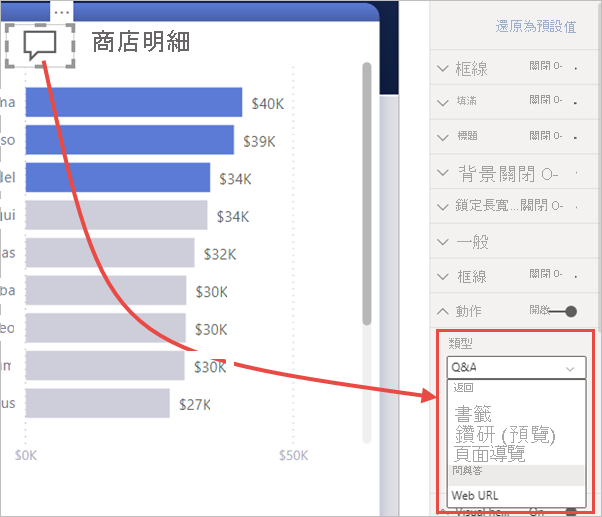
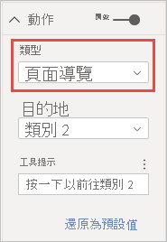

# 在 Power BI 中使用按鈕
在 Power BI 中使用**按鈕**可以供建立像應用程式般運作的報表，進而打造出互動式環境，讓使用者能夠暫留、按一下及和 Power BI 內容更進一步互動。 您可以在 **Power BI Desktop** 和 **Power BI 服務**中將按鈕新增到報表。 當在 Power BI 服務中共用報表時，報表會為使用者提供與應用程式相似的體驗。

## 在報表中建立按鈕

### 在 Power BI Desktop 中建立按鈕

若要在 **Power BI Desktop** 中建立按鈕，請在 [插入]  功能區選取 [按鈕]  ，下拉式功能表隨即出現，以供從選項集合選取想要的按鈕，如下圖所示。 

### 在 Power BI 服務中建立按鈕

若要在 **Power BI 服務**中建立按鈕，請在編輯檢視中開啟報表。 選取頂端功能表列中的 [按鈕]  ，下拉式功能表隨即出現，以供從選項集合中選取想要的按鈕，如下圖所示。 

## 自訂按鈕

不論是在 Power BI Desktop 或是 Power BI 服務中建立按鈕，其餘流程都是相同的。 當在報表畫布上選取按鈕時，[視覺效果]  窗格即會顯示許多自訂按鈕的方式，以符合需求。 例如，您可以透過切換位於該 [視覺效果]  窗格卡中的滑桿來開啟或關閉**按鈕文字**。 您也可以變更按鈕圖示、按鈕填滿、標題、當使用者在報表中選取按鈕時所要採取的動作，以及其他屬性。

## 設定按鈕在閒置、滑鼠在其上暫留、或是受到選取時的屬性

Power BI 中的按鈕有三種狀態：預設 (當滑鼠未在其上暫留，或其為受選取時的顯示方式)、滑鼠在其上暫留、受到選取 (通常稱之為「受到點選」  )。 [視覺效果]  中的多數卡片，均可根據這些狀態個別修改，為自訂按鈕提供足夠的彈性。

[視覺效果]  窗格中的以下卡可讓您根據按鈕的三個狀態，來修改按鈕的格式或行為：

* 按鈕文字
* 圖示
* 外框
* 填滿

若要選取按鈕在各狀態的顯示方式，請展開這些卡中的其中一個，並選取顯示在卡上方的下拉式清單。 在下圖中，您可以看見 [圖示]  卡已展開，且已選取下拉式清單，並顯示三種狀態。

## 選取按鈕的動作

您可選取使用者在 Power BI 中選取按鈕時所要採取的動作。 您可從 [視覺效果]  窗格的 [動作]  存取按鈕動作的選項。

以下是按鈕動作的選項：

- [返回]  會讓使用者返回報表的上一頁。 這相當適用於鑽研頁面。
- [書籤]  代表與書籤建立關聯的報表頁面，該書籤是為目前報表所定義的。 深入了解 [Power BI 中的書籤](desktop-bookmarks.md)。 
- [鑽研 (預覽)]  會將使用者巡覽至篩選到其選取項目的鑽研頁面，而無需使用書籤。 深入了解[報表中的鑽研按鈕](desktop-drill-through-buttons.md)。
- [頁面瀏覽]  會將使用者巡覽至報表內的不同頁面，且也無須使用書籤。 請參閱本文中的[建立頁面瀏覽](#create-page-navigation)以取得詳細資料。
- [問與答]  會開啟 [問與答總管]  視窗。 

部分按鈕會自動選取預設動作。 例如，[問與答]  按鈕會自動將 [問與答]  選作預設動作。 您可參閱[此部落格文章](https://powerbi.microsoft.com/blog/power-bi-desktop-april-2018-feature-summary/#Q&AExplorer)來深入了解 [問與答總管]  。

您可對欲使用的按鈕使用「CTRL + 按一下」  ，來嘗試或測試為報表建立的按鈕。 

### 建立頁面瀏覽

透過 [頁面瀏覽]**動作**  類型，您可快速地建置整個瀏覽體驗，而完全無須儲存或管理任何書籤。

若要設定頁面瀏覽按鈕，請使用 [頁面瀏覽]  作為動作類型，然後選取 [目的地]  。

您可以快速地建置自訂瀏覽窗格。 若想要變更在瀏覽窗格中顯示的頁面，您可以不需要編輯和管理書籤。

此外，您也可以條件式地格式化工具提示，其方法就跟格式化其他按鈕類型一樣。

## 後續步驟
如需類似功能或與按鈕互動的詳細資訊，請參閱下列文章：

* [在 Power BI 報表中使用鑽研](desktop-drillthrough.md)
* [在 Power BI 中使用書籤來共用深入解析並建立故事](desktop-bookmarks.md)

