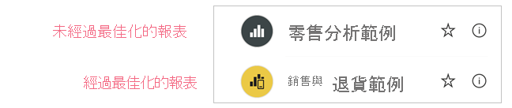
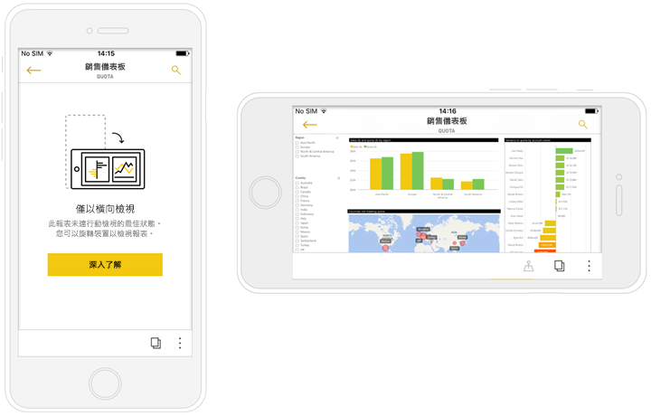

# 為行動裝置應用程式最佳化 Power BI 報表
行動使用者能以橫式方向檢視任何 Power BI 報表頁面。 不過，報表作者可以建立針對行動裝置最佳化的其他檢視，並以直式方向顯示。 這種設計選項 (在 Power BI Desktop 與 Power BI 服務都提供) 可讓作者只選取並重新安排對行動使用者來說有意義的視覺效果。

.

Power BI 提供許多功能，可協助您建立已針對行動裝置最佳化的報表版本：
* 行動裝置版面配置檢視 - 您可以在其中透過將視覺效果拖放到手機模擬器畫布上，以建立針對行動裝置最佳化的報表。
* 視覺效果與交叉分析篩選器 - 可針對在小型行動裝置螢幕上使用最佳化。

這些功能可讓您設計及建置吸引人且針對行動裝置最佳化的互動式報表。

## 建立針對行動裝置最佳化的直向版本報表頁面

第一個步驟是在標準 Web 檢視中設計並建立報表。 當您建立報表後，即可針對手機與平板電腦進行最佳化。

若要建立針對行動裝置最佳化的檢視，請開啟行動裝置版面配置檢視：
   * 在 Power BI Desktop 中，選取 [檢視] 功能區，然後選擇 [行動裝置版面配置]。
   * 在 Power BI 服務中，選擇 [更多選項] \(...\) > [編輯報表] > [行動裝置版面配置]。

   您會看到一個可捲的畫布 (形狀像電話一樣)，以及一個 [視覺效果] 窗格，其中列出原始報表頁面上的所有視覺效果。

   .

* [視覺效果] 窗格中的每個視覺效果都會隨著其名稱一起出現，讓您方便辨識。
* 每個視覺效果也都有可見度指標。 視覺效果的可見度指標會視 Web 報表檢視目前狀態中的視覺效果可見度狀態而變更。 使用書籤時，可見度指標很有用。

## 將視覺效果新增至行動裝置版面配置畫布
若要將視覺效果新增至行動裝置版面配置，請將其從 [視覺效果] 窗格拖曳至手機畫布。 當您將視覺效果拖曳至畫布時，其會貼齊至格線。 或者，您也可以在 [視覺效果] 窗格中按兩下視覺效果，然後視覺效果就會加入畫布中。

您可以將部分或所有 Web 報表頁面視覺效果新增至針對行動裝置最佳化的報表頁面。 您只能新增每個視覺效果一次，而且不需要包含所有視覺效果。

>[!NOTE]
> 您可以將隱藏的視覺效果拖放到畫布上。 將會放置這些項目，但不會顯示，除非目前 Web 報表檢視中的可見度狀態變更。

視覺效果可以疊在另一層視覺效果上，以使用書籤建立互動式報表，或透過在影像上疊加視覺效果以建立吸引人的報表。

當您將視覺效果放在畫布上之後，您可以透過拖曳視覺效果邊緣周圍出現的控點來調整其大小。 若要在調整大小時維持視覺效果的外觀比例，請在拖曳調整大小控點時，按住 **Shift** 鍵。

下圖說明如何將視覺效果從 [視覺效果] 窗格拖放到畫布上，以及如何調整大小並在視覺效果上重疊其他視覺效果。

   

手機報表方格會隨不同大小的手機縮放，因此您的報表在小螢幕及大螢幕手機上都很適合。

## 將視覺效果從行動裝置版面配置畫布移除
若要將視覺效果從行動裝置版面配置移除，請按一下手機畫布上視覺效果右上角的 [X]，或選取視覺效果並按 [刪除]。

您可以透過按一下 [視覺效果] 窗格上的橡皮擦，以從畫布移除所有視覺效果。

從行動裝置版面配置畫布移除視覺效果只會將其從畫布移除。 視覺效果仍會出現在 [視覺效果] 窗格中，而且原始報表不會受到影響。

## 設定視覺效果與交叉分析篩選器以在針對行動裝置最佳化的報表中使用

### 視覺效果

根據預設，許多視覺效果 (特別是圖表類型的視覺效果) 都有回應。  這表示無論螢幕大小為何，它們都會動態地變更，以顯示最大量的資料與見解。

當視覺效果的大小變更時，Power BI 會以資料為優先。 例如，其可能會自動移除邊框間距，並將圖例移至視覺效果頂端，如此一來即使視覺效果變小，也能充分表達資訊。

 
如果您基於某些原因而想要關閉回應能力，您可以在視覺效果格式設定的 [一般] 區段中這樣做。

### 交叉分析篩選器

交叉分析篩選器提供在畫布上篩選報表資料的功能。 在一般報表撰寫模式下設計交叉分析篩選器時，您可以修改部分交叉分析篩選器設定，使其更適用於針對行動裝置最佳化的報表：
* 您可以決定要讓報表讀取者只選取一個項目或選取多個項目。
* 您可以將交叉分析篩選器設為垂直、水平或回應式 (回應式交叉分析篩選器必須是水平的)。

如果您將交叉分析篩選器設為回應式，則在變更其大小和形狀時會顯示較多或較少選項。 它可以是高、短、寬或窄。 如果您將它設得夠小，則它只會變成報表頁面上的篩選圖示。

 
深入了解如何[建立回應式交叉分析篩選器](power-bi-slicer-filter-responsive.md)。

## 發行針對行動裝置最佳化的報表
若要發行已針對行動裝置最佳化的報表版本，請[從 Power BI Desktop 將主報表發行至 Power BI 服務](desktop-upload-desktop-files.md)。 這會同時發佈已針對行動裝置最佳化的版本。

## 在手機或平板電腦上檢視最佳化與未最佳化的報表

在 Power BI 行動裝置應用程式中，針對行動裝置最佳化的報表會以特殊圖示表示。

在手機上，應用程式會自動偵測報表是否已針對行動裝置最佳化。
* 如果有已針對行動裝置最佳化的報表存在，應用程式會自動以針對行動裝置最佳化模式開啟報表。
* 如果沒有已針對行動裝置最佳化的報表存在，報表會以未經最佳化的橫向檢視開啟。

將手機轉成橫向會以未經最佳化的檢視開啟報表 (具有原始報表版面配置)，無論報表是否已經過最佳化。

如果您只將部分頁面最佳化，當讀者進入未經最佳化的頁面時，系統會提示他們切換到橫向檢視。 將手機或平板電腦轉成橫向，可讓他們以橫向模式查看頁面。 [深入了解如何與針對直向模式最佳化的 Power BI 報表互動](../consumer/mobile/mobile-apps-view-phone-report.md)。

## 建立針對行動裝置最佳化的版面配置時的考量
* 針對具有多個頁面的報表，您可以將所有頁面最佳化，或只將一些頁面最佳化。
* 若已定義報表頁面的背景色彩，則針對行動裝置最佳化的報表將會有相同的背景色彩。
* 您無法只為針對行動裝置最佳化的報表修改格式設定。 格式設定在主要與行動裝置版面配置之間是一致的。 例如，字型大小將會相同。
* 若要變更視覺效果，例如變更其格式設定、資料集、篩選或任何其他屬性，請返回 Web 報表撰寫模式。

## 後續步驟
* [在 Power BI 中建立儀表板的手機檢視](service-create-dashboard-mobile-phone-view.md)。
* [檢視針對手機最佳化的 Power BI 報表](../consumer/mobile/mobile-apps-view-phone-report.md)。
* [有關建立報表與儀表板的 Power BI 文件](./index.yml)。
* 有其他問題嗎？ [嘗試在 Power BI 社群提問](https://community.powerbi.com/)。