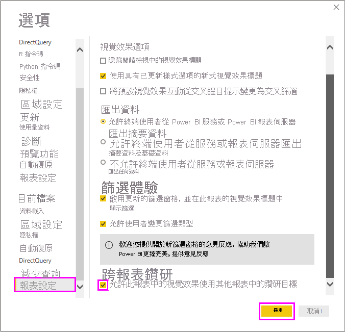
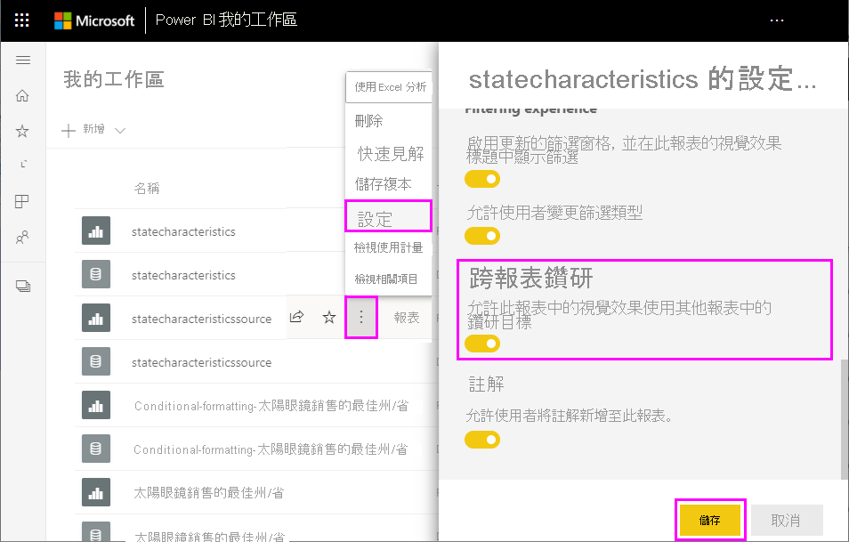

# 在 Power BI 中使用跨報表鑽研

透過 Power BI 的「跨報表鑽研」功能，您可以依據內容從某個報表跳到相同 Power BI 服務工作區或應用程式中的另一個報表。 也可以使用跨報表鑽研來連接具有相關內容的兩個或多個報表，且隨跨報表連線傳遞篩選內容。 

若要起始跨報表鑽研，您可以在「來源報表」的「來源視覺效果」中選取資料點，然後從操作功能表選取跨報表 [鑽研] 目標。 

鑽取動作會開啟「目標報表」中的「目標頁面」。 

本文說明如何設定及使用 Power BI 報表的跨報表鑽研。

> [!NOTE]
> 您無法透過個別共用的[與我共用報表](../collaborate-share/service-share-dashboards.md#share-a-dashboard-or-report)來使用跨報表鑽研。 若要使用跨報表鑽研，您必須為所要存取報表所在工作區的成員。

## 啟用跨報表鑽研

啟用跨報表鑽研的第一個步驟是驗證來源和目標報表的資料模型。 雖然每個報表中的結構描述不一定要相同，但您要傳遞的欄位必須存在於這兩個資料模型中。 欄位名稱和其所屬資料表的名稱必須相同。 這些字串必須相符，且區分大小寫。

例如，如果您想要在 **US States** 資料表的 **State** 欄位上傳遞篩選，則這兩個模型都必須有 **US States** 資料表，且該資料表內有 **State** 欄位。 否則，您必須更新基礎模型中的欄位名稱或資料表名稱。 只更新欄位的顯示名稱，無法讓跨報表鑽研正常運作。

在您驗證模型之後，請讓來源報表使用跨報表鑽研。 

1. 在 Power BI Desktop 中，移至 [檔案] > [選項及設定] > [選項]。 
1. 在 [選項] 視窗左側導覽的 [目前檔案] 區段底部，選取 [報表設定]。 
1. 在右下方的 [跨報表鑽研] 底下，選取 [允許此報表中視覺效果使用其他報表中的鑽研目標]。 
1. 選取 [確定]。 
   
   

您也可以從 Power BI 服務啟用跨報表鑽研。
1. 在 Power BI 服務中，選取包含目標和來源報表的工作區。
1. 在工作區清單中的來源報表名稱旁，選取**更多選項**符號，然後選取 [設定]。 
1. 在 [設定] 窗格底部附近的 [跨報表鑽研] 底下，選取 [允許此報表中視覺效果使用其他報表中的鑽研目標]，然後選取 [儲存]。
   
   

## 設定跨報表鑽研目標

設定跨報表鑽研的目標頁面類似於在報表中設定鑽研。 在目標頁面上啟用鑽研，即可讓其他視覺效果將該頁面設定為鑽研目標。 若要在單一報表內建立鑽研，請參閱[在 Power BI Desktop 中使用鑽研](desktop-drillthrough.md)。

您可以在 Power BI Desktop 或 Power BI 服務中設定跨報表鑽研的目標。 
1. 編輯目標檔案，然後在目標報表的目標頁面上，選取 [視覺效果] 窗格的 [欄位] 區段。 
1. 在 [鑽研] 底下，將 [跨報表] 切換為 [開啟]。 
1. 將您想要作為鑽研目標使用的欄位拖曳到 [在此新增鑽研欄位]。 針對每個欄位，選取您是否要在將欄位作為類別使用時，還是要在其摘要類似量值時，允許進行鑽研。 
1. 選取您是否想要為視覺效果 [保留所有篩選]。 如果您不想要將已套用到來源視覺效果的篩選傳遞至目標視覺效果，請選取 [關閉]。
   
   ![已醒目提示 [鑽研] 選項的 [視覺效果] 窗格](media/desktop-cross-report-drill-through/cross-report-drill-through-03.png)
   
1. 如果您只將頁面用於跨報表鑽研，請刪除自動新增至畫布的 [上一頁] 按鈕。 [上一頁] 按鈕僅適用於報表內導覽。 
1. 設定目標頁面之後，如果您正在使用 Power BI 服務，請儲存報表；如果您使用的是 Power BI Desktop，請儲存並發佈報表。

這樣就大功告成了！ 您的報表已準備好進行跨報表鑽研。 

## 使用跨報表鑽研

若要使用跨報表鑽研，請在 Power BI 服務中選取來源報表，然後選取視覺效果，其鑽研欄位的使用方式與您在設定目標頁面時所指定方式相同。 以滑鼠右鍵按一下資料點來開啟視覺效果操作功能表，並選取 [鑽研]，然後選取鑽研目標。 跨報表鑽研目標會格式化為**頁面名稱 [報表名稱]** 。

您會在目標跨報表鑽研頁面中看到結果，就和您在建立目標時所設定的一樣。 系統會根據鑽研設定來篩選結果。

> [!IMPORTANT]
> Power BI 會快取跨報表鑽研目標。 如果您進行變更之後，鑽研目標沒有如預期般顯示，請務必重新整理瀏覽器。 

如果您在設定目標頁面時將 [保留所有篩選] 設定為 [開啟]，則來源視覺效果的篩選內容可以包含下列各項： 

- 影響來源視覺效果的報表、頁面和視覺效果層級篩選 
- 影響來源視覺效果的交叉篩選和交叉醒目提示 
- 頁面上的交叉分析篩選器和同步交叉分析篩選器
- URL 參數

當您登陸目標報表進行鑽研時，Power BI 只會將篩選套用到欄位名稱和資料表名稱字串完全相符的欄位。 

Power BI 不會從目標報表套用黏性篩選，但會套用您的預設個人書籤 (若有的話)。 例如，如果您的預設個人書籤包含 *Country = US* 的報表層級篩選，則 Power BI 會先套用該篩選，再套用來自來源視覺效果的篩選內容。 

針對跨報表鑽研，Power BI 會將篩選內容傳遞至目標報表中的標準頁面。 Power BI 不會傳遞工具提示頁面的篩選內容，因為工具提示頁面是根據叫用工具提示的來源視覺效果進行篩選。

如果您想要在跨報表鑽研動作之後返回來源報表，請使用瀏覽器的**上一頁**按鈕。 

## 後續步驟

您可能也會對下列文章感興趣：

- [Power BI 中的交叉分析篩選器](../visuals/power-bi-visualization-slicers.md)
- [在 Power BI Desktop 中使用鑽研](desktop-drillthrough.md)
