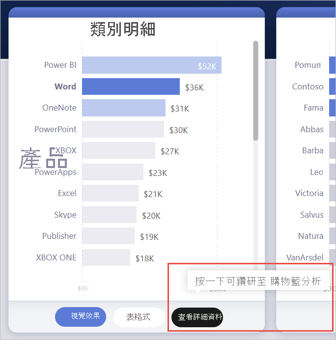
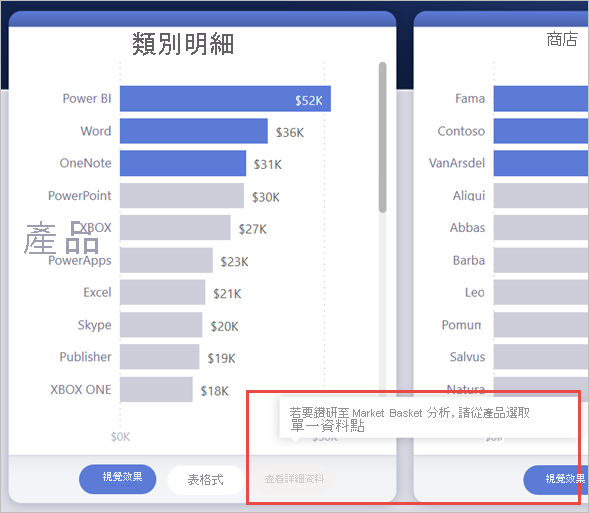
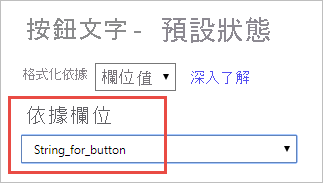
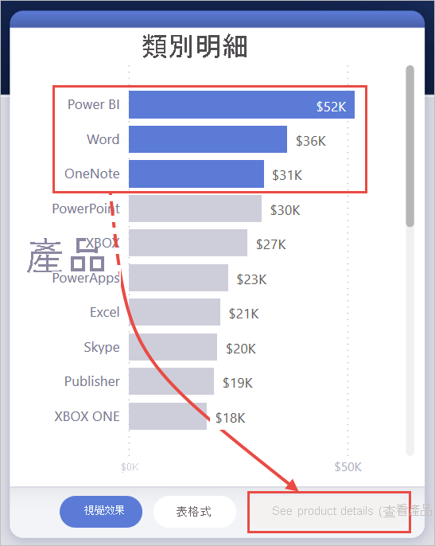
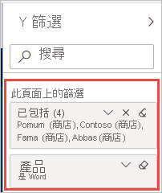
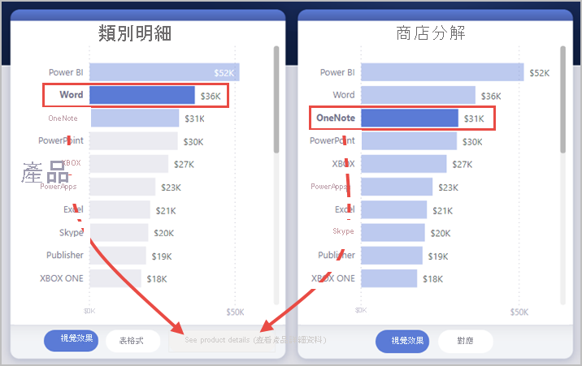

# <a name="create-a-drill-through-button-in-power-bi"></a>在 Power BI 中建立鑽研按鈕

在 Power BI 中建立按鈕時，您可選取 [鑽研] 動作。 這個動作類型會建立按鈕，其會鑽研至焦點頁面以取得篩選至特定內容的詳細資料。

鑽研按鈕在您想要增加報表中重要鑽研案例的發現性時相當實用。

在此範例中，在使用者選取圖表中的 [文字] 列後，即會啟用 [查看詳細資料] 按鈕。



在選取 [查看詳細資料] 按鈕時，使用者會鑽研至 [購物籃分析] 頁面。 正如同可在左側看見的視覺效果，鑽研頁面現在會為文字進行篩選。


## <a name="set-up-a-drill-through-button"></a>設定鑽研按鈕

若要設定鑽研按鈕，您需要先在報表中[設定有效的鑽研頁面](desktop-drillthrough.md)。 然後，您需要使用 [鑽研] 作為動作類型來建立按鈕，然後選取鑽研頁面作為 [目的地]。

因為鑽研按鈕有兩種狀態 (鑽研已啟用與已停用)，所以會看到有兩個工具提示選項。


若將工具提示方塊保持空白，則 Power BI 會自動產生工具提示。 這些工具提示是以目的地和鑽研欄位為基礎。

以下是停用按鈕時自動產生工具提示的範例：

「若要鑽研到 [購物籃分析] (目的地頁面)，請從 [產品] (鑽研欄位) 選取單一資料點。」



以下是啟用按鈕時自動產生工具提示的範例：

「按一下以鑽研至 [購物籃分析] (目的地頁面)。」


但是，若想要提供自訂工具提示，您一律可以輸入靜態字串。 我們尚未支援工具提示的條件式格式設定。

您可以使用條件式格式設定，以根據所選欄位的值來變更按鈕文字。 若要這樣做，您需要建立會根據 DAX 函式 SELECTEDVALUE 輸出所需字串的量值。

以下是範例量值，若「沒有」選取單一產品值，則該量值會輸出「查看產品詳細資料」；否則，其會輸出「查看 [所選取產品] 的詳細資料」：

```
String_for_button = If(SELECTEDVALUE('Product'[Product], 0) == 0), "See product details", "See details for " & SELECTEDVALUE('Product'[Product]))
```

建立此量值後，您即可為按鈕文字選取 [條件式格式設定] 選項：

![選取 [條件式格式設定]](media/desktop-drill-through-buttons/power-bi-button-conditional-tooltip.png)

然後，您可以選取為按鈕文字建立的量值：



選取單一產品時，按鈕文字會顯示：

「查看文字的詳細資料」


若沒有選取任何產品，或選取了超過一項產品，則會停用按鈕，且按鈕文字會顯示：

「查看產品詳細資料」



## <a name="pass-filter-context"></a>傳遞篩選內容

按鈕的運作方式與一般鑽研相似，因此您也可以透過交叉篩選包含鑽研欄位的視覺效果，以傳遞其他欄位的篩選條件。 例如，使用 **Ctrl** + **按一下**及交叉篩選，您可以將 [店面] 上的多個篩選條件傳遞至鑽研頁面，因為選取項目會交叉篩選包含 [產品] (鑽研欄位) 的視覺效果：


當選取鑽研按鈕時，即會看到 [店面] 和 [產品] 上的篩選條件都傳遞到了目的地頁面：



### <a name="ambiguous-filter-context"></a>不明確的篩選內容

由於鑽研按鈕不會繫結至單一視覺效果，因此若選取項目不明確，按鈕即會停用。

在此範例中，因為兩個視覺效果都包含 [產品] 上的單一選取項目，因此按鈕已停用。 因為判斷要將鑽研動作繫結至哪一個視覺效果的資料點時模稜兩可：



## <a name="limitations"></a>限制

- 此按鈕不允許針對多個目的地使用單一按鈕。
- 此按鈕只支援相同報表內的鑽研；換句話說，其不支援跨報表鑽研。
- 按鈕的停用狀態格式設定會與報表佈景主題中色彩類別繫結。 深入了解[色彩類別](desktop-report-themes.md#setting-structural-colors)。
- 鑽研動作適用於所有內建視覺效果，且適用於從 AppSource 匯入的「部分」視覺效果。 但是，鑽研動作不保證適用於「所有」從 AppSource 匯入的視覺效果。

## <a name="next-steps"></a>後續步驟
如需類似功能或與按鈕互動的詳細資訊，請參閱下列文章：

* [建立按鈕](desktop-buttons.md)
* [在 Power BI 報表中使用鑽研](desktop-drillthrough.md)
* [在 Power BI 中使用書籤來共用深入解析並建立故事](desktop-bookmarks.md)

