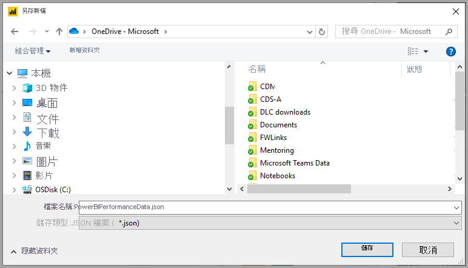

# 使用效能分析器檢查報表元素效能

在 **Power BI Desktop** 中，您可以了解每個報表元素 (例如視覺效果和 DAX 公式) 執行的情況。 您可以使用「效能分析器」  來查看並記錄當使用者與每個報表元素互動時，每個報表元素執行的情況，以及其效能資源最密集 (或最不密集) 的層面。

效能分析器會檢查並顯示更新或重新整理起始的使用者互動的所有視覺效果所需的持續期間，並提供資訊，讓您可以檢視、向下切入或匯出結果。 效能分析器可協助您識別最影響報表效能的視覺效果，並找出影響的原因。

## 顯示效能分析器窗格

在 **Power BI Desktop** 中，選取 [檢視]  功能區。 在 [檢視]  功能區的 [顯示]  區域中，您可以選取 [效能分析器]  旁的核取方塊，以顯示 [效能分析器] 窗格。

![在 [檢視] 功能區中，選取 [效能分析器]](media/desktop-performance-analyzer/performance-analyzer-02.png)

選取之後，效能分析器會顯示在其自己的窗格中，於報表畫布右側。

## 使用效能分析器

效能分析器會測量更新報表元素所需的處理時間 (包括建立或更新視覺效果的時間)，該更新是因為會導致執行查詢的任何使用者互動而起始。 例如，調整交叉分析篩選器需要修改交叉分析篩選器視覺效果、將查詢傳送至資料模型，以及因新設定而必須更新的受影響視覺效果。 

若要讓效能分析器開始錄製，只需選取 [開始錄製] 

您在報表中所採取的任何動作都會以 Power BI 載入視覺效果的順序，顯示並記錄在 [效能分析器] 窗格中。 例如，您可能有一份報表，使用者表示該報表重新整理耗費很長的時間。 或者，調整滑桿時，報表中的某些視覺效果耗費很長的時間才顯示。 效能分析器可以告訴您有哪個視覺效果是原因，並識別視覺效果中的哪些層面耗費最長的持續期間來處理。 

一旦開始錄製，[開始錄製]  按鈕即會呈現灰色 (非作用中，因為您已開始錄製)，而 [停止]  按鈕會變成作用中。 

效能分析器會即時收集並顯示效能測量資訊。 因此，每當您按一下視覺效果、移動交叉分析篩選器，或以其他方式互動時，效能分析器都會立即在其窗格中顯示效能結果。

如果窗格有更多資訊可顯示，則會出現捲軸以導覽至其他資訊。

每個互動在窗格中都會有一個區段識別碼，描述起始記錄項目的動作。 在下圖中，互動是使用者已變更交叉分析篩選器。

每個視覺效果的記錄資訊都包含完成下列工作類型耗費的時間 (持續期間)：

* **DAX 查詢** - 如果需要 DAX 查詢，這是在視覺效果傳送查詢，與 Analysis Services 傳回結果之間的時間。
* **視覺效果顯示** - 視覺效果在螢幕上繪製所需的時間，包括擷取任何 Web 影像或地理編碼所需的時間。 
* **其他** - 視覺效果準備查詢、等候其他視覺效果完成或執行其他背景處理所需的時間。

[持續時間 (毫秒)]  值指出每項作業「開始」  和「結束」  時間戳記之間的差異。 大部分的畫布和視覺效果作業都會在單一使用者介面執行緒上依序執行，該執行緒由多個作業共用。 回報的持續時間，包含在其他作業完成時排入佇列所花費的時間。 GitHub 上的[效能分析器範例](https://github.com/microsoft/powerbi-desktop-samples/tree/master/Performance%20Analyzer)和其相關聯的[文件](https://github.com/microsoft/powerbi-desktop-samples/blob/master/Performance%20Analyzer/Power%20BI%20Performance%20Analyzer%20Export%20File%20Format.docx)提供視覺效果如何查詢資料，以及如何轉譯的詳細資料。

當您與要使用效能分析器測量的報表元素互動之後，您可以選取 [停止]  按鈕。 在您選取 [停止]  以進行分析之後，效能資訊仍保留在窗格中。

若要清除 [效能分析器] 窗格中的資訊，請選取 [清除]  。 當您選取 [清除]  時，會清除所有資訊，而且不會儲存。 請參閱下一節以了解如何在記錄中儲存資訊。 

## 重新整理視覺效果

您可以在 [效能分析器] 窗格中選取 [重新整理視覺效果]  來重新整理報表目前頁面上的所有視覺效果，進而讓效能分析器收集所有此類視覺效果的相關資訊。

您也可以重新整理個別的視覺效果。 當效能分析器錄製時，您可以選取每個視覺效果右上角的 [重新整理此視覺效果]  ，以重新整理該視覺效果，並擷取其效能資訊。

## 儲存效能資訊

您可以藉由選取 [匯出]  按鈕，來儲存效能分析器所建立關於報表的資訊。 選取 [匯出]  會使用 [效能分析器] 窗格中的資訊建立一個 .json 檔案。 

## 後續步驟
如需 **Power BI Desktop** 的詳細資訊，以及如何開始使用，請參閱下列文章。

* [Power BI Desktop 是什麼？](../fundamentals/desktop-what-is-desktop.md)
* [Power BI Desktop 的查詢概觀](../transform-model/desktop-query-overview.md)
* [Power BI Desktop 中的資料來源](../connect-data/desktop-data-sources.md)
* [連接至 Power BI Desktop 中的資料](../connect-data/desktop-connect-to-data.md)
* [使用 Power BI Desktop 合併資料並使其成形](../connect-data/desktop-shape-and-combine-data.md)
* [Power BI Desktop 中的常見查詢工作](../transform-model/desktop-common-query-tasks.md)   

如需效能分析器範例的資訊，請參閱下列資源。

* [效能分析器範例](https://github.com/microsoft/powerbi-desktop-samples/tree/master/Performance%20Analyzer)
* [效能分析器範例文件](https://github.com/microsoft/powerbi-desktop-samples/blob/master/Performance%20Analyzer/Power%20BI%20Performance%20Analyzer%20Export%20File%20Format.docx)
