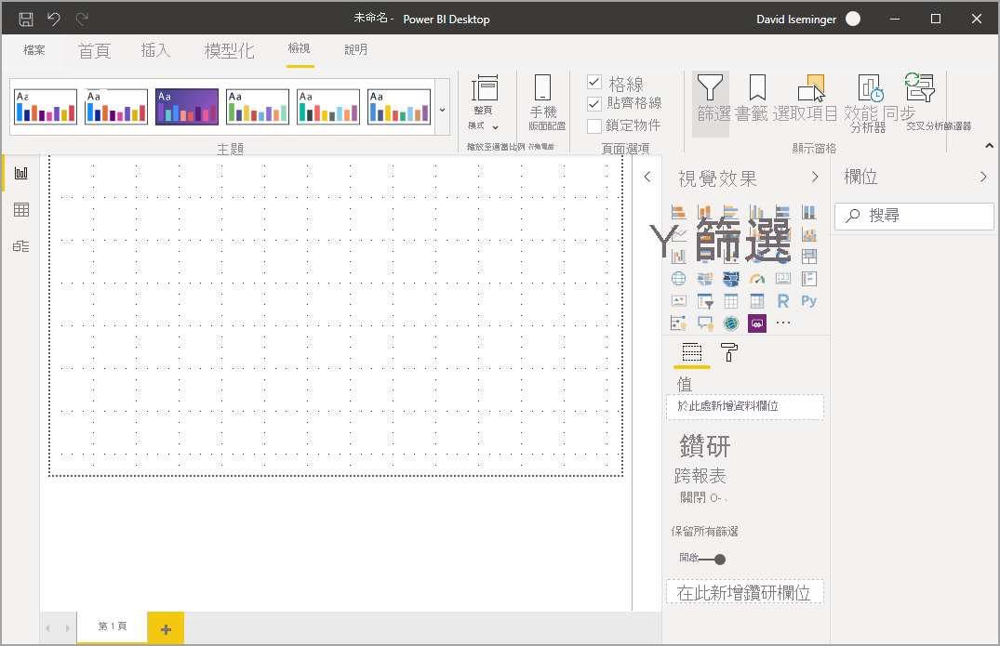
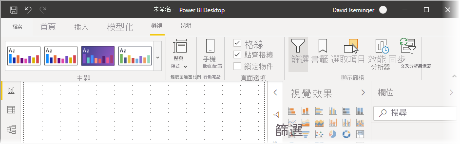
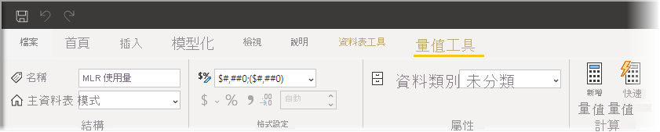

# 使用 Power BI Desktop 中已更新的功能區

Power BI Desktop 已修訂其功能區，使其外觀和體驗更能與其他 Microsoft 產品 (例如 Microsoft Office) 保持一致。

## 如何啟用已更新功能區

從 2020 年 5 月版本的 Power BI Desktop 開始，更新功能區已正式推出。 從 2020 年 3 月更新開始，更新的功能區預設為開啟。 

## 更新功能區的功能

更新功能區的優點，是為了使跨 Power BI Desktop 以及其他 Microsoft 產品的體驗，變得簡單而熟悉。 

這些優點可以分組成下列類別：

* **改良的外觀、風格與組織** - Power BI Desktop 已更新功能區中的圖示和功能，都與 Office 應用程式中功能區項目的外觀、風格和組織一致。

    

* **直覺化的佈景主題庫** - 佈景主題庫 (可在 [檢視] 功能區中找到) 具有 PowerPoint 佈景主題庫的熟悉外觀與風格。 因此，功能區中的影像會向您顯示佈景主題變更後的外觀，例如色彩組合和字型。 

    

* **以您的檢視為基礎的動態功能區內容** - 在 Power BI Desktop 的現有功能區中，無法使用的圖示或命令只會呈現灰色，因而產生不太理想的體驗。 使用已更新功能區時，圖示會以動態方式顯示和排列，讓您在內容中一律知道哪些選項可供您使用。

* **單行功能區折疊後可為您節省空間** - 已更新功能區的另一個優點，是能夠將功能區本身折疊成單行，以動態方式顯示以您的內容為基礎的功能區項目。 

    

* **瀏覽和選取按鈕的按鍵提示** - 您可以按 **Alt + Windows 鍵**來啟用按鍵提示，以便於瀏覽功能區。 啟用之後，您可以按鍵盤上顯示的按鍵進行瀏覽。

    

* **自訂格式字串** - 除了可在 [屬性] 窗格中設定自訂格式字串之外，您也可以在功能區中進行設定。 選取您想要自訂的量值或資料行，即會根據您的選擇來顯示 [量值工具] 或 [資料行工具] 內容索引標籤。 在該索引標籤的格式區段中，您可以直接在下拉式方塊中鍵入自訂格式字串。

    

* **協助工具** - 可完整存取標題列、功能區和檔案功能表。 按 Ctrl + F6 巡覽至功能區區段。 在功能區區段，您可以使用 **Tab** 鍵在頂端列和底部列之間移動，並使用方向鍵在項目之間移動。

除了那些可見的變更之外，已更新功能區也可以讓我們對 Power BI Desktop 及其功能區進行後續更新，如下所示：

* 在功能區中建立更具彈性且直覺的控制項，例如視覺效果資源庫
* 將「黑色」和「深灰色」Office 佈景主題加入到 Power BI Desktop
* 改善協助工具

## 後續步驟
您可以使用 Power BI Desktop 連接至各式各樣的資料。 如需有關資料來源的詳細資訊，請參閱下列資源︰

* [Power BI Desktop 是什麼？](../fundamentals/desktop-what-is-desktop.md)
* [Power BI Desktop 中的資料來源](../connect-data/desktop-data-sources.md)
* [使用 Power BI Desktop 合併資料並使其成形](../connect-data/desktop-shape-and-combine-data.md)
* [在 Power BI Desktop 中連接至 Excel 活頁簿](../connect-data/desktop-connect-excel.md)   
* [直接將資料輸入 Power BI Desktop 中](../connect-data/desktop-enter-data-directly-into-desktop.md)   
