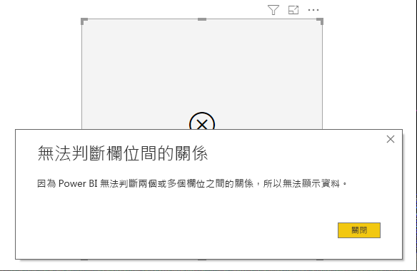

# 在 Power BI 中顯示沒有資料的項目

Power BI 可讓您將來自各式來源的各種資料視覺化。 建立視覺效果時，Power BI 只會顯示相關的資料，以適當地管理該資料的呈現及顯示方式。 Power BI 會根據視覺效果的設定及基礎資料模型，來判斷哪些資料具有關聯性。 本文說明 Power BI 在判斷相關資料時的行為，並提供範例以說明判斷的方式。

## 判斷相關資料

若要開始了解 Power BI 如何判斷資料相關性以決定是否要顯示，讓我們以一個資料表作為簡單的範例。 使用本文結尾[範例資料模型](#example-data-model)區段中呈現的模型，考慮搭配下列設定來建置資料表：

**1.來自相同資料表的群組：** *Product[Color] - Product[Size]*

|*Product[Color]*  |*Product[Size]*  |
|---------|---------|
|藍色     |大         |
|藍色     |中         |
|藍色     |小         |
|紅色     |大         |

在此範例中，Power BI 會顯示存在於 *[Product]* 資料表中的 *[Color-Size]* 組合。 

讓我們看看另一個不同的組合：

**2.來自不同但直接相關之資料表的群組，以及一個量值：** *ProductStyle[Finish] - Product[Color] - Sum(Sales[Quantity])*

|*ProductStyle[Finish]*  |*Product[Color]*  |*[SumQuantity]*  |
|---------|---------|---------|
|亮面     |藍色         |10         |
|暗面     |藍色         |15         |

在此範例中，Power BI 只會顯示實際存在的組合。 例如，它將不會顯示 ("None" + "Blue") 或 ("Matte" + "Red")，因為模型中不存在那些組合。 決定組合是否存在的條件，是 *Sum(Sales[Quantity])* 的值不得為空白。

讓我們看看另一個不同的例子： 

**3.來自不同但相關之資料表的群組，且沒有量值：** *ProductStyle[Finish] - Product[Color]*

|*ProductStyle[Finish]*  |*Product[Color]*  |
|---------|---------|
|亮面     |藍色         |
|亮面     |紅色         |
|暗面     |藍色         |

由於沒有明確量值，且兩個資料表是直接相關的，Power BI 會嘗試插入量值來限制結果的組合。 在此範例中，Power BI 會插入 *CALCULATE(COUNTROWS('Product'))* 量值，其應該不會為空，因為 *Product* 是通用於那兩個資料表的資料表。

因此，Power BI 會顯示在 Product 資料表中確實有項目的組合，這會排除 *("None" + "Blue")* 和 *("Matte" + "Red")* 的組合。

**4.來自不同且不相關之資料表的群組**

範例模型沒有此組合，但如果有群組是來自不同且不相關的資料表，Power BI 就無法關聯兩個資料行。 結果會是每個資料行的值交叉聯結。 在該情況下，Power BI 會發出 *unconstrained join* 類型的錯誤，因為計算此類交叉聯結將會在資料庫中耗用大量資源，且無法為使用者提供許多資訊。 

## 顯示沒有資料的項目

上一節說明 Power BI 如何判斷資料相關性以決定是否要顯示。 但在某些情況下，您可能會「想要」  顯示沒有資料的項目。 

**顯示沒有資料的項目**功能便可讓您這麼做，並包含沒有量值資料 (空白量值) 的資料列和資料行。

若要啟用**顯示沒有資料的項目**功能，請選取視覺效果，然後在 [欄位]  中以滑鼠右鍵按一下欄位，並從顯示的功能表中選取 [顯示沒有資料的項目]  ，如下圖所示：

**顯示沒有資料的項目**功能在下列情況下將「不會」  產生影響：

* 沒有將量值新增至視覺效果，且群組的資料行是來自相同的資料表
* 群組彼此不相關；Power BI 不會針對具有不相關群組的視覺效果執行查詢
* 量值與所有群組皆不相關；這是因為量值只有針對某些群組組合才會永遠不為空白
* 有排除空白量值的使用者定義量值篩選，例如：*SalesAmount > 0*

### 「顯示沒有資料的項目」的運作方式

**顯示沒有資料的項目**最有意思的使用案例是當量值存在時。 讓我們看看當群組是來自相同的資料表，或可透過模型中的路徑相關聯的情況。 例如，*ProductStyle* 是直接與 *Product* 相關，且間接與 *Sales* 相關；*ProductStyle* 和 *ProductCategory* 可以透過 *Product* 資料表互相關聯，依此類推。

讓我們看看幾個有意思的案例，並比較開啟和關閉 [顯示沒有資料的項目]  所帶來的影響。 

**1.將來自相同資料表的資料行組成群組：** *Product[Color] - Product[Size] - Sum(Sales[Quantity])*

關閉 [顯示沒有資料的項目]  功能時的情況：

|*Product[Color]*  |*Product[Size]*  |*[SumQuantity]*  |
|---------|---------|---------|
|藍色     |中         |15         |
|藍色     |小         |10         |

開啟 [顯示沒有資料的項目]  功能時的情況：

|*Product[Color]*  |*Product[Size]*  |*[SumQuantity]*  |
|---------|---------|---------|
|藍色     |大         |         |
|藍色     |中         |15         |
|藍色     |小         |10         |
|紅色     |大         |         |

注意到在開啟該功能時，出現兩個新的組合：*Blue - Large* 和 *Red - Large*。 那兩個項目在 *Sales* 資料表中都沒有相對應的 *Quantity*。 不過，它們出現在 *Product* 資料表中。

**2.將來自相關資料表的資料行組成群組：** *ProductStyle[Finish] - Product[Color] - Sum(Sales[Quantity])*

關閉 [顯示沒有資料的項目]  功能時的情況：

|*ProductStyle[Finish]*  |*Product[Color]*  |*[SumQuantity]*  |
|---------|---------|---------|
|亮面     |藍色         |10         |
|暗面     |藍色         |15         |

開啟 [顯示沒有資料的項目]  功能時的情況：

|*ProductStyle[Finish]*  |*Product[Color]*  |*[SumQuantity]*  |
|---------|---------|---------|
|亮面     |藍色         |10         |
|亮面     |紅色         |         |
|暗面     |藍色         |15         |
|無     |         |         |

注意到 *(Gloss-Red)* 和 *(None, blank)* 顯示為組合。 它們出現的原因如下：
* Power BI 先考慮 ProductStyle[Finish]，並選取所有要顯示的值，導致出現 Gloss、Matte、None 這三個值。
* Power BI 使用這些值選取出所有相對應的 *Product[Color]* 項目 
* 由於 *None* 沒有對應到任何 *Product[Color]* ，系統針對該值顯示空白

請務必注意，針對資料行選取值的機制會與順序相依，您可以將它想成兩個資料表之間的「左方外部聯結」  作業。 如果資料行的順序出現變更，結果也將會變更。

讓我們看看變更順序的範例，以及它影響結果的方式。 此範例與本節中的項目 **2** 相同，只是順序出現變更。

**Product[Color] - ProductStyle[Finish] - Sum(Sales[Quantity])**

開啟 [顯示沒有資料的項目]  功能時的情況：

|*Product[Color]* |*ProductStyle[Finish]*  |*[SumQuantity]*  |
|---------|---------|---------|
|藍色     |亮面         |10         |
|藍色     |暗面         |15         |
|紅色     |亮面         |         |

在此範例中，注意到 *ProductStyle[Finish]=None* 並沒有出現在資料表中。 這是因為在此範例中，Power BI 是先選取 *Product* 資料表中的所有 *Color* 值。 然後 Power BI 再針對每個 Color 選取包含資料的相對應 *Finish* 值。 由於 *None* 沒有顯示在 *Color* 的任何組合中，因此系統沒有選取它。

## Power BI 視覺效果行為

在視覺效果的一個欄位上啟用 [顯示沒有資料的項目]  時，會為相同「視覺效果貯體」  或階層中的所有其他欄位自動啟用該功能。 視覺效果貯體或階層可以是視覺效果的**軸**或**圖例**，或**類別**、**資料列**或**資料行**。

例如，在**資料列**貯體中包含四個欄位的矩陣視覺效果中，若其中一個欄位啟用了 [顯示沒有資料的項目]  ，則該矩陣中的所有項目都會啟用該功能。 在下圖中，已在**資料列**貯體中的第一個欄位 (*SupplierID* 欄位) 上啟用 [顯示沒有資料的項目]  。 **資料列**貯體中的其他欄位也會自動啟用該功能。

![相同視覺效果中的欄位自動啟用 [顯示沒有資料的項目]](media/desktop-show-items-no-data/show-items-no-data-05.png)

相較之下，**資料行**貯體中顯示的 *Continent* 欄位則「不會」  自動啟用 [顯示沒有資料的項目]  。 

此視覺效果行為常會在將視覺效果轉換成不同類型時出現，例如將矩陣視覺效果轉換成表格視覺效果。 在這類轉換中，[顯示沒有資料的項目]  會自動移動到其貯體中欄位具有已啟用功能的貯體。 在先前的範例中，若 *SupplierID* 已啟用 [顯示沒有資料的項目]  ，並將視覺效果轉換成表格，則**資料行**貯體中的 *Continent* 欄位會與**資料列**貯體中的欄位一同移動到表格視覺效果中唯一使用的貯體 (**值**貯體)。 因此，**值**貯體中的所有欄位都會啟用 [顯示沒有資料的項目]  。

### 匯出資料

使用 [匯出摘要資料]  功能時，[顯示沒有資料的項目]  功能的行為會和將匯出轉換成表格視覺效果時相同。 因此，匯出圖表矩陣視覺效果等視覺效果時，所匯出資料看起來可能會和顯示的視覺效果不同。 這是因為轉換成表格視覺效果時，作為匯出處理流程的一部分，系統會為所有匯出的欄位啟用 [顯示沒有資料的項目]  。 

## 範例資料模型

本節會示範用於本文中範例的範例資料模型。

**模型**：

**資料**：

|Product[ProductId]|    Product[ProductName]|   Product[Color]| Product[Size]|  Product[CategoryId]|    Product[StyleId]|
|---------|---------|---------|---------|---------|---------|
|1  |Prod1  |藍色   |小  |1  |1 |
|2  |Prod2  |藍色   |中 |2  |2 |
|3  |Prod3  |紅色    |大  |1  |1 |
|4  |Prod4  |藍色   |大  |2  |2 |

|ProductCategory[CategoryId]|   ProductCategory[CategoryName]|
|---------|---------|
|1  |手機   |
|2  |相機 |
|3  |電視 |

|ProductStyle[StyleId]| ProductStyle[Finish]|   ProductStyle[Polished]|
|---------|---------|---------|
|1  |亮面  |是 |
|2  |暗面  |否 |
|3  |無   |否 |

|Sales[SaleId]| Sales[ProductId]|   Sales[Date]|    Sales[Quantity]|
|---------|---------|---------|---------|
|1  |1  |2012/1/1 0:00| 10 |
|2  |2  |2013/1/1 0:00| 15 |

## 後續步驟

本文已說明如何在 Power BI 中啟用**顯示沒有資料的項目**功能。 您可能也會對下列文章感興趣： 

* [Power BI 中多維度模型的預設成員](../connect-data/desktop-default-member-multidimensional-models.md)
