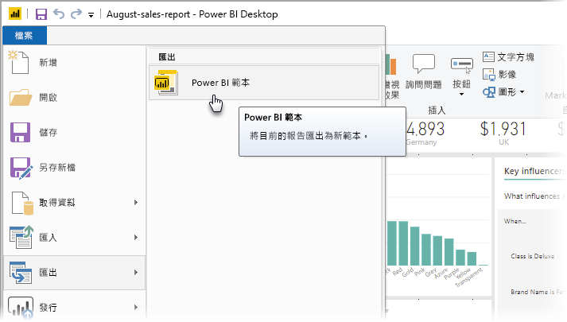
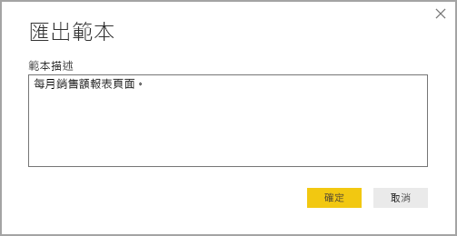
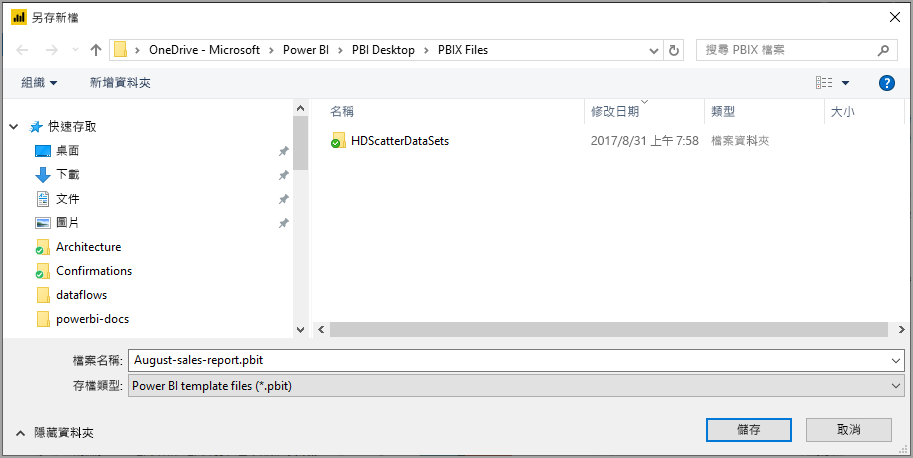
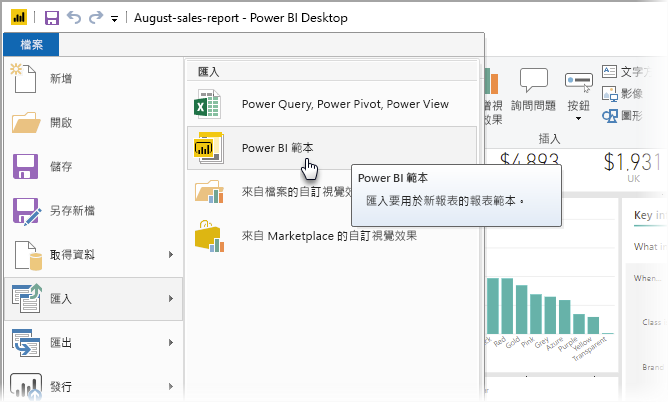
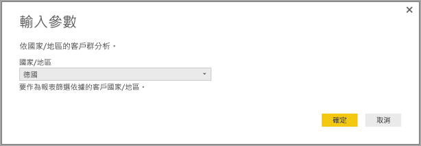
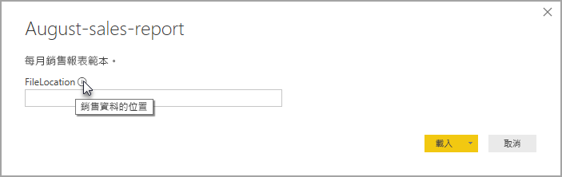

# 建立 Power BI Desktop 的報表範本

使用 **Power BI Desktop**，您可以建立吸引人的報表來與整個組織共用見解。 使用 Power BI Desktop **範本**，您可以根據現有的範本建立報表範本來簡化工作，且您或組織中其他使用者也可以使用此範本作為新報表版面配置、資料模型和查詢的起點。 **Power BI Desktop** 中範本可協助您快速開始和標準化報表的建立過程。

## 建立範本

Power BI 報表範本包含作為產生來源報表的下列資訊：

* 報表**頁面**、視覺效果和其他視覺效果項目
* **資料模型定義**，包括結構描述、關聯性、量值和其他模型定義成品
* 所有**查詢定義**，例如查詢、查詢參數和其他查詢項目

「不」  包含在範本中項目為報表的資料。 

報表範本會使用 .PBIT 副檔名 (與使用 .PBIX 副檔名的 Power BI Desktop 報表不同)。 

若要建立報表範本，請從功能表選取 [檔案] > [匯出] > [Power BI 範本]  ，這會開啟下列視窗，其提示您提供範本的描述。 在此範例中，我們的範本描述是「每月銷售報表範本」。 

選取 [確定]  ，系統隨即會提示您選擇要儲存 .PBIT 範本檔案的檔案位置。

這便是您需要完成的所有操作；會在您指定的檔案位置建立 Power BI 報表範本，其副檔名為 .PBIT。

> [!NOTE]
> Power BI 報表範本檔案通常會比 Power BI Desktop 報表小，因為範本不包括任何資料，只包含報表定義本身。 

## 使用範本

若要使用 Power BI 報表範本，您只需在 Power BI Desktop 中開啟它，便可開始使用。 您可以透過兩種方式來開啟 Power BI 報表範本：

* 按兩下任何 .PBIT 檔案來自動啟動 Power BI Desktop 並載入範本
* 在 Power BI Desktop 中選取 [檔案] > [匯入] > [Power BI 範本] 

當您開啟報表範本時，會隨即出現一個對話方塊，其中包含作為範本基礎報表中所定義的任何參數值。 例如，若報表會根據國家或地區分析客戶，且具備 *Country* 參數來指定客戶所在的位置，即會出現一個提示，要求您從定義參數時所指定的值清單中選取一個 *Country* 值。 

提供所有必要參數後，系統會提示您指定與報表建立關聯的基礎資料位置。 目前的報表建立者接著便可以其認證為基礎來連線到資料。

指定參數和資料後，會隨即建立報表，其中包含所有作為範本基礎報表一部分的頁面、視覺效果、資料模型成品和查詢。 

就這麼簡單。 在 Power BI Desktop 中建立和使用報表範本相當容易，可讓您輕鬆地重新產生吸引人的版面配置和其他報表外觀，並與其他人共用。

## 後續步驟
您可能也想要了解**查詢參數**：
* [在 Power BI Desktop 中使用查詢參數？](https://docs.microsoft.com/power-query/power-query-query-parameters)

此外，您可以使用 Power BI Desktop 執行各種作業。 如需有關其功能的詳細資訊，請參閱下列資源：

* [Power BI Desktop 是什麼？](../fundamentals/desktop-what-is-desktop.md)
* [Power BI Desktop 的查詢概觀](../transform-model/desktop-query-overview.md)
* [Power BI Desktop 中的資料類型](../connect-data/desktop-data-types.md)
* [使用 Power BI Desktop 合併資料並使其成形](../connect-data/desktop-shape-and-combine-data.md)
* [Power BI Desktop 中的常見查詢工作](../transform-model/desktop-common-query-tasks.md)    
