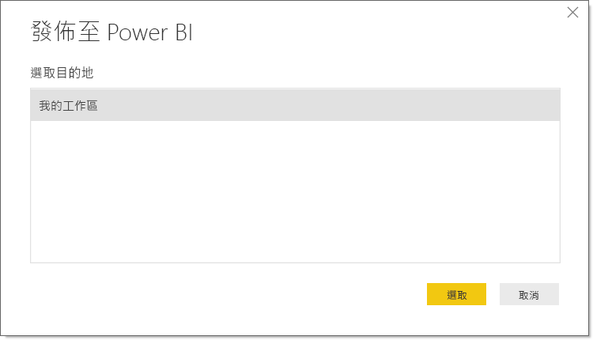
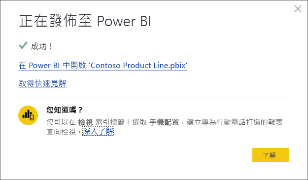

# 從 Power BI Desktop 發佈資料集和報表
當將 Power BI Desktop 檔案發佈至 Power BI 服務時，您會將模型中的資料發佈至 Power BI 工作區。 您在 [報表] 檢視中所建立的任何報表也是如此。 您會看到新的資料集具有相同名稱，以及在工作區導覽器中的所有報表。

從 Power BI Desktop 發佈，以及在 Power BI 中使用 **Get Data** 連接並上傳 Power BI Desktop 檔案，兩者效果相同。

> [!NOTE]
> 您對 Power BI 中報表所做任何變更都不會儲存回原始的 Power BI Desktop 檔案。 包括在您新增、刪除或變更報表中的視覺效果時。

## 發佈 Power BI Desktop 資料集和報表
1. 在 Power BI Desktop 中，選擇 [檔案] \> [發佈] \> [發佈至 Power BI]，或選取功能區上的 [發佈]。  

   

2. 登入 Power BI。
3. 選取目的地。

   

發佈完成時，您會收到報表連結。 選取該連結，在 Power BI 網站中開啟報表。

## 重新發佈或取代從 Power BI Desktop 發佈的資料集
當發佈 Power BI Desktop 檔案時，您在 Power BI Desktop 中建立的資料集和任何報表都會上傳至 Power BI 網站。 當您重新發佈 Power BI Desktop 檔案時，會將 Power BI 網站中的資料集取代為 Power BI Desktop 檔案中已更新的資料集。

此程序很簡單，但請注意幾件事：

* 如果 Power BI 中有兩個或多個資料集名稱與 Power BI Desktop 檔案名稱相同，則發佈可能會失敗。 請確定在 Power BI 只有一個資料集具有相同名稱。 您也可以重新命名此檔案並發佈，建立與檔案同名的新資料集。
* 如果您重新命名或刪除資料行或量值，任何已存在於 Power BI 且具有該欄位的視覺效果都可能會無法使用。 
* Power BI 會忽略現有資料行的某些格式變更。 例如，如果您將資料行的格式從 0.25% 變更為 25%。
* 假設您在 Power BI 中有針對現有資料集設定的重新整理排程。 當將新的資料來源新增至檔案然後重新發佈時，您必須在下一次排程重新整理之前登入。
* 當您重新發佈已從 Power BI Desktop 發佈的資料集並定義重新整理排程時，則會在重新發佈之後立即開始資料集重新整理。
* 當對資料集進行變更，然後將其重新發佈時，會顯示一則訊息，說明變更可能會影響多少個工作區、報表和儀表板，並要求確認是否要以所修改資料集來取代目前已發佈的資料集。 此訊息也提供 Power BI 服務中完整資料集影響分析的連結，您可用以查看詳細資訊，並採取動作來降低變更的風險。

   

   [深入了解資料集影響分析](../collaborate-share/service-dataset-impact-analysis.md)。

> [!NOTE]
> Power BI 報表中的某些資料連線可能包含資料連結，而非將資料包含在匯入 Power BI 服務的資料集中。 例如，DirectQuery 連線會在有更新或互動時連結至資料，而不是匯入資料本身。 如果報表中的連結資料來源位於內部部署，您可能需要閘道才能透過 Power BI 加以存取。 如需詳細資訊，請參閱[什麼是內部部署的資料閘道？](../connect-data/service-gateway-onprem.md)
> 