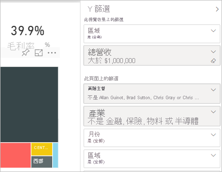
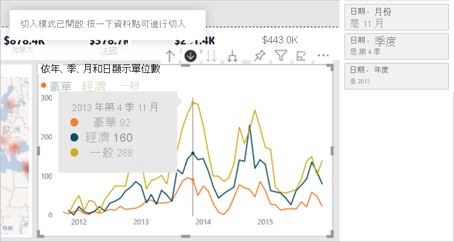
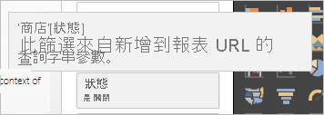
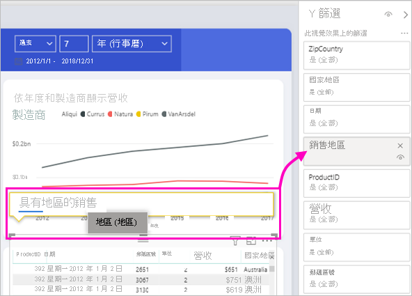

# Power BI 報表中的篩選類型

篩選並非全都以相同方式運作，因為不是以相同方式建立它們。 建立它們的方式會影響在編輯模式下它們於新 [篩選] 窗格中的運作方式。 在本文中，我們描述不同種類的篩選：建立它們的不同方式，以及適用它們的不同事物。 閱讀如何[將篩選條件新增至報表](power-bi-report-add-filter.md)。 

讓我們從兩個最常用的篩選類型開始：手動和自動。

## 手動篩選 

手動篩選是報表建立者在新的 [篩選] 窗格中拖放至任何位置的篩選條件。 對報表具有編輯權限的使用者可在新窗格中編輯、刪除、清除、隱藏、鎖定、重新命名或排序此篩選條件。

## 自動篩選 

自動篩選是當您建置視覺效果時，自動新增至篩選窗格視覺效果層級的篩選條件。 這些篩選條件是以構成視覺效果的欄位為基礎。 對報表具有編輯權限的使用者可在新窗格中編輯、清除、隱藏、鎖定、重新命名或排序此篩選條件。 他們無法刪除自動篩選，因為視覺效果會參考這些欄位。

## 其他進階篩選條件

接下來的篩選類型較不常用，但仍請務必了解它們，如果它們顯示在報表中的話。 此外，您可能會發現它們有助於為您的報表建立正確的篩選條件。

## 包含和排除篩選條件

當您針對視覺效果使用包含或排除功能時，包含和排除篩選條件會自動新增至篩選窗格。 對報表具有編輯權限的使用者可在新窗格中刪除、鎖定、隱藏或排序此篩選條件。 它們無法編輯、清除或重新命名包含或排除篩選條件，因為它與視覺效果的包含和排除功能相關聯。

## 向下切入篩選條件

當您針對報表中的視覺效果使用向下切入功能時，向下切入篩選條件會自動新增至篩選窗格。 對報表具有編輯權限的使用者可在新窗格中編輯或清除篩選條件。 他們無法刪除、隱藏、鎖定、重新命名或排序此篩選條件，因為它與視覺效果的向下切入功能相關聯。 若要移除向下切入篩選條件，您可以按一下視覺效果的向上切入按鈕。

## 交叉切入篩選條件

當向下切入篩選條件透過交叉篩選條件或交叉反白顯示功能傳遞至另一個視覺效果時，交叉切入篩選條件會自動加入至新的窗格。 對報表具有編輯權限的使用者無法刪除、清除、隱藏、鎖定、重新命名或排序此篩選條件，因為它與視覺效果的向下切入功能相關聯。 他們也無法編輯此篩選條件，因為它來自另一個視覺效果中的向下切入篩選條件。 若要移除向下切入篩選條件，請針對傳遞篩選條件的視覺效果按一下向上切入按鈕。

## 鑽研篩選

鑽研篩選條件會透過鑽研功能從某一頁面傳遞,至另一頁面。 它們會顯示在鑽研窗格中。 有兩種類型的鑽研篩選條件。 第一種類型是叫用鑽研的篩選條件。 報表編輯者可以編輯、刪除、清除、隱藏或鎖定這種類型的篩選條件。 第二種類型是根據來源頁面的頁面層級篩選條件傳遞至目標的鑽研篩選條件。 報表編輯者可以編輯、刪除或清除這種暫時性類型的鑽研篩選條件。 他們無法針對使用者鎖定或隱藏此篩選條件。

## URL 篩選條件

URL 篩選條件會藉由新增 URL 查詢參數加入至新窗格。 對報表具有編輯權限的使用者可在新窗格中編輯、刪除或清除篩選條件。 他們無法隱藏、鎖定、重新命名或排序此篩選條件，因為它與 URL 參數相關聯。 若要移除篩選條件，請從 URL 移除參數。 以下是具有參數的範例 URL：

app.powerbi.com/groups/me/apps/*app-id*/reports/*report-id*/ReportSection?filter=Stores~2FStatus%20eq%20'Off'

深入閱讀 [URL 篩選條件](../collaborate-share/service-url-filters.md)。

## 傳遞篩選條件

傳遞篩選條件是透過問與答建立的視覺效果層級篩選條件。 作者可在新窗格中刪除、隱藏或排序這些篩選條件。 不過，它們無法重新命名、編輯、清除或鎖定這些篩選條件。

## 比較篩選類型

下表比較作者可以利用不同類型的篩選條件做什麼。

| 篩選類型 | 編輯 | Clear | 刪除 | 隱藏 | 鎖定 | Sort | 重新命名 |
|----|----|----|----|----|----|----|----|
| 手動篩選 | Y | Y | Y | Y | Y | Y | Y |
| 自動篩選 | Y | Y | N | Y | Y | Y | Y |
| 包含/排除篩選條件 | N | N | Y | Y | Y | Y | N |
| 向下切入篩選條件 | Y | Y | N | N | N | N | N |
| 交叉切入篩選條件 | N | N | N | N | N | N | N |
| 鑽研篩選條件 (叫用鑽研) | Y | Y | Y | Y | Y | N | N |
| 鑽研篩選條件 (暫時性) | Y | Y | Y | N | N | N | N |
| URL 篩選條件 - 暫時性 | Y | Y | Y | N | N | N | N |
| 傳遞篩選條件 | N | N | Y | Y | N | Y | N |

## 後續步驟

[將篩選條件新增至報表](power-bi-report-add-filter.md)

[報表 [篩選] 窗格概觀](../consumer/end-user-report-filter.md)

[在報表中進行篩選和醒目提示](power-bi-reports-filters-and-highlighting.md)

有其他問題嗎？ [試試 Power BI 社群](https://community.powerbi.com/)
