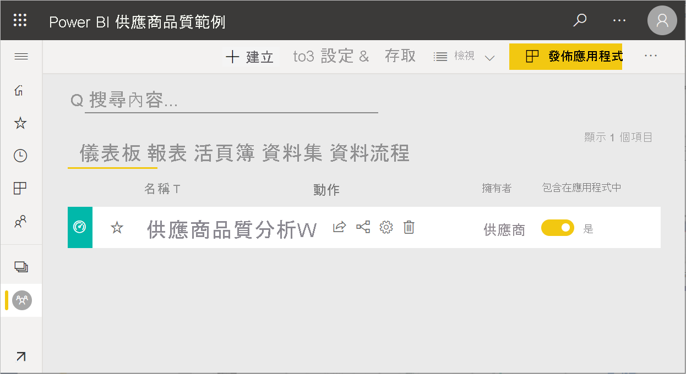
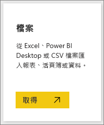
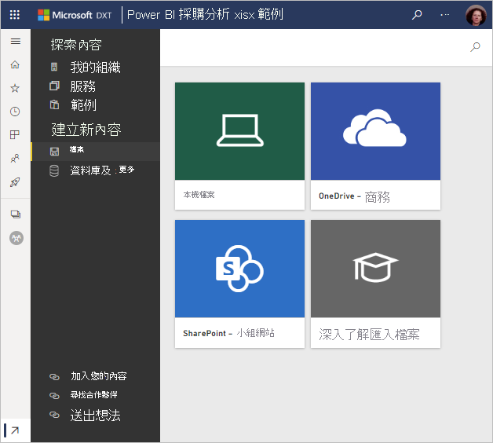
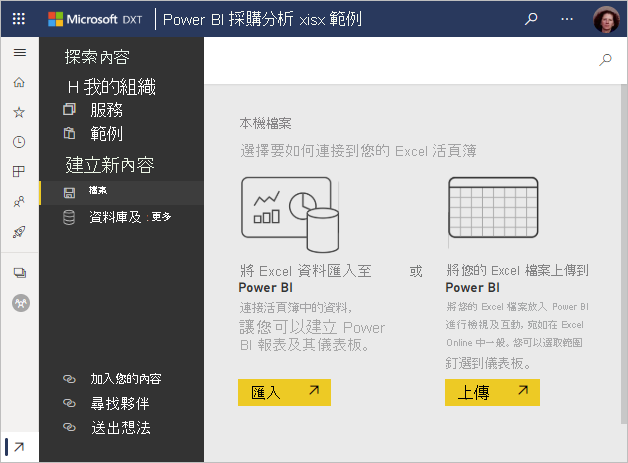

# 取得 Power BI 範例
您是否剛接觸 Power BI 並想要試用，但沒有任何資料；  或者，您可能想要查看說明 Power BI 功能的報表。 交給我們吧。

Power BI 提供不同類型的範例，適用於不同的用途： 
- **[Power BI 報表](#sales--returns-sample-pbix-file) (.pbix 檔案)** ，您可以在資料故事程式庫中檢視、在 Power BI Desktop 中開啟和探索，或上傳至 Power BI 服務。
- 一種 **[範例應用程式](#sample-app-from-appsource)** ，您可以從 AppSource 下載，也可直接在 Power BI 服務中進行。 包含儀表板、報表和資料集的應用程式。 您可以進行修改，然後將其散發給您的同事。
- Power BI 服務中 **[有八個原始內建範例](#eight-original-samples)** 作為「內容套件」  ，具有儀表板、報表和資料集。 您可以直接在 Power BI 服務中加以安裝。 內建範例也可以作為 Power BI 報表 (.pbix) 和 Excel 活頁簿 (.xlsx)。
- **[Excel 活頁簿](#download-sample-excel-files)** 版本的內建範例版本，其中包含資料模型和 Power View 工作表。 您可以在 Excel 中探索或編輯資料模型，使用 Excel 活頁簿作為 Power BI 報表的資料來源。 您也可以將活頁簿上傳為 Excel 檔案，並在 Power BI 報表中顯示 Excel 視覺效果和樞紐分析表。 
- 此外還有 **[財務資料範例活頁簿](sample-financial-download.md)** ，可供下載的 Excel 檔案中簡單平面資料表。 此範例包含虛構產品的匿名資料，並以市場區隔和國家/地區來區分銷售。 其會為 Power BI 報表提供有用的基本資料來源。

我們的線上文件會在教學課程和範例中使用這些相同範例，讓您能夠跟著進行。

## 銷售與退貨範例 .pbix 檔案

:::image type="content" source="media/sample-datasets/sales-returns-sample-pbix.png" alt-text="銷售與退貨範例 .pbix 檔案":::

銷售與退貨範例報表

Power BI 報表設計師 Miguel Myers 和 Chris Hamill 建立銷售與退貨 .pbix 檔案，以示範 Power BI 中的許多新功能，包括按鈕、鑽研、條件式格式設定、假設和自訂工具提示。 

這份報表的案例是銷售 Microsoft 主題滑板的公司。 他們想要查看其銷售與退貨狀態，並分析他們應該如何修改其作業。 

您可以下列方式探索：

- 在 Power BI 社群[資料故事程式庫](https://community.powerbi.com/t5/Data-Stories-Gallery/Sales-amp-Returns-Sample-Report/m-p/876607) (英文) 中檢視以及互動。
- 下載 .pbix 檔案並深入探索。 一窺「幕後」真相，以了解 Miguel 如何進行。 選取此連結會自動下載檔案：[銷售與退貨範例報表](https://go.microsoft.com/fwlink/?linkid=2113239)。
- 閱讀 Power BI 部落格文章中的報表，[瀏覽新的銷售與退貨範例報表](https://powerbi.microsoft.com/blog/take_a_tour_of_the_new_sales_returns_sample_report/) (英文)。

## AppSource 的範例應用程式

行銷和銷售「應用程式」  可以從 Microsoft AppSource 取得。 應用程式是將相關儀表板和報表結合的 Power BI 內容類型。 應用程式可以有一或多個儀表板和一或多個報表，所有儀表板和報表都會組合在一起。 您可以從 Power BI 服務中的 [應用程式]  下載行銷和銷售應用程式，或在瀏覽器中前往 AppSource。

- 本文[安裝和使用應用程式](../consumer/end-user-app-view.md)會說明如何從 Power BI 服務內下載應用程式。
- 此連結會帶您前往 AppSource 中的[銷售與行銷應用程式](https://appsource.microsoft.com/product/power-bi/microsoft-retail-analysis-sample.salesandmarketingsample?tab=Overview)。

安裝之後，其會出現在應用程式集合中。

:::image type="content" source="media/sample-datasets/power-bi-sales-marketing-app.png" alt-text="銷售與行銷應用程式圖格":::

當您開啟時，請選取**探索範例資料**。 

:::image type="content" source="media/sample-datasets/power-bi-explore-app.png" alt-text="探索應用程式":::

您會看到應用程式檢視，在瀏覽窗格中有儀表板和個別報表頁面。 

:::image type="content" source="media/sample-datasets/power-bi-sales-marketing-app-navigation.png" alt-text="應用程式瀏覽窗格":::

因為您已安裝，所以也可以開啟「工作區」  並且編輯應用程式的元素。 選取 [編輯]  鉛筆圖示，以開啟工作區。

:::image type="content" source="media/sample-datasets/power-bi-app-edit-pencil.png" alt-text="編輯應用程式":::

現在您會在工作區的清單檢視中，看到來自應用程式的儀表板、報表和資料集。 在此工作區中，您可以編輯每個項目。

:::image type="content" source="media/sample-datasets/power-bi-sales-marketing-workspace.png" alt-text="銷售與行銷工作區":::

如有需要，您可以將此應用程式散發給組織中的任何人。 選取 [更新應用程式]  。

:::image type="content" source="media/sample-datasets/power-bi-update-app.png" alt-text="更新應用程式按鈕":::

完成 [設定]  索引標籤，包括選擇**應用程式佈景主題色彩**。 

:::image type="content" source="media/sample-datasets/power-bi-app-setup.png" alt-text="選取應用程式設定":::

完成 [瀏覽]  和 [權限]  索引標籤，然後選取 [更新應用程式]  。

:::image type="content" source="media/sample-datasets/power-bi-select-update-app.png" alt-text="選取更新應用程式以便發佈":::

深入了解如何[在 Power BI 中發佈應用程式](../collaborate-share/service-create-distribute-apps.md)。

## 八個原始範例
有八個原始範例供您使用。 每個範例各代表一種不同產業。 您可以使用不同的格式來與每個範例進行互動：

- 在 Power BI 服務中安裝[內建內容套件](#install-built-in-content-packs)。
- 下載 [Power BI 報表檔案](#download-original-sample-power-bi-files) (.pbix)。
- 下載 [Excel 活頁簿檔案](#download-sample-excel-files) (.xlsx)，然後將其上傳至 Power BI 服務。
- 探索 [Excel 中的 Excel 檔案](#explore-excel-samples-inside-excel)。

obviEnce 公司 ([www.obvience.com](http://www.obvience.com/)) 與 Microsoft 合作，建立可供您搭配 Power BI 使用的範例。  資料經匿名處理，並代表了不同產業：財務、HR、銷售等。 

這些範例均以數種格式提供：內容套件、Excel 活頁簿及 Power BI .pbix 檔案。 如果您不了解這些是什麼，或如何開始使用，也不必擔心。 本文說明這一切。 針對每個範例，我們建立了一個「導覽」  。 導覽是說明範例背後案例並帶您瀏覽不同案例的文章。 也許會有一個案例回答您經理的問題、另一個則會談討競爭力解析，或建立報表及儀表板以供共用、或說明業務轉換。

在開始之前，以下是使用這些範例的法律規範。 之後，我們會介紹範例及示範使用方式。

### 範例 Excel 活頁簿的使用方式方針

&copy;2015 Microsoft Corporation. All rights reserved. 文件和活頁簿皆以「現況」提供。 活頁簿中呈現的資訊和檢視，包括 URL 及其他網際網路網站參考資料，可能會變更，恕不另行通知。 貴用戶須自行承擔使用風險。 部分範例僅供示範，均屬虛構， 亦沒有任何預定或推斷的實際關聯。 針對此處提供的資訊，Microsoft 不做任何明示或默許的擔保。

活頁簿不會提供您任何 Microsoft 產品的任何智慧財產權法定權利。 您可以複製並使用此活頁簿以供內部參考之用。

活頁簿和相關的資料是由 obviEnce 提供。 [www.obvience.com](http://www.obvience.com)

ObviEnce 是一家 ISV 和 Microsoft Business Intelligence 的智慧財產權 (IP) 提供機構。 ObviEnce 與 Microsoft 密切合作以開發最佳作法，亦建立開始與部署 Microsoft Business Intelligence 解決方案的概念領導地位。

活頁簿和資料皆為 obviEnce LLC 的財產，並僅供以業界範例資料示範 Power BI 功能的目的而分享。

任何活頁簿及/或資料 (包括每個活頁簿包含之資訊工作表) 的使用皆必須包含上述歸屬聲明。 活頁簿和任何視覺效果亦必須提供下列著作權聲明：obviEnce &copy;。

按一下下方任一連結下載 Excel 活頁簿檔案或 .pbix 檔案，即表示您同意上述條款。

### 客戶獲利率範例  
[瀏覽客戶獲利率範例](sample-customer-profitability.md)

這個產業範例會分析財務長對公司主管、產品和客戶的關鍵計量。 您可以調查哪些因素會影響公司的獲利率。

### 人力資源範例 
[瀏覽 HR 範例](sample-human-resources.md)

這個產業範例藉由分析新進員工、現有員工和離職員工，著眼於公司的招聘策略。  透過瀏覽資料，您可以找到自願離職的傾向與招聘策略的趨勢。

### IT 費用分析範例 
[瀏覽 IT 支出分析範例](sample-it-spend.md)

在這個產業範例中，我們分析公司 IT 部門的規劃成本與實際成本。 這項比較可幫助我們了解公司的年度計畫是否得當，並可針對大大偏離計畫的領域進行調查。 此範例中的公司，會經歷一年一度的計畫週期，然後按季產出新的「最新估計」(LE) 來協助分析 IT 支出於會計年度的變化。

### 商機分析範例 
[瀏覽商機分析範例](sample-opportunity-analysis.md)

這個產業範例會探討軟體公司的銷售通路。 業務經理依地區、交易大小和通路追蹤商機和營收，藉此監控他們的直接與合作夥伴銷售通路。

### 採購分析範例  
[瀏覽採購分析範例](sample-procurement.md)

這個產業範例會分析財務長對公司主管、產品和客戶的關鍵計量。 您可以調查哪些因素會影響公司的獲利率。

### 零售分析範例  
[瀏覽零售分析範例](sample-retail-analysis.md)

這個產業範例會分析在多個門市和區域售出之品項的零售資料。 計量會比較今年與去年在以下領域的表現：銷售、單位、毛利率和變異數，以及新門市分析。

### 銷售與行銷範例  
[瀏覽銷售與行銷範例](sample-sales-and-marketing.md)

這個產業範例會分析製造公司 VanArsdel Ltd。它可讓行銷長觀察產業與 VanArsdel 的市場占有率。  透過瀏覽範例，您可以找到這家公司的市場佔有率、生產量、銷售和情緒指數。

### 供應商品質範例  
[瀏覽供應商品質範例](sample-supplier-quality.md)

這個產業範例著重在傳統供應鏈的其中一項挑戰：供應商品質的分析。 有兩個主要的計量會在此分析中發揮作用：缺失總數和缺失所造成的停工期總計。 這個範例有兩個主要目標：找出品質最佳與最差的供應商，以及找出哪家工廠表現最好，能找到缺點並加以移除，將停工期降到最低。

### 安裝內建內容套件

讓我們以 [內容套件]  作為起始。 內建範例可在 Power BI 服務中取得；您不需要離開 Power BI 來尋找範例。 內容套件是某人建立的一或多個儀表板、資料集和報表組合，可以搭配 Power BI 服務使用。 每個 Power BI 範例內容套件都包含一個資料集、報表和儀表板。  內容套件仍然可用，但是逐漸淘汰中。 其不適用於 Power BI Desktop。

1. 開啟 Power BI 服務 (app.powerbi.com) 並登入。
2. 瀏覽至 [我的工作區]，或是您想要在其中安裝範例的其他工作區。 
2. 在左下角選取 [取得資料]  。

    
3. 在顯示的 [取得資料] 頁面上，選取 [範例]  。

   
4. 選取其中一個範例以開啟該範例的描述，然後選擇 [連線]  。  

   ![選取某個範例 > 選取 [連線]](media/sample-datasets/power-bi-connect.png)
5. Power BI 會匯入內容套件，並將新的儀表板、報表及資料集新增到您目前的工作區。 使用範例讓 Power BI 進行測試回合。  

   

現在您有了資料，可以開始進行。  使用範例內容套件試試幾個教學課程，或直接開啟 Power BI 服務及探索。

### 下載原始範例 Power BI 檔案
每個範例內容套件也都能以 Power BI .pbix 檔案形式提供。 .pbix 檔案的設計目的是搭配 Power BI Desktop 使用。  

1. 使用下方連結個別下載檔案。 選取這些連結會自動將檔案儲存至您的 [下載] 資料夾。 

   - [客戶獲利率範例 PBIX](https://download.microsoft.com/download/6/A/9/6A93FD6E-CBA5-40BD-B42E-4DCAE8CDD059/Customer%20Profitability%20Sample%20PBIX.pbix)
   - [人力資源範例 PBIX](https://download.microsoft.com/download/6/9/5/69503155-05A5-483E-829A-F7B5F3DD5D27/Human%20Resources%20Sample%20PBIX.pbix)
   - [採購分析範例 PBIX](https://download.microsoft.com/download/D/5/3/D5390069-F723-413B-8D27-5888500516EB/Procurement%20Analysis%20Sample%20PBIX.pbix)
   - [零售分析範例 PBIX](https://download.microsoft.com/download/9/6/D/96DDC2FF-2568-491D-AAFA-AFDD6F763AE3/Retail%20Analysis%20Sample%20PBIX.pbix)
   - [銷售與行銷範例 PBIX](https://download.microsoft.com/download/9/7/6/9767913A-29DB-40CF-8944-9AC2BC940C53/Sales%20and%20Marketing%20Sample%20PBIX.pbix)
   - [供應商品質分析範例 PBIX](https://download.microsoft.com/download/8/C/6/8C661638-C102-4C04-992E-9EA56A5D319B/Supplier-Quality-Analysis-Sample-PBIX.pbix)

1. 在 Power BI Desktop 中，選取 [檔案] > [開啟]  ，然後瀏覽至您儲存範例 .pbix 檔案的位置。

4. 選取 .pbix 檔案，以在 Power BI Desktop 中加以開啟。

### 下載範例 Excel 檔案
每個範例內容套件也都能以 Excel 活頁簿形式提供。 這些 Excel 活頁簿經過設計，可與 Power BI 服務搭配使用。  

1. 請使用下方連結個別下載檔案，或[下載所有範例檔案的 ZIP 檔案](https://go.microsoft.com/fwlink/?LinkId=535020)。 如果您是進階使用者，可能必須下載 Excel 活頁簿以探索或編輯資料模型。

   - [客戶獲利率範例](https://go.microsoft.com/fwlink/?LinkId=529781)
   - [人力資源範例](https://go.microsoft.com/fwlink/?LinkId=529780)
   - [商機追蹤範例](https://go.microsoft.com/fwlink/?LinkId=529782)
   - [採購分析範例](https://go.microsoft.com/fwlink/?LinkId=529784)
   - [零售分析範例](https://go.microsoft.com/fwlink/?LinkId=529778)
   - [銷售與行銷範例](https://go.microsoft.com/fwlink/?LinkId=529785)
   - [供應商品質分析範例](https://go.microsoft.com/fwlink/?LinkId=529779)

2. 儲存下載的檔案。 檔案的儲存位置會有差異。

     **本機**- 如果您將檔案儲存到電腦上的本機磁碟或組織中的其他位置，您可以從 Power BI 將檔案匯入 Power BI 中。 您的檔案會保留在本機磁碟，因此不會將整個檔案匯入 Power BI。 發生的情況是在 Power BI 網站中建立新資料集，並將資料和資料模型 (在某些情況下) 載入資料集。 如果您的檔案有任何報表，則這些報表會顯示在 Power BI 網站的 [報表] 下。
    
     **OneDrive - 商務** – 如果您有商務用 OneDrive，並使用與用來登入 Power BI 相同的帳戶進行登入，則商務用 OneDrive 是目前為止確保 Excel、Power BI 或 .CSV 檔案中工作與 Power BI 中資料集、報表和儀表板保持同步的最佳位置。 由於 Power BI 和 OneDrive 都在雲端，因此 Power BI 每隔約一小時就會連接到您在 OneDrive 上的檔案。 如果發現任何變更，便會自動更新 Power BI 中的資料集、報表和儀表板。
    
     **SharePoint 小組網站** - 將 Power BI 檔案儲存到 SharePoint - 小組網站與儲存到商務用 OneDrive 大致相同。 最大的差異是從 Power BI 連接到檔案的方式。 您可以指定 URL 或連接到根資料夾。
1. 開啟 Power BI 服務 (app.powerbi.com) 並登入。

1. 瀏覽至 [我的工作區] 或另一個工作區，或只針對範例建立工作區。

4. 選取瀏覽窗格左下角的 [取得資料]  。

    
5. 在顯示的 [取得資料]  頁面上，選取 [檔案] > [取得]  。

    
6. 選取您下載及儲存範例的位置。

    
7. 選取檔案。 視您儲存檔案的位置而定，選取 [連線]  或 [開啟]  。

8. 選擇要匯入資料，還是要將活頁簿帶入 Power BI 以查看其在 Excel Online 中的實際呈現方式。

    
9. 如果您選取 [匯入]  ，Power BI 會匯入範例活頁簿，並將其新增為新儀表板、報表和資料集，在此案例中，每個都名為 **Procurement Analysis Sample**。

    - 因為活頁簿具有 Power View 工作表，Power BI 會為每個 Power BI 工作表建立含有頁面的報表。 
    - Power BI 會使用新的空白圖格來建立新的儀表板。  選取該圖格會帶您前往您剛剛新增的報表。

10. 開啟報表。 選取報表的不同元素以探索其互動。 

    

### 探索 Excel 內的 Excel 範例

(選擇性) 想了解 Excel 活頁簿中的資料如何轉換為 Power BI 資料集和報表嗎？ *在 Excel 中*開啟 Excel 範例，瀏覽工作表就會得到一些答案。

- 第一次在 Excel 中開啟範例活頁簿時，您可能會看到兩個警告。 第一個警告說明活頁簿是在受保護的檢視中。 選取 [啟用編輯]  。 第二個警告可能指出活頁簿具有外部資料連線。 選取 [啟用內容]  。
- 每個活頁簿都包含數個 Power View 工作表。 如果您想要在 Excel 中查看 Power View 工作表，您需要下載封裝的登錄機碼來[啟用 Power View 增益集](https://support.office.com/article/flash-silverlight-and-shockwave-controls-blocked-in-microsoft-office-55738f12-a01d-420e-a533-7cef1ff6aeb1)。
- 實際資料會位在何處？ Power Pivot 資料模型中。 您不需要 Power View 工作表就能查看資料。 在 [Power Pivot]  索引標籤中，選取 [管理]  。

    沒看到 [Power Pivot]  索引標籤？ [啟用 Power Pivot 增益集](https://support.office.com/article/Start-Power-Pivot-in-Microsoft-Excel-2013-add-in-A891A66D-36E3-43FC-81E8-FC4798F39EA8)。

    在 Power Pivot 中，您可以查看所有基礎資料表中的資料，再加上所有 DAX 公式。 

- [資訊] 索引標籤提供建立此範例之 obviEnce 公司的相關資訊。

## 後續步驟
[Power BI 服務中的設計工具基本概念](../fundamentals/service-basic-concepts.md)

[教學課程：連線到 Power BI 範例](sample-tutorial-connect-to-the-samples.md)

[Power BI 的資料來源](../connect-data/service-get-data.md)

有其他問題嗎？ [試試 Power BI 社群](https://community.powerbi.com/)
