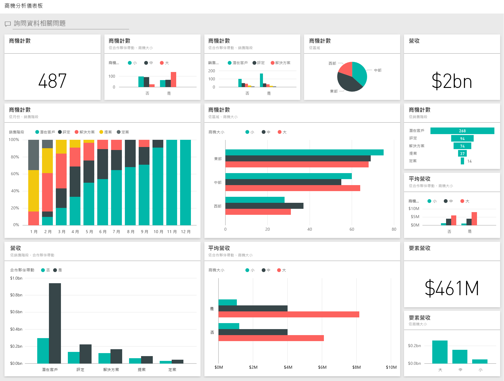

# 適用於 Power BI 的商機分析範例：觀看導覽

商機分析範例內容套件包含一個儀表板、報表和一家具有 2 個銷售通路 (「直接」  和「合作夥伴」  ) 之軟體公司的資料集。 此儀表板由銷售經理所建立，以區域、交易量與通路來追蹤商機與營收。

此案例依賴兩個營收量值：

* 營收：業務人員對於公司營收的預估。
* 要素營收：以營收 x 機率百分比進行計算，且認為其可更精確地預測實際銷售營收。 機率由交易目前的「銷售階段」  決定：
  * 潛在客戶：10%  
  * 評定：20%  
  * 解決方案：40%  
  * 提案：60%  
  * 定案：80%

此範例是系列中的一部分，說明您可如何使用 Power BI 的商業導向資料、報表與儀表板。 它是由 [obviEnce](http://www.obvience.com/) 使用真實資料 (已匿名化) 所建立。 資料會以數種格式提供：內容套件、.pbix Power BI Desktop 檔案，或 Excel 活頁簿。 請參閱 [Power BI 範例](sample-datasets.md)。 

此教學課程探索 Power BI 服務中的商機分析範例內容套件。 因為 Power BI Desktop 和服務中報表的使用體驗皆非常類似，因此您也可以在 Power BI Desktop 中使用範例 .pbix 檔案來進行教學課程。 

您不需要 Power BI 授權，即可在 Power BI Desktop 中瀏覽範例。 如果您沒有 Power BI Pro 授權，則可以將範例儲存到 Power BI 服務中的 [我的工作區]。 

## 取得範例

您必須先將範例下載為[內容套件](#get-the-content-pack-for-this-sample)、[.pbix 檔案](#get-the-pbix-file-for-this-sample)或 [Excel 活頁簿](#get-the-excel-workbook-for-this-sample)，才能使用範例。

### 取得此範例的內容套件

1. 開啟 Power BI 服務 (app.powerbi.com) 並登入，然後開啟您要儲存範例的工作區。 

    如果您沒有 Power BI Pro 授權，則可以將範例儲存到 [我的工作區]。

2. 在左下角選取 [取得資料]  。

    ![選取 [取得資料]](media/sample-datasets/power-bi-get-data.png)
3. 在顯示的 [取得資料]  頁面上，選取 [範例]  。

4. 選取 [商機分析範例]  ，然後選擇 [連線]  。  

   
5. Power BI 會匯入內容套件，然後將新儀表板、報表和資料集新增至您目前的工作區。

   

### 取得此範例的 .pbix 檔案

或者，您可以將商機分析範例下載為 [.pbix 檔案](https://download.microsoft.com/download/9/1/5/915ABCFA-7125-4D85-A7BD-05645BD95BD8/Opportunity%20Analysis%20Sample%20PBIX.pbix)，其設計目的是要用於 Power BI Desktop。

### 取得此範例的 Excel 活頁簿

如果您想要檢視此範例的資料來源，其也有可用的 [Excel 活頁簿](https://go.microsoft.com/fwlink/?LinkId=529782) 格式。 活頁簿包含的 Power View 工作表可供您檢視及修改。 若要查看未經處理資料，請啟用「資料分析」增益集，然後選取 [Power Pivot] > [管理]  。 若要啟用 Power View 和 Power Pivot 增益集，請參閱[在 Excel 中探索 Excel 範例](sample-datasets.md#explore-excel-samples-inside-excel)以了解詳情。

## 儀表板告訴我們什麼？
我們的銷售經理已建立儀表板來追蹤其最重要計量。 當他們看到值得關注的項目時，可以選取磚來深入探究資料：

- 公司營收 $20 億而要素營收為 $4.61 億。
- 商機計數和營收會依照類似的漏斗圖模式，總計隨著每個後續階段遞減。
- 我們的商機大多位於東部地區。
- 大商機會比中小型商機產生更多營收。
- 大型合作夥伴交易產生更多營收：平均為 8 百萬美元，而直接銷售為 6 百萬美元。

不論交易歸屬於大型、中型或小型，為了成交都必須付出一樣的心力，因此公司應該分析資料以更了解大商機。

1. 在儲存範例的工作區中，開啟 [儀表板]  索引標籤，然後尋找 [商機分析範例]  儀表板並加以選取。

2. 選取 [由夥伴帶動、銷售階段劃分的商機計數]  圖格，以開啟 [商機分析範例] 報表的第一頁。 

    ![[由夥伴帶動的商機計數 (銷售階段)] 圖格](media/sample-opportunity-analysis/opportunity2.png)

## 瀏覽報表的頁面

透過選取底部的頁面索引標籤，檢視報表中的每個頁面。

### [商機計數概觀] 頁面
![[商機計數] 頁面](media/sample-opportunity-analysis/opportunity3.png)

注意下列詳細資料：
* 東部是我們商機計數最大的地區。  
* 在 [依區域劃分的商機計數]  圓形圖中，依次選取每個區域，以依區域篩選頁面。 在每個地區中，請注意合作夥伴都會更積極追求大商機。   
* [由夥伴帶動和商機大小劃分的商機計數]  直條圖顯示，大部分的大型商機都是夥伴帶動，而大部分的中小型商機則不是如此。
* 在 [依銷售階段劃分的商機計數]  橫條圖中，依次選取每個**銷售階段**，以查看區域計數中的差異。 請注意，雖然東部區域擁有最大的商機計數，但解決方案、提案和定案銷售階段中的所有三個區域會有為數相當的計數。 此結果表示我們在中部和西部區域有更高的成交率。

### [營收分析] 頁面
此頁會採取類似的資料檢視方式，但改由營收的角度而不是計數的角度來看。  

![[營收概觀] 頁面](media/sample-opportunity-analysis/opportunity4.png)

注意下列詳細資料：
* 東部不只是商機最大的區域，也是營收最高的區域。  
* 如果您透過為 [夥伴驅動]  選取 [是]  來篩選 [依銷售階段與夥伴驅動的營收]  圖表，您會看到營收為 15 億美元，要素營收為 2 億 9400 萬美元。 針對非夥伴驅動營收，將這些金額與 6.44 億美元和 1.66 億美元進行比較。 
* 相較於非夥伴驅動銷售平均營收 6 百萬，若商機是夥伴驅動，則大型帳戶平均 8 百萬的營收較高。  
* 針對夥伴驅動銷售，大型商機的平均營收幾乎是中型商機的兩倍。  
* 而不論是合作夥伴帶動的銷售及非合作夥伴帶動的銷售，其中小型銷售的平均營收為數相當。   

顯然我們的夥伴在向客戶銷售時表現得比非夥伴更好。 因此，將更多交易分配給我們的合作夥伴應該是合理的。

### 依區域和階段的商機計數
報表的此頁面會查看與前一個頁面上的資料類似的資料，但會依區域和階段對其進行細分。 

![[區域階段計數] 頁面](media/sample-opportunity-analysis/opportunity5.png)

注意下列詳細資料：
* 如果您在 [依區域劃分的商機計數]  圓形圖中選取 [東部]  來依東部區域進行篩選，您會發現此區域的商機在夥伴帶動和非夥伴帶動之間幾乎相同。
* 大商機最常出現在中部區域，小型商機最常出現在東部區域，而中型商機則最常出現在西部區域。

### [依月份劃分的近期商機] 頁面
針對此頁面，我們會檢視類似的要素，但是從日期/時間的角度來看。 
 
![[近期商機] 頁面](media/sample-opportunity-analysis/opportunity6.png)

我們 CFO 使用此頁面來管理工作量。 透過查看依銷售階段和月份區分的營收商機，他們可以據此進行適當的規劃。

注意下列詳細資料：
* [定案] 銷售階段的平均營收最高。 因此成交是第一要務。
* 如果您依月份篩選 (透過選取 [月份]  交叉分析篩選器中的月份) 時，您會看到一月的 [定案] 銷售階段有較多大型交易，要素營收為 $7500 萬。 反之，二月的 [解決方案] 和 [提案] 銷售階段中大多數是中型交易。
* 一般而言，要素營收數字會因銷售階段、商機數與交易大小而變動。 針對這些要素加入篩選 (使用右邊的 [篩選]  窗格) 以探索更深入的見解。

## 後續步驟：連線到您的資料
您可以在此環境盡情嘗試，因為您可以選擇不儲存您的變更。 但如果儲存了變更，您也可以隨時選取 [取得資料]  以取得此範例的新複本。

希望此教學已讓您了解 Power BI 儀表板、問與答和報表能夠如何提供範例資料的見解。 現在輪到您了，請連接到您自己的資料。 您可以透過 Power BI 連接到各式各樣的資料來源。 若要深入了解，請參閱[開始使用 Power BI 服務](../fundamentals/service-get-started.md)。
