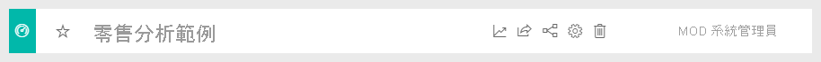
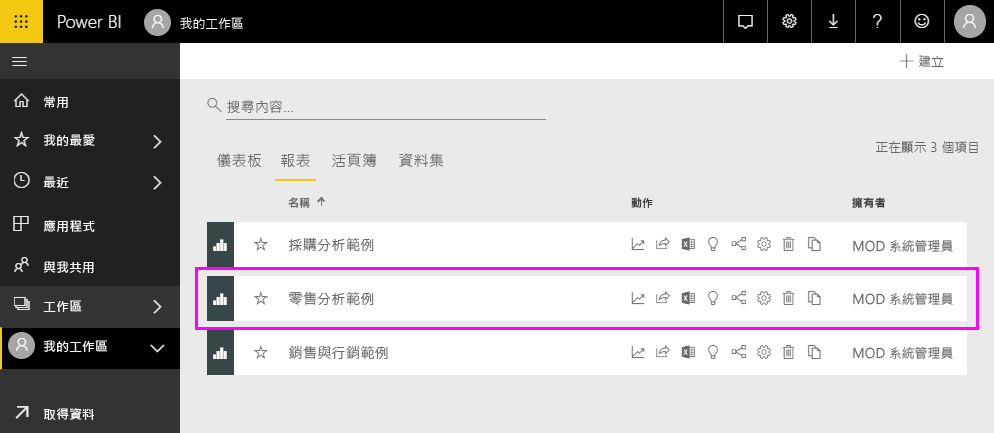
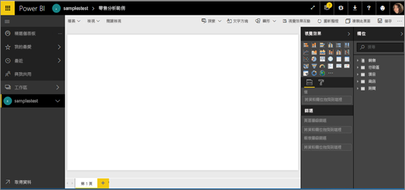
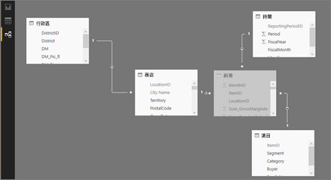

# 探索零售分析範例

本教學課程說明如何： 
- 匯入零售分析範例內容套件，將其新增至 Power BI 服務，然後開啟內容。 「內容套件」  是一種範例類型，其中資料集會隨附在儀表板及報表中。 
- 在 Power BI Desktop 中開啟零售分析範例 .pbix 檔案。

如果您想要多了解一點背景，請參閱 [Power BI 的範例資料集](sample-datasets.md)。 在該文章中，您會了解範例的所有資訊：範例要如何取得、儲存、使用，以及各範例可提供的一些案例。 

## 必要條件
這些範例適用於 Power BI 服務和 Power BI Desktop。 若要跟著做，我們是使用零售分析範例。

本教學課程使用的「零售分析」  內容套件範例，包含儀表板、報表和資料集。
若要熟悉此特定內容套件及其案例，請參閱[適用於 Power BI 的零售分析範例：觀看導覽](sample-retail-analysis.md)，再開始進行。

## 匯入 Power BI 服務中的範例

1. 開啟 Power BI 服務 (app.powerbi.com) 並登入，然後開啟您要儲存範例的工作區。 

    如果您沒有 Power BI Pro 授權，則可以將範例儲存到 [我的工作區]。

2. 在導覽窗格的底部，選取 [取得資料]  。 

   ![選取 [取得資料]](media/sample-datasets/power-bi-get-data.png)

   如果您看不到 [取得資料]  ，請選取窗格頂端的下列圖示來展開導覽窗格：。

5. 在顯示的 [取得資料]  頁面上，選取 [範例]  。
   
6. 選取 [零售分析範例]  ，然後選擇 [連線]  。   
   
   

## 匯入什麼內容？
透過簡單的內容套件，當您選取 [連線]  時，Power BI 會取得該內容套件的複本並將其儲存在雲端。 因為內容套件的建立者納入了資料集、報表及儀表板，所以當您選取 [連線]  時，這就是您會得到的項目。 

1. 當您選取 [連線]  時，Power BI 會建立新的儀表板，並將其列在您的 [儀表板]  索引標籤中。 
   
   
2. 開啟 [報表]  索引標籤。您會在這裡看到名為「零售分析範例」  的新報表。
   
   
   
   查看 [資料集]  索引標籤，其中也會有新的資料集。
   
   

## 探索您的新內容
現在請自行探索儀表板、資料集和報表。 有很多不同方法可以巡覽到您的儀表板、報表和資料集。 下列程序描述其中一種方法。  

1. 巡覽回 [儀表板]  索引標籤，然後選取 [零售分析範例]  儀表板加以開啟。       

   儀表板隨即開啟，其中有多種視覺效果磚。   
 
1. 選取儀表板中的其中一個磚以開啟基礎報表。 在此範例中，我們會選取區域圖 [依會計月份的今年銷售額、去年銷售額]  。  

   ![已醒目提示視覺效果的 [零售分析範例] 儀表板](media/sample-tutorial-connect-to-the-samples/power-bi-dashboards2new.png)

   報表會隨即開啟頁面，其中包含您選取的區域圖；在本例中為報表的 [區域每月銷售額]  頁面。
   
   
   
   > [!NOTE]
   > 如果磚是使用 [Power BI 問與答](power-bi-tutorial-q-and-a.md)所建立，則會改為開啟問與答頁面。 如果該磚是[釘選自 Excel](service-dashboard-pin-tile-from-excel.md)，則 Excel Online 將會在 Power BI 中開啟。
   > 
   > 
1. 當有人與同事共用內容套件時，他們通常只想要共用見解，而不想要提供資料的直接存取權。 在 [資料集]  索引標籤上，您有多種選項可以探索資料集。 不過，您無法像是在 Power BI Desktop 或 Excel 中一樣檢視多列和多欄資料。 
   
   
   
1. 其中一個探索資料集的方式，是從頭建立您自己的視覺效果及報表。 選取圖表圖示  以報表編輯模式開啟資料集。
     
   

1. 另一個探索資料集的方法是執行[快速見解](../consumer/end-user-insights.md)。 選取 [更多選項]  (...)，然後選擇 [取得快速見解]  。 當深入資訊就緒時，請選取 [檢視深入資訊]  。
     
    

## 下載 Power BI Desktop 中的範例 
當您第一次在 Power BI Desktop 中開啟範例 .pbix 檔案時，它會在 [報表檢視] 中顯示，以供您搭配視覺效果探索、建立及修改任何數量的報表頁面。 [報表檢視] 所提供的設計體驗，幾乎與 Power BI 服務中報表的 [編輯檢視] 相同。 您可以在四處移動、複製及貼上、合併其中的視覺效果等等。 

不同於在 Power BI 服務中編輯報表，在 Power BI Desktop 中，您也可以使用查詢及建立資料模型，確保資料在報表中能夠提供最透徹的見解。 然後，您可以將 Power BI Desktop 檔案儲存在任何位置，無論是本機磁碟機或雲端。

1. 下載[零售分析範例 .pbix 檔案](https://download.microsoft.com/download/9/6/D/96DDC2FF-2568-491D-AAFA-AFDD6F763AE3/Retail%20Analysis%20Sample%20PBIX.pbix)並在 Power BI Desktop 中加以開啟。 

    

1. 檔案會在 [報表檢視] 中開啟。 注意報表編輯器底部的四個索引標籤；這些索引標籤代表此報表中的四個頁面。 在此範例中，目前選取的是 [新門市]  頁面。 

    ![醒目提示的 [新門市] 索引標籤](media/sample-tutorial-connect-to-the-samples/power-bi-sample-tabs.png).

1. 若要深入了解報表編輯器，請參閱[報表編輯器導覽](service-the-report-editor-take-a-tour.md)。

## 報表中有哪些內容？
當您下載範例 .pbix 檔案時，您不僅會下載報表，也會下載「基礎資料集」  。 當您開啟檔案時，Power BI Desktop 會載入資料及其關聯查詢和關聯性。 您可以檢視基礎資料和關聯性，但無法在 [查詢編輯器] 中檢視基礎查詢。

1. 選取資料表圖示  以切換到 [資料檢視](../connect-data/desktop-data-view.md)。
 
    

    在 [資料檢視] 中，您可以檢查、探索及了解 Power BI Desktop 模型中的資料。 它與您在 [查詢編輯器] 中檢視資料表、資料行和資料的方式不同。 [資料檢視] 中的資料已載入至模型。

    當您建立資料模型時，有時會想要在報表畫布上沒有建立視覺效果的情況下，查看資料表中資料列和資料行的實際內容。 特別是當您要建立量值和導出資料行，或需要識別資料類型或資料類別時。

1. 選取下列圖示以切換到[關聯性檢視](../transform-model/desktop-relationship-view.md)：。
 
    

    [關聯性檢視] 會顯示模型中的所有資料表、資料行及關聯性。 您可以從這裡檢視、變更及建立關聯性。

## 後續步驟
您可以在此環境盡情嘗試，因為您可以選擇不儲存您的變更。 但如果儲存了變更，您也可以隨時選取 [取得資料]  以取得此範例的新複本。

我們希望此導覽已說明 Power BI 儀表板、資料集、關聯性和報表如何提供範例資料的見解。 現在輪到您了，請連接到您自己的資料。 您可以透過 Power BI 連接到各式各樣的資料來源。 若要深入了解，請參閱[開始使用 Power BI 服務](../fundamentals/service-get-started.md)和[開始使用 Power BI Desktop](../fundamentals/desktop-getting-started.md)。  

如需詳細資訊，請參閱：  
- [Power BI 服務中的設計工具基本概念](../fundamentals/service-basic-concepts.md)
- [Power BI 服務的範例](sample-datasets.md)
- [Power BI 的資料來源](../connect-data/service-get-data.md)

有其他問題嗎？ [試試 Power BI 社群](https://community.powerbi.com/)
