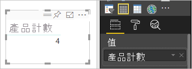
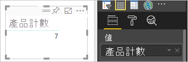

# 在 Power BI 服務中使用彙總 (加總、平均等等)

## 什麼是彙總？

有時候您會想要以數學方式結合資料中的值。 數學運算可能是加總、平均、最大值、計數等等。 當您結合資料中的值時，它稱為「彙總」  。 數學運算的結果是「彙總值」  。

Power BI 服務和 Power BI Desktop 建立視覺效果時，可能會彙總資料。 通常彙總就是所需要的結果，但有時候您可能想要以不同方式來彙總值。  例如，總和與平均值。 有幾種不同方式來管理和變更 Power BI 在視覺效果中使用的彙總。

首先，讓我們查看資料「類型」  ，因為資料類型會決定 Power BI 如何彙總它，以及是否可以彙總。

## 資料類型

大部分的資料集有多個資料類型。 在最基本的層級，資料會是數值或不是數值。 Power BI 可以使用總和、平均值、計數、最小值、變異數，以及更多方式來彙總數值資料。 該服務甚至可以彙總文字資料，這通常稱為「類別目錄」  資料。 如果您嘗試透過將類別欄位放在僅限數值的貯體 (例如**值**或**工具提示**) 來將它彙總，Power BI 將計算每個類別的出現次數，或計算每個類別的相異出現次數。 特殊類型的資料 (例如日期) 有屬於自己的一些彙總選項：最早、最新、第一個和最後一個。

在下列範例中：

- [銷售單位]  與 [製造價格]  是包含數值資料的資料行

- [業別]  、[國家/地區]  、[產品]  、[月份]  和 [月份名稱]  包含類別目錄資料

   

在 Power BI 中建立視覺效果時，服務會對某些類別欄位彙總數值欄位 (預設值是「總和」  )。  例如，「『依產品』的銷售單位」、「『依月份』的銷售單位」和「『依業別』的製造價格」。 Power BI 會將某些數值欄位參考為**量值**。 您可以輕鬆地在 Power BI 報表編輯器中識別量值，因為 [欄位]  清單中的量值旁邊會顯示 ∑ 符號。 如需詳細資訊，請參閱[報表編輯器導覽](service-the-report-editor-take-a-tour.md)。

![將 [欄位] 清單框起來的 Power BI 螢幕擷取畫面。](media/service-aggregates/power-bi-aggregate-fields.png)

## 為什麼彙總運作的方式和我想要的不同？

在 Power BI 服務中使用彙總可能會令人感到混淆。 您可能會有數值欄位，但 Power BI 不讓您變更彙總。 或是您有一個欄位，例如年份，您不想彙總它，只想要計算發生次數。

一般而言，基礎問題會是資料集中的欄位定義。 也許資料集擁有者將欄位定義為文字，而那便能說明 Power BI 為何無法對它進行加總或平均。 不幸的是，[只有資料集擁有者可以變更欄位的分類方式](../transform-model/desktop-measures.md)。 因此如果您具有資料集的擁有者權限，不論是針對 Desktop 或是用來建立該資料集的程式 (例如 Excel)，您便可以修正這個問題。 否則，您必須連絡資料集擁有者以取得協助。  

此文章結尾有專門的小節，稱為[考量與疑難排解  ](#considerations-and-troubleshooting)。 它能提供祕訣及指引。 如果您在那裡找不到答案，請在 [Power BI 社群論壇](https://community.powerbi.com) \(英文\) 提出您的問題。 您將能快速獲得直接來自 Power BI 小組的回應。

## 變更數值欄位的彙總方式

假設您有加總不同產品銷售單位的圖表，但您比較想要平均值。

1. 建立使用量值及類別的 [群組直條圖]  。 在此範例中，我們會使用「依產品的銷售單位」。  根據預設，Power BI 會建立針對每個產品 (將類別拖曳至 [軸]  中) 之加總銷售單位 (將量值拖曳至 [值]  中) 的圖表。

   ![圖表、[視覺效果] 窗格及將 [加總] 框起來之 [欄位] 清單的螢幕擷取畫面。](media/service-aggregates/power-bi-aggregate-sum.png)

1. 在 [視覺效果]  窗格中，以滑鼠右鍵按一下量值，然後選取您需要的彙總類型。 在此案例中，我們會選取 [平均]  。 如果您沒有看到您需要的彙總，請參閱[考量與疑難排解  ](#considerations-and-troubleshooting)一節。

   ![將 [平均] 選取並框起來之彙總清單的螢幕擷取畫面。](media/service-aggregates/power-bi-aggregate-average.png)

   > [!NOTE]
   > 下拉式清單中可用的選項會因 1) 所選取的欄位，以及 2) 資料集擁有者分類該欄位的方式而有所不同。

1. 您的視覺效果現在使用依平均值彙總。

   

## 彙總資料的方式

彙總欄位可用的某些選項：

- **不加總**。 在選擇此選項的情況下，Power BI 會將分開處理欄位中的每個值，且不加總它們。 如果您有服務不應該加總的數值識別碼資料行，請使用此選項。

- **加總**。 加總該欄位中的所有值。

- **平均**。 求出值的算術平均值。

- **最小值**。 顯示最小的值。

- **最大值**。 顯示最大的值。

- **計數 (沒有空格)。** 計算該欄位中不是空白值的數目。

- **計數 (相異)。** 計算該欄位中不同值的數目。

- **標準差。**

- **變異數**。

- **中位數**。  顯示中間值。 此值之上和之下具有相同的項目數。  如果有兩個中位數，Power BI 會取其平均值。

例如，下列資料：

| 國家/地區 | 數量 |
|:--- |:--- |
| 美國 |100 |
| 英國 |150 |
| 加拿大 |100 |
| 德國 |125 |
| 法國 | |
| 日本 |125 |
| 澳洲 |150 |

會得到下列結果：

- **不摘要**：分別顯示每個值

- **加總**：750

- **平均**：125

- **最大值**：150

- **最小值**：100

- **計數 (沒有空格)** ：6

- **計數 (相異)** ：4

- **標準差**：20.4124145...

- **變異數**：416.666...

- **中位數**：125

## 建立使用類別 (文字) 欄位的彙總

您也可以彙總非數值欄位。 例如，如果有產品名稱欄位，您可以將它新增為值，然後將它設定為 [計數]  、[相異計數]  、[第一個]  或 [最後一個]  。

1. 將 [產品]  欄位拖曳至 [值]  中。 [值]  通常用於數值欄位。 Power BI 會將此欄位辨識為文字欄位，將彙總設為 [不摘要]  ，並為您呈現單一資料行的資料表。

   ![[值] 中 [產品] 欄位的螢幕擷取畫面。](media/service-aggregates/power-bi-aggregate-value.png)

1. 如果您將彙總從預設的 [不摘要]  變更為 [計數 (相異)]  ，Power BI 就會計算不同產品的數目。 在此案例中有四個。
  
   

1. 如果您將彙總變更為 [計數]  ，Power BI 就會計算總數。 在本案例中，[產品]  有七個項目。

   

1. 藉由將相同的欄位 (在本案例中為 [產品]  ) 拖曳至 [值]  ，並維持預設彙總 [不摘要]  ，Power BI 便會依產品細分計數。

   

## 考量與疑難排解

問：為什麼沒有 [不摘要]  選項？

答：您所選取的欄位可能是在 Excel 或 [Power BI Desktop](../transform-model/desktop-measures.md) 中建立的導出量值或進階量值。 每個導出量值都有自己的硬式編碼公式。 您無法變更 Power BI 使用的彙總。 例如，如果是總和，就只能是總和。 [欄位]  清單會搭配計算機符號顯示「導出量值」  。

問：我的欄位**是**數值，為何我只能選擇 [計數]  和 [相異計數]  ？

答 1：可能的原因是資料集擁有者「沒有」  將該欄位分類為數字。 例如，如果資料集具有 [年]  欄位，則資料集擁有者可能會將值分類為文字。 Power BI 比較有可能會對 [年]  欄位進行計數 (例如 1974 年的出生人口)。 Power BI 比較不可能會對它進行加總或平均。 如果您是擁有者，則可以在 Power BI Desktop 中開啟資料集，並使用 [模型]  索引標籤來變更資料類型。

答 2：如果欄位具有計算機圖示，便代表它是「導出量值」  。 每個導出量值都具有屬於自己的硬式編碼公式，只有資料集擁有者可以變更它。 Power BI 使用的計算可能是簡單的彙總，例如平均或加總。 但也可能更複雜，例如「在父類別所佔比重的百分比」或「自年初起的計算加總」。 Power BI 不會將結果加總或平均。 相反地，它只會針對每個資料點重新計算 (使用硬式編碼公式)。

答 3：另一個可能的原因是，您將欄位放到了只允許類別值的「值區」  。  在此情況下，您只能選擇計數與相異計數。

答 4：第四個可能的原因是您使用該欄位作為座標軸。 例如，在橫條圖的軸上，Power BI 會針對每個相異值顯示一個橫條，它完全不會彙總欄位值。

>[!NOTE]
>此規則的例外狀況是散佈圖，「需要」  彙總 X 軸和 Y 軸的值。

問：為何我無法針對 SQL Server Analysis Services (SSAS) 資料來源對文字欄位進行彙總？

答：SSAS 多維度模型的即時連線不允許任何用戶端彙總，包括 first、last、avg、min、max 和 sum。

問：我有散佈圖，而且我希望我的欄位「不要」  彙總。  怎麼做？

答：將欄位新增至 [詳細資料]  值區，而不是 X 或 Y 軸的值區。

問：當我新增數值欄位至視覺效果時，它們大部分都預設為加總，但有些會預設為平均或計數，而其他則會預設為彙總。  為什麼預設彙總不一律相同？

答：資料集擁有者可以設定每個欄位的預設摘要。 如果您是資料集擁有者，請在 Power BI Desktop 的 [模型]  索引標籤中變更預設摘要。

問：我是資料集擁有者，我想確保欄位永遠不會進行彙總。

答：在 Power BI Desktop 中，請在 [模型]  索引標籤中，將 [資料類型]  設為 [文字]  。

問：我在我的下拉式清單中看不見 [不摘要]  的選項。

答：請嘗試移除欄位，並將其新增回去。

有其他問題嗎？ [試試 Power BI 社群](https://community.powerbi.com/)