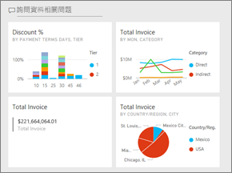
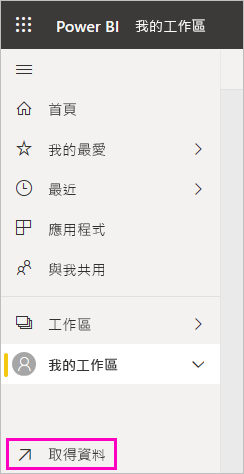
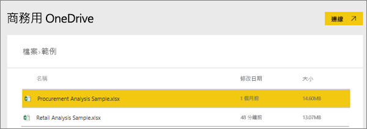
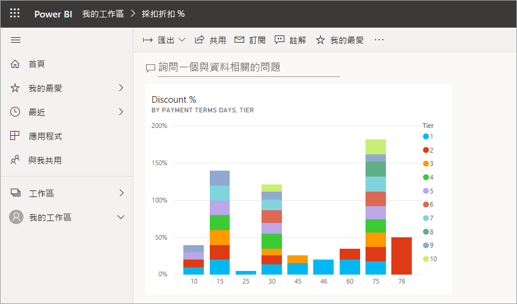
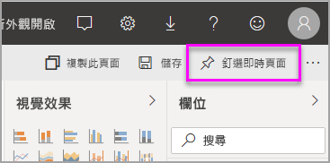
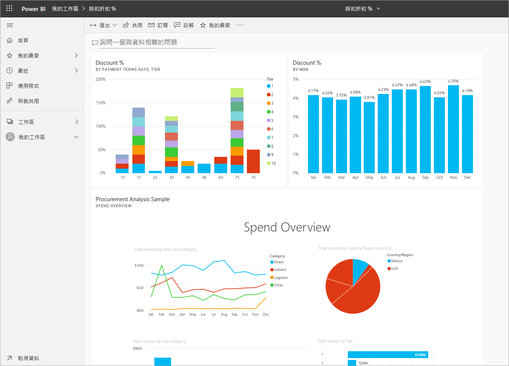

# 從報表建立 Power BI 儀表板
您已閱讀 [Power BI 的儀表板簡介](service-dashboards.md)，現在想要建立自己的儀表板。 建立儀表板的方式有很多種。 例如，您可以建立儀表板：從報表、從頭建立、從資料集、或複製現有的儀表板。  

我們會從建立可釘選已建置報表視覺效果的快速簡單儀表板開始。 

完成此文章之後，您就能充分了解：
- 儀表板和報表之間的關聯性
- 如何在報表編輯器中開啟編輯檢視
- 如何釘選磚 
- 如何在儀表板與報表之間巡覽 
 

> [!NOTE] 
> 儀表板是 Power BI 服務的功能，而不是 Power BI Desktop 的功能。 雖然您無法在 Power BI 行動裝置應用程式中建立儀表板，但可以在該處[檢視和共用](../consumer/mobile/mobile-apps-view-dashboard.md)儀表板。
>
> 

## 影片：從報表釘選視覺效果和影像來建立儀表板
觀看 Amanda 釘選報表的視覺效果，建立新的儀表板。 然後使用 [採購分析] 範例，遵循下一節[匯入包含報表的資料集](#import-a-dataset-with-a-report)中的步驟來親自嘗試。
    

<iframe width="560" height="315" src="https://www.youtube.com/embed/lJKgWnvl6bQ" frameborder="0" allowfullscreen></iframe>

## 匯入資料集與報表
在此逐步解說中，我們會匯入其中一個 Power BI 範例資料集，並用它建立新的儀表板。 我們使用的範例是具有兩份 PowerView 工作表的 Excel 活頁簿。 當 Power BI 匯入活頁簿時，會將資料集以及報表新增至您的工作區。 從 PowerView 工作表自動建立報表。

1. 下載 [[採購分析] 範例](https://go.microsoft.com/fwlink/?LinkId=529784)Excel 檔案。 建議您將它儲存在您的商務用 OneDrive 中。
2. 在瀏覽器中開啟 Power BI 服務 (app.powerbi.com)。
3. 從導覽窗格中，選取 [我的工作區]  ，然後選取 [取得資料]  。

    
5. 在 [檔案]  下選取 [取得]  。

   
6. 瀏覽至您儲存採購分析範例 Excel 檔案的位置。 選取它並選擇 [連接]  。

   
7. 在此練習中請選取 [匯入]  。

    ![[商務用 OneDrive] 視窗](media/service-dashboard-create/power-bi-import.png)
8. 出現成功訊息時，選取 **x** 將其關閉。

   

> [!TIP]
> 您知道嗎？ 您可以透過選取頂端具有三條線的圖示  來縮小導覽窗格。 這樣可讓報表本身有更多空間可用。

### 開啟報表並將磚釘選到您的儀表板上
1. 在相同的工作區中，選取 [報表]  索引標籤，然後選取 [採購分析範例]  以開啟報表。

    ![[報表] 索引標籤](media/service-dashboard-create/power-bi-reports.png) 報表會在 [閱讀] 檢視中開啟。 請注意，它的左邊有兩個索引標籤：[折扣分析]  和 [支出概觀]  。 每個索引標籤都代表報表的一個頁面。

2. 選取 [更多選項 (...)]   > [編輯報表]  以在 [編輯] 檢視中開啟報表。

    ![[閱讀] 檢視中的報表](media/service-dashboard-create/power-bi-reading-view.png)
3. 暫留在視覺效果上，以顯示可用的選項。 若要在儀表板上新增視覺效果，請選取釘選圖示 .

    
4. 因為要建立新的儀表板，所以選取 [新增儀表板]  選項並為其命名。

    ![[釘選到儀表板] 對話方塊](media/service-dashboard-create/power-bi-pin-tile.png)
5. 當您選取 [釘選]  時，Power BI 會在目前的工作區中建立新的儀表板。 在**已釘選到儀表板**訊息出現後，請選取 [移至儀表板]  。 如果系統提示您儲存報表，請選擇 [儲存]  。

    

    Power BI 會開啟新的儀表板。 儀表板具有一個磚：您剛釘選的視覺效果。

   
7. 選取磚以返回報表。 再多釘選幾個磚到新的儀表板上。 當 [釘選至儀表板]  視窗出現時，請選取 [現有儀表板]  。  

   ![[釘選到儀表板] 對話方塊](media/service-dashboard-create/power-bi-existing-dashboard.png)

## 將整份報表頁面釘選至儀表板
與其一次釘選一個視覺效果，您可以[將整個報表頁面釘選為動態磚  ](service-dashboard-pin-live-tile-from-report.md)。 讓我們來試試看。

1. 在報表編輯器中，選取 [支出概觀]  索引標籤以開啟報表的第二頁。

   

2. 我們希望您的儀表板具有報表中所有視覺效果。 在功能表列的右上角，選取 [[動態釘選] 頁面]  。 在儀表板上，動態頁面磚會在頁面重新整理時更新。

   

3. 當 [釘選至儀表板]  視窗出現時，請選取 [現有儀表板]  。

   ![[釘選到儀表板] 對話方塊](media/service-dashboard-create/power-bi-pin-live2.png)

4. 出現「成功」訊息後，請選取 [移至儀表板]  。 您將能在那裡看見從報表釘選的磚。 在下列範例中，我們從報表的第一頁釘選了兩個磚，並從第二頁釘選了一個動態磚。

   

## 後續步驟
恭喜您建立了第一個儀表板！ 現在您有了儀表板，您可以用來做很多事。 遵循下列其中一篇建議的文章，或自行開始探索： 

* [調整大小和移動磚](service-dashboard-edit-tile.md)
* [儀表板磚的所有相關資訊](service-dashboard-tiles.md)
* [建立應用程式來共用儀表板](../collaborate-share/service-create-workspaces.md)
* [Power BI - 基本概念](../fundamentals/service-basic-concepts.md)
* [設計絕佳儀表板的秘訣](service-dashboards-design-tips.md)

有其他問題嗎？ [試試 Power BI 社群](https://community.powerbi.com/)。
