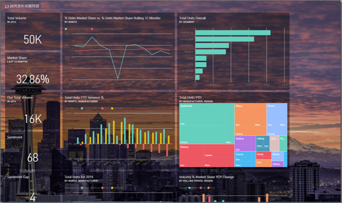
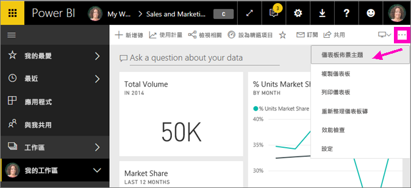
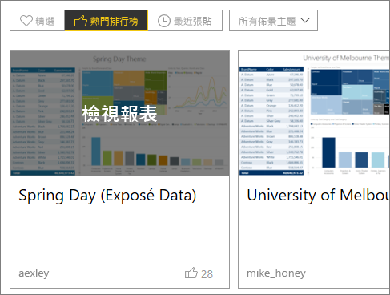
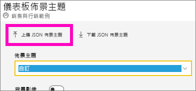
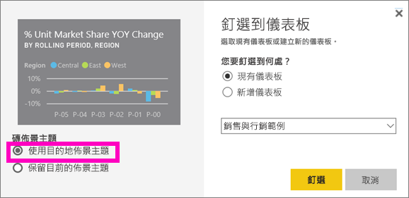

# 在 Power BI 服務中使用儀表板佈景主題
透過**儀表板主題**，您可以將某個色彩佈景主題套用到整個儀表板，例如公司色彩、季節性色彩，或是您可能想要套用的任何其他色彩佈景主題。 當您套用 [儀表板主題]  時，儀表板中的所有視覺效果都會使用您選擇的佈景主題色彩 (但有些例外，本文稍後會加以說明)。

變更儀表板上的報表視覺效果色彩，並不會影響報表中的視覺效果。 而且，當您從[已套用報表佈景主題](desktop-report-themes.md)的報表釘選磚時，也可以選擇要保留目前的佈景主題，或使用儀表板的佈景主題。

## 必要條件
* 如果要跟著做，[請開啟 [銷售與行銷範例] 儀表板](sample-datasets.md)。

## 儀表板佈景主題的運作方式
若要開始，請開啟您建立 (或有權編輯) 並想要自訂的儀表板。 選取 [更多選項]  (...)，然後選擇 [儀表板佈景主題]  。 

在顯示的儀表板窗格中，選取其中一個預先建立的佈景主題。  在下方範例中，我們選取了 [深色]  。

![選取了 [淺色] 選項](media/service-dashboard-themes/power-bi-theme-menu.png)

![套用了 [深色] 選項](media/service-dashboard-themes/power-bi-theme-dark.png)

## 建立自訂佈景主題

Power BI 儀表板的預設佈景主題是 [淺色]  。 如果您想要自訂色彩或建立自己的佈景主題，請在下拉式清單中選取 [自訂]  。 

![從下拉式清單中選取 [自訂]](media/service-dashboard-themes/power-bi-theme-custom.png)

使用自訂選項建立自己的儀表板佈景主題。 若要新增背景影像，建議您使用解析度至少有 1920x1080 的影像。 若要使用影像做為背景，請將影像上傳到公開網站並複製 URL，然後將它貼到 [影像 URL]  欄位中。 

### 使用 JSON 佈景主題
另一個建立自訂佈景主題的方法是上傳 JSON 檔案，其中有您要用於儀表板的所有色彩設定。 在 Power BI Desktop 中，報表建立者會使用 JSON 檔案來[建立報表佈景主題](desktop-report-themes.md)。 同一批的 JSON 檔案可以為儀表板上傳，您也可以從 Power BI 社群的[佈景主題資源庫](https://community.powerbi.com/t5/Themes-Gallery/bd-p/ThemesGallery)頁面找到並上傳 JSON 檔案 

您也可以將自己的自訂佈景主題儲存為 JSON 檔案，然後與其他儀表板建立者共用。 

### 使用佈景主題資源庫中的佈景主題

如同預先建立及自訂選項，上傳佈景主題時，色彩會自動套用到儀表板上的所有磚。 

1. 暫留在一個佈景主題上，然後選擇 [檢視報表]  。

    

2. 向下捲動，尋找 JSON 檔案的連結。  選取下載圖示並儲存檔案。

    

3. 返回 Power BI 服務，在 [自訂儀表板佈景主題] 視窗中選取 [上傳 JSON 佈景主題]  。

    

4. 瀏覽到您儲存 JSON 佈景主題檔案的位置，然後選取 [開始]  。

5. 在 [儀表板佈景主題] 頁面上選取 [儲存]  。 新的佈景主題隨即套用到您的儀表板。

    

## 考量與限制

* 如果您的報表使用的佈景主題與儀表板佈景主題不同，則可以控制視覺效果要保留目前的佈景主題，還是要使用儀表板佈景主題來達到不同來源的視覺效果一致性。 將磚釘選到儀表板時，若要保留報表佈景主題，請選取 [保留目前的佈景主題]  。 儀表板上的視覺效果會保留報表佈景主題，包括透明度設定。 

    您唯一會看見 [磚佈景主題]  選項的機會，出現在您於 Power BI Desktop 中建立報表、[新增報表佈景主題](desktop-report-themes.md)，然後將報表發佈到 Power BI 服務。 

    ![選取了 [保留目前的佈景主題]](media/service-dashboard-themes/power-bi-keep-current.png)

    請嘗試重新釘選磚，並選取 [使用儀表板佈景主題]  。

    

* 儀表板佈景主題無法套用到釘選的動態報表頁面、iframe 磚、SSRS 磚、活頁簿磚或影像。
* 儀表板佈景主題可在行動裝置上檢視，但儀表板佈景主題的建立只能在 Power BI 服務中完成。 
* 儀表板自訂佈景主題只能搭配從報表釘選的磚使用。 

