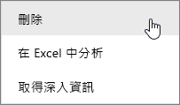
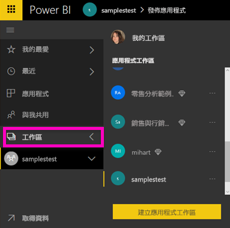

# 刪除 Power BI 服務中的絶大部分所有項目
本文會教導您如何刪除 Power BI 服務中的儀表板、報告、活頁簿、資料集、應用程式、視覺效果和工作區。

## 刪除儀表板
儀表板可以移除。 移除儀表板並不會刪除基礎資料集，或任何與該儀表板相關聯的報表。

* 如果您是儀表板的擁有者，就可刪除它。 如果您正與同事共用儀表板，則從您的 Power BI 工作區移除儀表板將會從他們的 Power BI 工作區移除該儀表板。
* 如果是別人提供您共用的儀表板，而您不想再看見它，您可以移除它。  移除儀表板並不是把它從其他人的 Power BI 工作區中移除。
* 如果儀表板屬於[組織內容套件](../collaborate-share/service-organizational-content-pack-disconnect.md)，則移除相關聯的資料集將是移除它的唯一方法。

### 刪除儀表板
1. 在工作區中，選取 [儀表板] 索引標籤。
2. 找到要刪除的儀表板，然後選取刪除圖示 :::image type="icon" source="media/service-delete/power-bi-delete-icon.png" border="false":::。

    

## 刪除報表
別擔心，刪除報表不會刪除報表所依據的資料集。  您從報表釘選的所有視覺效果也安全無虞：它們會保留在儀表板上，直到您個別加以刪除。

### 刪除報表
1. 在工作區中，選取 [報表] 索引標籤。
2. 找到要刪除的報表，然後選取刪除圖示 :::image type="icon" source="media/service-delete/power-bi-delete-icon.png" border="false":::。   

    
3. 確認刪除。

   ![[刪除報表] 對話方塊](media/service-delete/power-bi-delete-report.png)

   > [!NOTE]
   > 如果報表是[內容套件](../collaborate-share/service-organizational-content-pack-introduction.md)的一部分，您就無法使用這個方法刪除它。  請參閱[移除與組織內容套件的連接](../collaborate-share/service-organizational-content-pack-disconnect.md)。
   >
   >

## 刪除活頁簿
活頁簿可以予以移除。 不過，移除活頁簿也會移除包含這個活頁簿資料的所有報表和儀表板磚。

如果活頁簿儲存在商務用 OneDrive 上，則從 Power BI 中刪除它並不會從 OneDrive 予以刪除。

### 刪除活頁簿
1. 在工作區中，選取 [活頁簿] 索引標籤。
2. 找到要刪除的活頁簿，然後選取刪除 :::image type="icon" source="media/service-delete/power-bi-delete-report2.png" border="false"::: 圖示。

    ![[活頁簿] 索引標籤](media/service-delete/power-bi-delete-workbooknew.png)
3. 確認刪除。

   ![[移除活頁簿] 對話方塊](media/service-delete/power-bi-delete-confirm.png)

## 刪除資料集
資料集可以刪除。 不過，刪除資料集也會刪除包含該資料集資料的所有報告和儀表板圖格。

如果資料集是一或多個[組織內容套件](../collaborate-share/service-organizational-content-pack-disconnect.md)的一部分，則刪除它的唯一方式是從正在使用它的內容套件中予以移除，並等待處理，然後再嘗試進行刪除。

### 刪除資料集
1. 在工作區中，選取 [資料集] 索引標籤。
2. 找到要刪除的資料集，然後選取 [更多選項] (…)。  

    ![[資料集] 索引標籤](media/service-delete/power-bi-delete-datasetnew.png)
3. 從下拉式清單中，選取 [刪除]。

   
4. 確認刪除。

   ![[刪除儀表板] 對話方塊](media/service-delete/power-bi-delete-dataset-confirm.png)

## 刪除工作區
> [!WARNING]
> 建立工作區時，您會建立 Microsoft 365 群組。 刪除工作區時，您會刪除該 Microsoft 365 群組。 這表示該群組也會從其他 Microsoft 365 產品 (例如 SharePoint 和 Microsoft Teams) 中刪除。
>
>

身為工作區作者，您可以將其刪除。 如果您已將應用程式發佈到整個組織，則刪除它時，也會刪除所有群組成員的相關聯應用程式，並從 AppSource 中予以移除。 刪除工作區與離開工作區不同。

### 刪除工作區 - 如果您是系統管理員
1. 從導覽窗格中選取 [工作區]

2. 選取所要刪除工作區右側的 [更多選項] (…)，然後選擇 [編輯工作區]。

    

3. 在 [編輯工作區] 視窗中，選取 [刪除工作區] > [刪除]。

    

### 從清單中移除工作區
如果您不再想要成為工作區成員，則可「離開」工作區，並將其從清單中移除。 保留工作區，會針對所有其他工作區成員將它保留在原地。  

> [!IMPORTANT]
> 如果您是工作區的唯一系統管理員，則 Power BI 不會允許您離開。
>
>

1. 從您要移除的工作區開始。

2. 在右上角選取 [更多選項] (…)，並選擇 [離開工作區] > [離開]。

      :::image type="icon" source="media/service-delete/power-bi-leave-workspace.png" border="false":::

   > [!NOTE]
   > 您在下拉式清單中所看到選項取決於您是該工作區的系統管理員或成員。
   >
   >

## 刪除或移除應用程式
應用程式可以從應用程式清單頁面中輕鬆予以移除。 但只有應用程式系統管理員才能永久刪除應用程式。

### 從應用程式清單頁面中移除應用程式
從應用程式清單頁面中刪除應用程式，並不會刪除其他成員的應用程式。

1. 在導覽窗格中，選取 [應用程式] 以開啟應用程式清單頁面。
2. 將滑鼠游標移至要刪除的應用程式上方，然後選取刪除 :::image type="icon" source="media/service-delete/power-bi-delete-report2.png" border="false"::: 圖示。

   ![選取 [應用程式]](media/service-delete/power-bi-delete-app.png)

   如果您不小心移除應用程式，則有數個選項可以進行復原。  您可以要求應用程式建立者重新傳送該應用程式、找到包含應用程式連結的原始電子郵件、檢查[通知中心](../consumer/end-user-notification-center.md)以查看是否仍列出該應用程式的通知，或者檢查[組織的 AppSource](../consumer/end-user-apps.md)。

## 考量與疑難排解
本文涵蓋如何刪除 Power BI 服務的主要建置組塊。 但您在 Power BI 中還有其他可刪除的項目。  

* [移除精選儀表板](../consumer/end-user-featured.md)
* [移除儀表板 (將儀表板移除最愛)](../consumer/end-user-favorite.md)
* [刪除報表頁面](service-delete.md)
* [刪除儀表板磚](service-dashboard-edit-tile.md)
* [刪除報表視覺效果](service-delete.md)

有其他問題嗎？ [試試 Power BI 社群](https://community.powerbi.com/)
