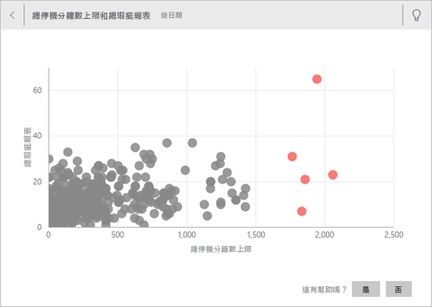

# 使用 Power BI 自動產生資料見解
您有新資料集，但不太確定要從何處著手？  需要快速建置儀表板嗎？  想要尋找您可能錯失的深入解析嗎？

您可以執行快速深入剖析，根據資料產生相關的互動式視覺效果。 您可以針對整個資料集 (快速深入剖析) 或特定的儀表板磚 (定義範圍的深入解析) 執行快速深入剖析。 您甚至可以針對深入資訊執行深入解析！

> [!NOTE]
> 見解不適用於 DirectQuery；它僅適用於上傳至 Power BI 的資料。
> 

深入解析功能的建置基礎是一組會持續完善的[進階分析演算法](../consumer/end-user-insight-types.md)，該演算法是與 Microsoft Research 合作開發，且會持續使用，讓更多人能透過全新的直覺式方式在資料中尋找深入資訊。

## 對資料集執行快速深入剖析
觀看 Amanda 如何對資料集執行快速深入剖析、在焦點模式中開啟深入解析、在儀表板中將其中一個深入解析釘選為磚，然後取得儀表板磚的深入解析。

<iframe width="560" height="315" src="https://www.youtube.com/embed/et_MLSL2sA8" frameborder="0" allowfullscreen></iframe>

現在換您試試看。 使用[供應商品質分析範例](sample-supplier-quality.md)探索見解。

1. 從 [資料集]  索引標籤，選取 [更多選項]  (...)，然後選擇 [取得快速見解]  。
   
    ![[資料集] 索引標籤](media/service-insights/power-bi-ellipses.png)
   
    
2. Power BI 使用[各種演算法](../consumer/end-user-insight-types.md)來搜尋資料集中的趨勢。
   
    ![[正在搜尋深入資訊] 對話方塊](media/service-insights/pbi_autoinsightssearching.png)
3. 您的深入剖析資訊會在幾秒內準備就緒。  選取 [檢視深入資訊]  以顯示視覺效果。
   
    
   
    > [!NOTE]
    > 某些資料集會因為資料不具顯著性差異，而無法產生見解。  若要深入了解，請參閱[將資料最佳化以進行深入解析](service-insights-optimize.md)。
    > 
    
4. 視覺效果會在特殊的**深入資訊摘要**畫布中顯示，最多可包含 32 個不同的深入剖析卡片。 每張卡片會有一個圖表或圖形，並附上簡短的描述。
   
    

## 與深入解析卡片互動

1. 將滑鼠暫留在卡片上，然後選取釘選圖示，已將視覺效果新增至儀表板。

2. 將游標暫留在卡片上方，選取 [更多選項]  (...)，然後選擇 [檢視見解]  。 

    隨即在焦點模式中開啟見解畫面。
   
    
3. 在焦點模式中，您可以︰
   
   * 篩選視覺效果。 如果尚未開啟 [篩選]  窗格，請選取視窗右側的箭號加以展開。

       ![展開見解的 [篩選] 功能表](media/service-insights/power-bi-insights-filter-new.png)
   * 選取 [釘選視覺效果]  將見解卡片釘選到儀表板。
   * 在卡片本身執行見解，這通常稱為「定義範圍的見解」  。 在右上角，選取燈泡圖示  或 [取得見解]  。
     
       
     
     深入解析會顯示於左側，而只以該單一深入解析資料為依據的新卡片則沿著右側顯示。
     
       
4. 若要返回原始的深入解析畫布，請選取左上角的 [結束焦點模式]  。

## 對儀表板磚執行深入解析
不要搜尋針對整個資料集的見解，而是縮小搜尋範圍來對資料進行定義範圍的見解，該資料用於建立單一儀表板磚。 

1. 開啟儀表板。
2. 將游標停留在磚上方， 選取 [更多選項]  (...)，然後選擇 [檢視見解]  。 隨即在[焦點模式](../consumer/end-user-focus.md)中開啟磚，而深入解析卡片會沿著右側顯示。    
   
        
3. 一個深入剖析是否引起您的興趣？ 選取該資訊摘要卡片可挖掘更深入的資料。 選取的資訊摘要會顯示於左側，只以該單一資訊摘要中資料為依據的新資訊摘要卡片則沿著右側顯示。    
4. 持續探索您的資料；當發現有趣的深入解析時，您可以選取右上角的 [釘選視覺效果]  ，將其釘選在儀表板上。

## 後續步驟
- 如果您擁有資料集，請[針對快速見解將它最佳化](service-insights-optimize.md)。
- 了解[可用的快速見解類型](../consumer/end-user-insight-types.md)。

有其他問題嗎？ [試試 Power BI 社群](https://community.powerbi.com/)。
