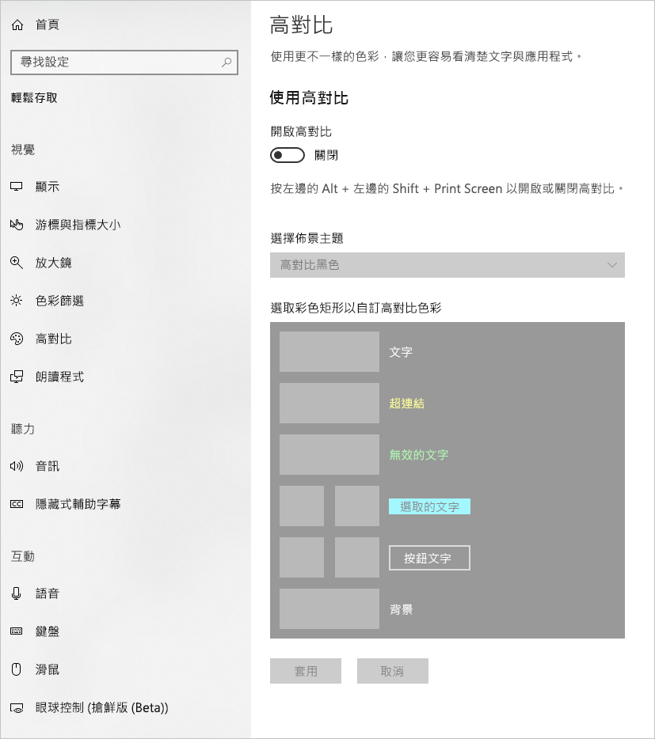
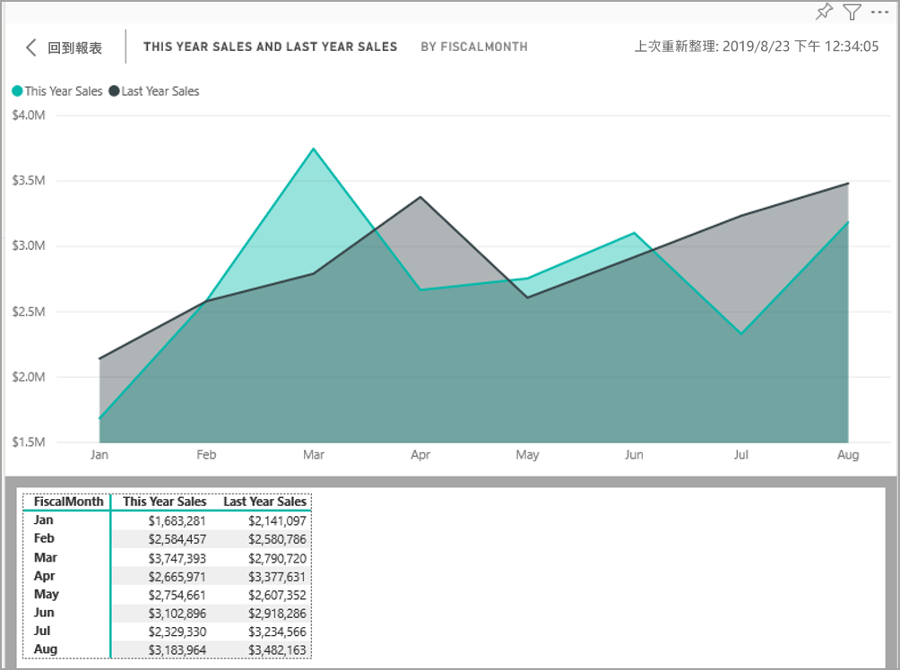
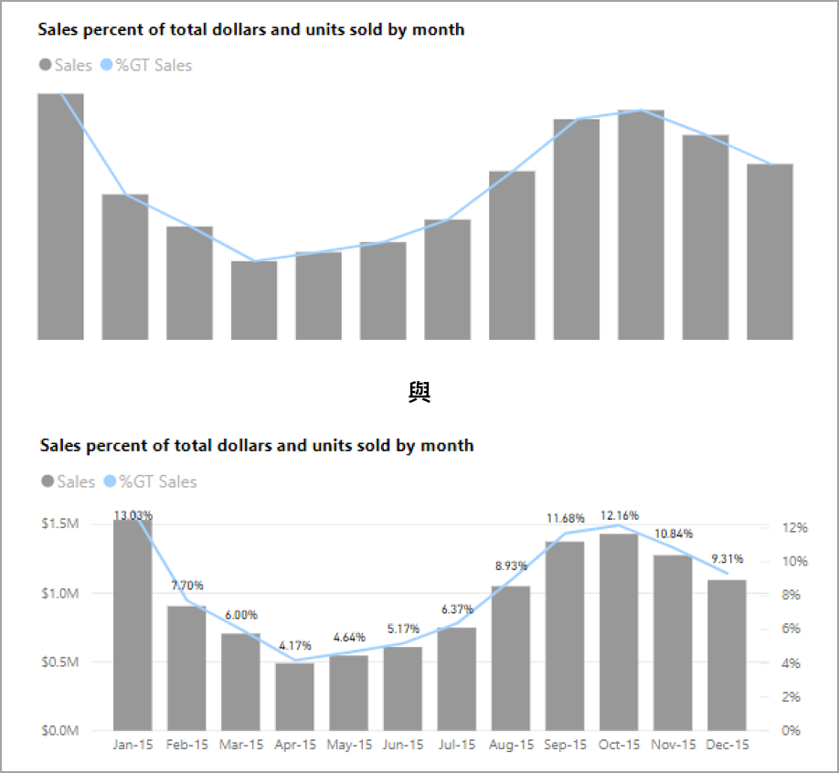

# 在 Power BI 中建立可存取的報表
您可以設計和建立具視覺吸引力的報表，同時針對協助工具進行設計。 建置報表時，無論您的對象為何都建議盡可能地將報表建置為可供更多人使用，而無須針對某種特殊設計進行調整。

本文描述協助工具功能及在 Power BI 中用來建立可存取報表的工具。

若要改善使用螢幕助讀程式建立報表的流程，您可以使用操作功能表。 功能表可讓您在 [欄位]  清單中上下移動區域內的欄位。 此功能表也可以讓您將欄位移動到其他區域，例如 [圖例]  或 [值]  等。

![[欄位] 區中的操作功能表可讓您將欄位向上、向下移動，或移到其他區域](media/desktop-accessibility/accessibility-09.png)

## 協助工具功能類型

Power BI 提供建立可存取報表的功能，但身為報表作者，是否要將這些報表併入您的報表都取決於您。 本文中描述的協助工具功能有三種類別：

* 內建協助工具功能 (無須設定)
* 內建協助工具功能 (需要設定)
* 其他提示及考量事項

我們會在下列各節討論每一種類別。

## 內建協助工具功能

Power BI 的產品中內建了協助工具功能，無須報表作者進行任何設定。 這些功能如下：

* 鍵盤導覽
* 螢幕助讀程式相容性
* 高對比色彩檢視
* 焦點模式
* 顯示運算列表

此外，還有一些功能可協助報表的使用體驗。 您可以在本文結尾的[後續步驟](#next-steps)一節中找到描述這些功能的文章。

讓我們再來看看這些內建的協助工具功能。 

### 鍵盤導覽

身為報表作者，您無須擔心您的取用者是否可以使用他們的鍵盤來巡覽報表。 Power BI 視覺效果全部都可以使用鍵盤進行巡覽，且您的報表取用者可以逐步檢視視覺效果中的資料點、在頁面索引標籤間切換，以及存取互動功能 (包括交叉醒目提示、篩選和切割)。

報表取用者巡覽報表時，會顯示焦點指出使用者在報表中的位置。 取決於正在使用的瀏覽器，焦點模式可能會以不同方式顯示。

若要存取最常使用的鍵盤快速鍵，您可以按 *?* 來顯示鍵盤快速鍵對話方塊。 若要深入了解，請參閱本文結尾[後續步驟](#next-steps)一節中這些關於可存取使用體驗和鍵盤快速鍵的文章。

### 螢幕助讀程式相容性

一般而言，Power BI 中每個具備鍵盤導覽的物件也都和螢幕助讀程式相容。 當報表取用者巡覽至視覺效果時，螢幕助讀程式會讀出標題、視覺效果類型和任何替代文字 (若已設定)。

### 高對比色彩檢視

Power BI 包含報表的高對比支援。 若您正在 Windows 中使用高對比模式，則 Power BI Desktop 會自動偵測正在 Windows 中使用的高對比佈景主題，並會將設定套用至您的報表。 那些高對比色彩會隨著報表一起發佈至 Power BI 服務或其他位置。

Power BI 服務也會嘗試偵測為 Windows 選取的高對比設定，但偵測的有效且精確程度取決於 Power BI 服務正在使用的瀏覽器。 若您希望在 Power BI 服務中手動設定佈景主題，您可在右上角選取 [V] > [高對比]  色彩，然後選取想要套用至報表的佈景主題。

### 焦點模式
若報表取用者正在儀表板中查看視覺效果，則取用者可巡覽至視覺效果的操作功能表並選取 [在焦點模式中開啟]  來展開視覺效果，使其在他們的螢幕中填滿更多空間。

### 顯示運算列表
報表取用者也可以按 **Alt+Shift+F11** 來以表格式格式檢視視覺效果中的資料。 這個表格與在視覺效果操作功能表中按下 [顯示資料]  時相似，但會顯示適合螢幕助讀程式的表格。

## 需要設定的內建協助工具功能

Power BI 的產品中內建了需要報表作者進行設定的協助工具功能。  這些功能包括：

* 替代文字
* 定位順序
* 標題與標籤
* 標記
* 報表主題

## 替代文字

替代文字 (替代文字描述) 會用來向螢幕助讀程式使用者描述視覺效果的外觀和功能，以及報表頁面上的影像。 報表作者應將替代文字新增至報表上傳達有意義資訊的每個物件。 提供替代文字可確保報表取用者了解您試著透過視覺效果傳達的內容，即使其看不到視覺效果、影像、圖形或文字方塊也無妨。 您可以選取物件 (例如視覺效果、圖形等)，然後在 [視覺效果]  窗格中，選取 [格式]  區段，展開 [一般]  ，捲動至底部並填入 [替代文字]  文字方塊，來為 Power BI Desktop 上的任何物件提供替代文字。 [替代文字]  文字方塊具有 250 個字元的限制。

替代文字應包含您希望報表取用者從視覺效果擷取的見解相關資訊。 由於螢幕助讀程式會讀出視覺效果的標題和類型，因此您只需要填入描述。 下列視覺效果的替代文字範例可以是：「根據所銷售產品的色彩，並以產品類別進一步細分的淨使用者滿意度。」 

請注意，呼叫見解或特定資料點可能不是最適合放入靜態替代文字中的項目，因為 Power BI 中資料是動態的。 若您想要使用動態替代文字，請參閱描述替代文字條件式格式設定的下一節。

### 替代文字的條件式格式設定

讓 Power BI 深具視覺吸引力的其中一項功能便是其動態資料。 您可以使用 DAX 量值和條件式格式設定來建立動態替代文字。 螢幕助讀程式接著便可以呼叫報表取用者正在檢視資料的特定值。

### 定位順序
設定定位順序可協助鍵盤使用者以符合使用者視覺上處理報表視覺效果順序的方式來巡覽報表。 若您正在報表中包含裝飾性的圖形和影像，建議您從定位順序中移除那些項目。 

若要設定定位順序，請選取功能區中的 [檢視]  索引標籤，然後選取 [選取窗格]  按鈕來顯示 [選取] 窗格。

![顯示 [選取] 窗格的 [檢視] 功能表](media/desktop-accessibility/accessibility-creating-reports-08.png)

在 [選取窗格]  中，選取 [定位順序]  會顯示您報表目前的定位順序。 您可以選取物件，然後使用向上和向下鍵按鈕來在階層中移動物件，或您可以使用滑鼠來選取物件，並將該物件拖曳到清單中您想要的位置。 按一下物件旁邊的數字，即可在定位順序中隱藏物件。

![[選取] 窗格中的定位順序](media/desktop-accessibility/accessibility-creating-reports-09.png)

### 標題和標籤
視覺效果和報表頁面標題是引導報表取用者的重要協助工具功能。 請避免在報表標題中使用任何縮寫或術語；若您將報表與新使用者或組織外部的人員共用，其可能會不知道術語或縮寫的意義。 下列影像會顯示視覺效果，其標題中包含縮寫 (位於左側)，以及視覺效果的更清晰標題 (位於右側)。

在視覺效果中，確認任何標題、軸標籤、圖例值和資料標籤都易於閱讀和了解。 請比較下列影像，其中第一個影像包含較少資料或資料描述，第二個則包含許多資料或資料描述。

使用資料標籤，您甚至可以選擇開啟或關閉視覺效果中每個系列的標籤，或將其放置在系列的上方或下方。 雖然 Power BI 會盡力將資料標籤放置在線條的上方或下方，但有時候還是會不太清晰。 在下列視覺效果中，資料標籤相當混亂且不容易閱讀。

將資料標籤放置在系列的上方或下方可帶來幫助，特別是當您正在使用包含複數線條的折線圖時。 在進行一些調整後，資料標籤現在看起來好多了。

### 標記

最佳做法是避免使用色彩 (包含功能條件式格式設定) 作為傳達資訊的唯一方式。 相反地，您可以使用標記來傳達不同系列。

針對線條、區域和組合視覺效果，以及散佈圖和泡泡圖，您可以開啟標記，並針對每個線條使用不同的標記圖形。

若要開啟標記，請在 [視覺效果] 窗格中選取 [格式] 區段，展開 [圖形]  區段，然後向下捲動並尋找 [顯示標記]  切換，並將其切換至 [開啟]  ，如下圖所示。 

您也可以從該 [圖形] 區段的下拉式方塊中，使用 [自訂系列]  來選取每個線條的名稱 (或區域，若您使用區域圖的話)。 在下拉式清單底下，針對選取之線條所使用的標記，您可以調整許多層面，包括其形狀、色彩和大小。

雖然我們建議報表作者開啟資料標籤和標記，針對每個視覺效果來開啟它們可能會使報表令人分心並降低可存取性。 在下圖中，您可以比較同時開啟資料標籤和標記的視覺效果，以及關閉資料標籤且更容易讓人了解的版本。

若您不確定視覺效果或報表是否過於雜亂，請執行 [squint test](https://chrome.google.com/webstore/detail/the-squint-test/gppnipfbappicilfniaimcnagbpfflpg) (斜視測試) 來進行測試。  若您的眼睛相較於資料點更容易受到資料標籤吸引，請關閉您的資料標籤。

### 佈景主題、對比和方便色盲人士使用的色彩

建議您確保報表在文字與任何背景色彩之間有足夠的對比。 WCAG 2.1 成功準則 1.4.3 描述文字和背景色彩應具備至少 4.5:1 的對比比例。 有數種工具 (例如 [Color Contrast Analyzer](https://developer.paciellogroup.com/resources/contrastanalyser/) (色彩對比分析器)、[WebAIM](https://webaim.org/resources/contrastchecker/) 和 [Accessible Colors](http://accessible-colors.com/) (可存取色彩) 可讓您用來檢查報表的色彩。

建議您也考慮一部分報表檢視人員可能會有色彩視覺上的缺陷。 [Coblis](http://www.color-blindness.com/coblis-color-blindness-simulator/) 和 [Vischeck](http://www.vischeck.com/vischeck/vischeckImage.php) 等工具可模擬具有不同色彩缺陷的報表檢視者所看見內容。  在報表中使用較少色彩或單色調色盤可協助降低建立無法存取報表的可能。

特定色彩組合對具有色彩視覺缺陷的使用者來說特別難以辨識。 這些包含下列組合： 

* 綠色和紅色
* 綠色和棕色
* 藍色和紫色
* 綠色和藍色
* 淺綠色和黃色
* 藍色和灰色
* 綠色和灰色
* 綠色和黑色

請避免在圖表中使用這些色彩，或在相同的報表頁面中使用這些色彩。 Power BI 具有一些內建佈景主題，有助於讓報表更容易存取，但最佳做法是使用本文中建議的一些其他工具來檢查報表。

## 提示及考量事項
本節提供在您同時考慮協助工具及建立報表時，需要留意的一些指導、提示和考量事項。

### 了解您對象所需要的內容

建立報表是一項反覆流程。 在您開啟將視覺效果放置在頁面上之前，請先和您的一些報表取用者討論，以進一步了解其希望從報表獲得的資訊及想要如何查看報表。  

這項流程中應包含將協助工具建置到其中。 您可能會發現您與報表取用者的構想不同。 一旦準備好報表的初始草稿後，請向報表取用者展示該草稿，然後收集更多的意見反應。 身為報表作者，收集意見反應可協助減少未來報表取用者因為不滿而大舉提出的變更要求。

### 保持報表簡單且一致

盡可能地將報表保持簡單且一致。 許多人經常會嘗試在單一視覺效果中放入太多內容。 通常將其分成多個視覺效果可使其更為簡單且易於了解。 若視覺效果會顯示不同的資料面向，請考慮使用多個視覺效果，並使用篩選或視覺效果互動來建立豐富體驗。 同時，請將頁面上的視覺效果數量保持在最小數目。 請嘗試避免不必要的冗餘和頁面雜亂。 您不需要使用兩個視覺效果來顯示相同內容。 報表取用者可能會被太多視覺效果所給予的所有資訊淹沒，或其注意力期間可能會受限並容易分心。 這不僅會讓報表更容易取用，在頁面上包含太多視覺效果也會降低報表的效能。

在報表中使用相同的字型色彩和視覺效果元素樣式，將報表保持一致。 針對所有視覺效果標題使用相同的字型大小，就跟您應針對資料標籤和軸標題所採取的動作相同。 若您正在多個報表頁面上使用交叉分析篩選器，請在報表的每個頁面上將其保持在相同的位置。

### 針對視力不良進行測試

測試報表針對視力不良取用者所呈現方式的其中一種快速方法，便是降低螢幕或行動裝置的亮度。  有些瀏覽器附加元件可讓您用來協助執行斜視測試。

## 報表協助工具檢查清單

除了提供協助工具和功能外，Power BI 還提供下列檢查清單，可讓您在建立報表時使用。 這份檢查清單可在您發佈報表前確保報表可供存取，且可提供給最大的對象群使用。 

### 所有視覺效果

* 確保標題、軸標籤和資料標籤文字及背景的色彩對比至少為 4.5:1。
* 避免使用色彩作為傳達資訊的唯一方式。 使用文字或圖示來補充或取代色彩。
* 取代不必要的術語或縮寫。
* 確保已將**替代文字**新增至頁面上所有非裝飾性的視覺效果。
* 檢查報表頁面適用於具有色彩視覺缺陷的使用者。

### 交叉分析篩選器
* 若報表頁面上具有數個交叉分析篩選器的集合，請確保所有頁面上的設計為一致。 盡可能地使用相同的字型、色彩和空間位置。

### 文字方塊
* 確保字型和背景間的色彩對比至少為 4.5:1。
* 請務必將文字內容放置在 [替代文字]  方塊中，讓螢幕助讀程式可以進行閱讀。

### 視覺效果互動
* 重要資訊是否只能透過互動存取？ 若是如此，請重新排列視覺效果，讓其經預先篩選，使重要的結論更為明顯。
* 是否正在使用書籤進行導覽？ 請嘗試使用鍵盤來巡覽報表，確保針對僅限鍵盤的使用者，體驗仍然可令人接受。

### 排序次序
* 是否特意設定了頁面上每個視覺效果的排序次序？ 可存取的 [顯示資料]  表格會根據在視覺效果上設定的排序次序來顯示資料。

### 工具提示
* 請不要使用工具提示來傳達重要資訊。 具有運動神經問題和不使用滑鼠的使用者將會難以存取這些工具提示。
* 請將工具提示新增至圖表以作為附屬資訊。 這會包含在每個視覺效果的可存取 [顯示資料]  表格中。

### 影片
* 避免在轉譯頁面時自動啟動的影片。
* 確保影片包含字幕或提供文字記錄。

### 音訊
* 避免在轉譯頁面時自動啟動的音訊。
* 為任何音訊提供文字記錄。

### 圖形
* 確保任何裝飾性的圖形都在定位順序中標記為隱藏，使螢幕助讀程式不會唸出這些圖形。
* 避免使用太多裝飾性的圖形，造成分心。
* 使用圖形來呼叫資料點時，請使用**替代文字**來解釋所呼叫的內容。

### 影像
* 使用影像來呼叫資料點時，請使用**替代文字**來解釋所呼叫的內容。
* 請確認任何裝飾性的影像都已在定位順序中標記為隱藏，使螢幕助讀程式不會唸出這些影像。
* 避免使用太多裝飾性的影像來造成分心。

### 自訂視覺效果
* 檢查自訂視覺效果的可存取 [顯示資料]  表格。 若顯示的資訊不足，請尋找其他視覺效果。
* 若您正在使用*播放軸*自訂視覺效果，請確認其不會自動播放。 請明顯地讓使用者知道其必須按下 [播放/暫停] 按鈕才能開始/停止變更的值。

### 頁面上的視覺效果
* 請在任何裝飾性的項目上設定定位順序及關閉定位順序 (將其標記為隱藏)。

## 考量與限制
協助工具功能有一些已知問題和限制。 下列清單描述這些問題和限制：

* 在 **Power BI Desktop** 中使用螢幕助讀程式時，如果您於 **Power BI Desktop** 中先開啟螢幕助讀程式，再開啟任何檔案，便可以獲得最佳體驗。

## 後續步驟

Power BI 協助工具的文章集合如下：

* [Power BI 中的協助工具概觀](desktop-accessibility-overview.md) 
* [使用協助工具來取用 Power BI 報表](desktop-accessibility-consuming-tools.md)
* [使用協助工具來建立 Power BI 報表](desktop-accessibility-creating-tools.md)
* [Power BI 報表的協助工具鍵盤快速鍵](desktop-accessibility-keyboard-shortcuts.md)
* [報表協助工具檢查清單](#report-accessibility-checklist)
