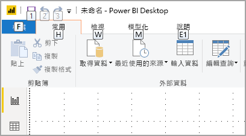
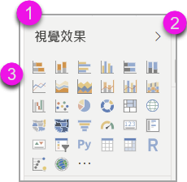
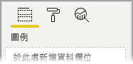
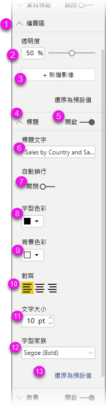

# 使用協助工具在 Power BI 中建立報表

對於使用協助工具來建立報表的報表作者而言，Power BI 具有許多可在此程序中提供協助的內建功能。

本文描述 Power BI Desktop 中可供報表建立者使用的多種協助工具類型。

## 應用程式層級導覽
在 Power BI Desktop 中巡覽時，您可以按 **Ctrl + F6**，將焦點移至應用程式的主要區域。 Power BI Desktop 主要區域中的焦點轉移將依下列順序進行：

1. 畫布上的物件
2. 頁面索引標籤
3. 窗格 (各自獨立，不論開啟哪些窗格都由左至右排列)
4. 檢視導覽
5. 頁尾
6. 登入
7. 黃色的警告/錯誤/更新列

在大部分情況下，使用 **Enter** 選取或進入區域，然後使用 **Esc** 鍵結束是 Power BI 中的常見程序。

## 功能區導覽

按 **Alt** 即可在目前功能區檢視中可用的每個命令上，看到稱為「按鍵提示」  的小方塊。 然後，您可以按下「按鍵提示」  中顯示的字母，該按鍵提示會暫留在您要使用的命令上方。 

例如，在下圖中已按下 **Alt** 鍵來顯示按鍵提示，其中包含用於可存取命令的字母。 接著，按 **M** 鍵就會開啟功能區上的 [模型]  索引標籤。

視您所按的字母而定，可能會看到其他按鍵提示。 例如，若 [首頁]  索引標籤為使用中狀態，但您按下 **W** 鍵，則會顯示 [檢視]  索引標籤，以及該 [檢視]  功能區索引標籤中群組的按鍵提示。您可以繼續按這些按鍵提示中顯示的字母，直到按下所要使用特定命令的字母為止。 若要移至上一組按鍵提示，請按 **Esc**。若要取消您所採取的動作並隱藏按鍵提示，請按 **Alt** 鍵。

## 視覺效果窗格導覽

若要巡覽 [視覺效果]  窗格，您必須先確定焦點位在該窗格上，方法是按 **Ctrl + F6** 直到到達該窗格為止。 當使用者巡覽 [視覺效果] 窗格時，焦點會先落在標頭上。 從頂端開始，定位順序如下所示，並顯示在下圖中：

1. 標頭標題
2. 展開/摺疊插入號
3. 第一個視覺效果圖示

當進入視覺效果時，您可以使用方向鍵巡覽至特定視覺效果，然後按 **Enter** 加以選取。 如果您使用螢幕助讀程式，該程式會提醒您是否建立了新圖表並告知其類型為何，或是告訴您已將特定類型圖表變更為另一種類型的圖表。 

在窗格的視覺效果區段之後，焦點順序接著會轉移至窗格樞紐，如下圖所示。

當焦點位在窗格樞紐時，定位只會落在所選窗格的圖示上。 若要切換至其他窗格，請使用方向鍵。

## 欄位區

當焦點位在窗格樞紐上時 (如前一節所述)，再次按 Tab 會將焦點移至**欄位區**。 

在**欄位區**中，焦點順序會移至：

* 每個欄位區的標題 (第一個)
* 接著是每個欄位區的指定欄位 (下一個)
* 用來開啟欄位功能表的下拉式按鈕 (其後)
* 然後是移除按鈕 (最後一個)

下圖顯示此焦點進展順序。

螢幕助讀程式將會讀出欄位區名稱及其工具提示。 針對欄位區中的每個欄位，螢幕助讀程式都會讀出欄位名稱及其工具提示。 如果欄位區是空的，則焦點應該移至整個空欄位區。 螢幕閱讀程式應該會讀出欄位區名稱、工具提示，並表示其是空的。

當欄位功能表開啟時，您可以使用 **Tab** 或是 **Shift + Tab** 或**向上** / **向下**鍵將其移動。 螢幕助讀程式會讀出選項名稱。

如果要將欄位從欄位區中的某個貯體移到另一個貯體，則可以使用鍵盤，並使用欄位區功能表中的 [移至]  選項，如下圖所示。

## [格式化] 窗格

[格式化]  窗格的焦點順序，會從頂端依卡片順序向下移動。 焦點會沿著卡片名稱移動，接著是其 [開啟]/[關閉]  切換按鈕 (如果有的話)。 當焦點位在卡片名稱上時，螢幕助讀程式會讀出卡片的名稱，以及卡片已展開還是摺疊。 您可以按 **Enter** 來展開或摺疊卡片。 **Enter** 也可以用於切換 [開啟]  或 [關閉]  切換按鈕。

![[格式化] 窗格上的焦點進展](media/desktop-accessibility/accessibility-create-reports-06.png)

如果卡片已開啟，則 **Tab** 會在卡片的控制項中移動，之後再進入下一個卡片。 針對卡片中的控制項，螢幕助讀程式會讀出標題、目前值和控制項類型。  

## [欄位] 清單導覽

您可以按 **Tab** 來巡覽 [欄位]  清單。 類似於格式化窗格，如果資料表已摺疊，則焦點順序會遵循下列順序循環切換：

1. [欄位]  清單標題
2. 搜尋列
3. 每個資料表名稱

![[欄位] 清單的焦點進展](media/desktop-accessibility/accessibility-create-reports-08.png)

若要展開 [欄位]  區中的所有資料表，請按 **Alt + Shift + 9**。 若要摺疊所有資料表，請按 **Alt + Shift + 1**。 若要展開單一資料表，請按**向右鍵**。 若要摺疊單一資料表，請按**向左鍵**。 類似於格式化窗格，如果資料表已展開，則在 [欄位] 清單中進行定位和巡覽會包含所顯示的欄位。 螢幕助讀程式會讀出已展開或摺疊資料表。

![[欄位] 清單 (已展開資料表) 的焦點進展](media/desktop-accessibility/accessibility-create-reports-09.png)

您可以藉由巡覽至所需欄位，然後按下 **Enter** 來為欄位加上核取記號。   螢幕助讀程式會讀出焦點所在的欄位，以及該欄位已核取還是未核取。

滑鼠使用者通常會將欄位拖放至畫布，或其所需的相關篩選貯體。 如果想要使用鍵盤，您可以透過進入欄位的操作功能表將欄位新增至篩選貯體，其方法是按 **Shift + F10**，使用方向鍵巡覽至 [新增至篩選]  ，然後在要新增欄位的篩選類型上按 **Enter** 鍵。

## 選取範圍窗格導覽
[選取範圍]  窗格具有下列焦點順序進展：

1. 標頭標題
2. 結束按鈕
3. 圖層/定位順序切換器
4. 在圖層中上移按鈕
5. 在圖層中下移按鈕
6. [顯示] 按鈕
7. [隱藏] 按鈕
8. 物件

您可以使用 Tab 來瀏覽焦點順序，然後按 **Enter** 以選取感興趣的項目。  

當進入圖層/定位順序切換器時，請使用向左鍵和向右鍵來切換圖層順序與定位順序。

當到達 [選取範圍]  窗格中的物件時，請按 **F6** 來啟動 [選取範圍]  窗格。 啟動 [選取專案]  窗格之後，您可以使用向上/向下鍵，巡覽至 [選取範圍]  窗格中的不同物件。
當巡覽至感興趣的物件時，您可以採取幾個不同的動作：

* 按 **Ctrl + Shift + S** 來隱藏/顯示物件
* 按 **Ctrl + Shift + F** 依圖層順序向上移動物件
* 按 **Ctrl + Shift + B** 依圖層順序向下移動物件
* 按 **Ctrl + 空格鍵**來複選物件

## Power BI Desktop 對話方塊

Power BI Desktop 中的所有對話都可以透過鍵盤導覽存取，並與螢幕助讀程式搭配使用。

Power BI Desktop 中的對話方塊包括下列各項：

* [快速量值] 對話方塊
* [條件式格式設定與資料橫條] 對話方塊
* [問與答總管] 對話方塊
* [使用者入門] 對話方塊
* [檔案] 功能表與 [關於] 對話方塊
* [警告] 列
* [檔案還原] 對話方塊
* [苦臉] 對話方塊

## 高對比支援

當在 Windows 中使用高對比模式時，您選取的那些設定以及調色盤也會在 Power BI Desktop 中套用至報表。

Power BI Desktop 會自動偵測 Windows 正在使用的高對比佈景主題，並將那些設定套用至報表。 那些高對比色彩會隨著報表一起發佈至 Power BI 服務或其他位置。

## 後續步驟

Power BI 協助工具的文章集合如下：

* [Power BI 中的協助工具概觀](desktop-accessibility-overview.md) 
* [建立具協助功能的 Power BI 報表](desktop-accessibility-creating-reports.md) 
* [使用協助工具來取用 Power BI 中的報表](desktop-accessibility-consuming-tools.md)
* [Power BI 報表的協助工具鍵盤快速鍵](desktop-accessibility-keyboard-shortcuts.md)
* [報表協助工具檢查清單](desktop-accessibility-creating-reports.md#report-accessibility-checklist)

