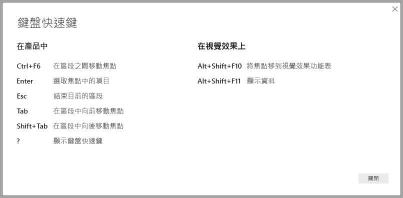

# Power BI Desktop 報告中的協助工具
Power BI 具有可讓行動不便人士更輕鬆地使用 Power BI 報表並與之互動的功能。 這些功能包括能夠利用鍵盤或螢幕助讀程式來使用報告、利用 Tab 鍵聚焦於頁面上的不同物件，以及在視覺效果中貼心地使用標記。

> [!NOTE]
> 2017 年 6 月 **Power BI Desktop** 和更新版本提供這些協助工具功能。 未來的版本也預計還有其他協助工具功能。
> 
> 

## 利用鍵盤或螢幕助讀程式來使用 Power BI Desktop 報告
自 2017 年 9 月起的 **Power BI Desktop** 版本開始，您即可按 **?** 鍵，以顯示描述 **Power BI Desktop** 所提供之協助工具鍵盤快速鍵的視窗。

透過協助工具增強功能，您可以利用鍵盤或螢幕助讀程式，並搭配下列技巧來使用 Power BI 報表：

您可以使用 **Ctrl+F6**，在報告頁面索引標籤之間或給定報告頁面上的物件之間切換焦點。

* 當焦點在「報告頁面索引標籤」時，可使用*Tab* 鍵或「方向」鍵將焦點從一個報告頁面移至下一個報告頁面。 不論目前是否已選取報告頁面的標題，螢幕助讀程式都會讀出標題。 若要載入焦點目前所在的報告頁面，請使用 *Enter* 鍵或「空格」鍵。
* 當焦點在載入的「報告頁面」時，請使用*Tab* 鍵將焦點移至頁面上的每個物件，包括所有文字方塊、影像、圖形和圖表。 螢幕助讀程式會讀取物件的類型、物件的標題 (如果有) 和物件的描述 (若報表作者提供)。 

當您在視覺效果之間瀏覽時，如果您要進一步與其互動，可以按 **Alt+Shift+F10** 將焦點移至視覺效果標頭，內含各種選項，包括排序和匯出圖表後的資料，以及焦點模式。 

您可以按 **Alt+Shift+F11** 呈現 [顯示資料] 視窗的可存取版本。 這可讓您使用您在螢幕助讀程式中一般會用到的相同鍵盤快速鍵，探索在 HTML 資料表中用於視覺效果的資料。 

![在 Power BI Desktop 中，按 Alt+Shift+F11，以顯示視覺效果可存取的 [See Data] \(查閱資料) 視窗](media/desktop-accessibility/accessibility_04.png)

> [!NOTE]
> 透過此鍵盤快速鍵，[顯示資料] 功能才可存取螢幕助讀程式。 如果您透過視覺效果標頭中的選項開啟 [顯示資料]，該功能將無法存取螢幕助讀程式。
> 
> 

建立這些協助工具的目的，在於讓使用者藉由螢幕助讀程式和鍵盤瀏覽，完整取用 Power BI 報表。

## 建立可存取之報告的秘訣
下列秘訣可協助您建立更容易存取的 **Power BI Desktop**報告。

* 對於**線條**、**區域**和**組合**視覺效果，以及**散佈圖**和**泡泡圖**，請開啟標記，並針對每個線條使用不同的「標記圖形」。
  
  * 若要開啟「標記」，請在 [視覺效果] 窗格中選取 [格式]，展開 [圖形] 區段，然後向下捲動找出 [標記] 開關，並切換到 [開啟]。
  * 然後，在該 [圖形]區段中，從下拉式清單方塊選取每個條線的名稱 (或區域名稱，如果您使用**區域**圖的話)。 在下拉式清單底下，針對選取之線條所使用的標記，您可以調整許多層面，包括其形狀、色彩和大小。
  
  
  
  * 針對每個線條使用不同的「標記圖形」時，報告取用者可以更容易區分不同的線條 (或區域)。
* 延續上一個項目符號內容，請勿依賴色彩來傳達資訊。 除了在折線圖和散佈圖上使用圖形外，也請勿依據條件格式化在資料表和矩陣中提供見解。 
* 為報表上的每個視覺效果挑選刻意設計的排序次序。 當螢幕助讀程式使用者瀏覽圖表後的資料時，其會挑選與視覺效果相同的排序次序。
* 從佈景主題資源庫中，選取高對比和色盲無礙的「佈景主題」，然後使用[**佈景主題設定**預覽功能](desktop-report-themes.md)來匯入。
* 對於報告上的每個物件，提供「替代文字」。 這樣可確保報告取用者了解您試著透過視覺效果傳達的內容，即使他們看不到視覺效果、影像、圖形或文字方塊也無妨。 若要針對 **Power BI Desktop** 報告上的任何物件提供「替代文字」，您可以選取物件 (例如視覺效果、圖形等)，然後在 [視覺效果] 窗格中，選取 [格式] 區段，展開 [一般]，然後捲動至底部，並填入 [替代文字] 文字方塊。
  
  ![在 [視覺效果] > [格式] > [一般] > [替代文字] 方塊中可以為報告中的任何物件新增替代文字](media/desktop-accessibility/accessibility_02.png)
* 確定您的報表在文字與任何背景色彩之間有足夠的對比。 您可使用多種工具 ([Colour Contrast Analyser](https://developer.paciellogroup.com/resources/contrastanalyser/)) 檢查報表色彩。 
* 使用可輕鬆閱讀的文字大小和字型。 文字大小或字型若太小而難以閱讀，則為無用的協助工具。
* 在所有視覺效果中包含標題、軸標籤和資料標籤。
* 為所有報表頁面使用有意義的標題。
* 請盡可能避免在報表中使用裝飾性圖形和影像，原因是其會包含在報表的定位順序中。 如果需要在報表中包含裝飾性物件，請更新物件的替代文字，讓螢幕助讀程式使用者知道該物件用於裝飾。

## 報表的高對比支援

當您在 Windows 中使用高對比模式時，您選取的那些設定以及調色盤也會在 **Power BI Desktop** 中套用至報表。 

**Power BI Desktop** 會自動偵測 Windows 中所使用的高對比佈景主題，並將那些設定套用至您的報表。 那些高對比色彩在發佈至 Power BI 服務或其他位置時會跟著報表一起。

Power BI 服務也會嘗試偵測為 Windows 選取的高對比設定，但偵測的有效且精確程度取決於 Power BI 服務正在使用的瀏覽器。 如果您想要在 Power BI 服務中手動設定佈景主題，可選取 [檢視] > [高對比色彩]，然後選取您想要套用至報表的佈景主題。

在 **Power BI Desktop** 時，請注意，某些區域 (例如 [視覺效果] 和 [欄位] 欄位不會反映選取的高對比 Windows 色彩配置。

## 考量與限制
協助工具功能已知有一些問題和限制，如下列清單所述：

* 在 **Power BI Desktop** 中使用螢幕助讀程式時，如果您於 Power BI Desktop 中先開啟所選螢幕助讀程式，再開啟任何檔案，這樣體驗最佳。
* 如果您使用朗讀程式，以 HTML 資料表的方式瀏覽 [顯示資料] 會有所限制。

## 後續步驟
* [在 Power BI Desktop 中使用報告佈景主題 (預覽)](desktop-report-themes.md)

