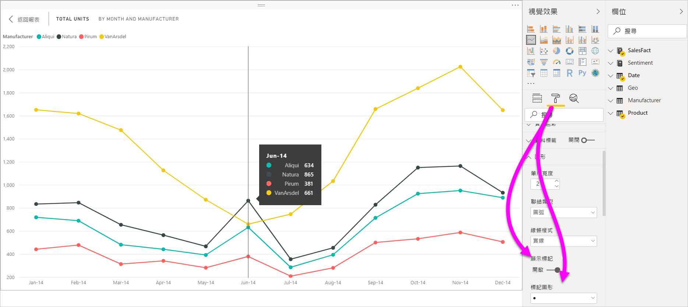
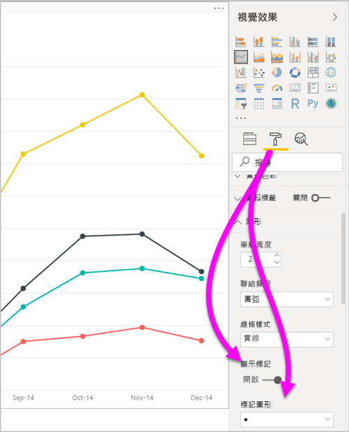
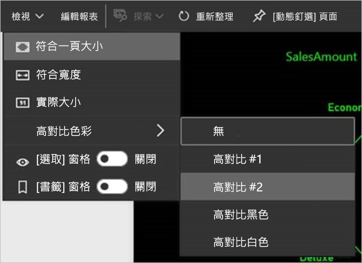

# Power BI Desktop 報告中的協助工具
Power BI 具有可讓行動不便人士更輕鬆地使用 Power BI 報表並與之互動的功能。 這些功能包括能夠利用鍵盤或螢幕助讀程式來使用報告、利用 Tab 鍵聚焦於頁面上的不同物件，以及在視覺效果中貼心地使用標記。

## 利用鍵盤或螢幕助讀程式來使用 Power BI Desktop 報告
從 **Power BI Desktop** 2017 年九月的版本開始，您可以按 **SHIFT + ?** 來顯示描述 **Power BI Desktop** 所提供協助工具鍵盤快速鍵的視窗。

透過協助工具增強功能，您可以利用鍵盤或螢幕助讀程式，並搭配下列技巧來使用 Power BI 報表：

> [!NOTE]
> 當您檢視報表時，通常應將掃描模式關閉。

您可以使用 **CTRL + F6**，在報表頁面索引標籤之間或指定報表頁面上的物件之間切換焦點。

* 當焦點在報表頁面索引標籤時，請使用 **TAB** 鍵或**方向**鍵將焦點從一個報表頁面移至下一個報表頁面。 螢幕助讀程式會讀出報表頁面的標題，以及其是否處於選取狀態。 若要載入焦點目前所在的報表頁面，請使用 **ENTER** 鍵或空格鍵。
* 當焦點在載入的報表頁面時，請使用 **TAB** 鍵將焦點移至頁面上的每個物件，包括所有文字方塊、影像、圖形和圖表。 螢幕助讀程式會讀取物件的類型和標題 (如果有的話)。 若報表作者有提供的話，螢幕助讀程式也會讀取該物件的描述。 

當您在視覺效果之間巡覽時，您可以按 **ALT + SHIFT + F10** 將焦點移至視覺效果標題。 視覺效果標題包含各種選項，包括排序、匯出圖表後的資料，以及焦點模式。 

您可以按 **ALT + SHIFT + F11** 來表示 [顯示資料]  視窗的無障礙版本。 這個視窗可讓您在 HTML 表格中探索視覺效果中使用的資料，並使用您平常搭配螢幕助讀程式使用的相同鍵盤快速鍵。 

![在 Power BI Desktop 中，按 ALT + SHIFT + F11，以顯示視覺效果的無障礙 [查看資料] 視窗](media/desktop-accessibility/accessibility-04.png)

> [!NOTE]
> 透過此鍵盤快速鍵，[顯示資料]  功能才可存取螢幕助讀程式。 如果您透過視覺效果標題中的選項開啟 [顯示資料]  ，該功能將無法存取螢幕助讀程式。 當您使用 [顯示資料]  時，請開啟掃描模式，以利用螢幕助讀程式提供的所有快速鍵。

從 **Power BI Desktop** 的 2018 年 7 月版本開始，交叉分析篩選器也有內建的協助工具功能。 當您選取交叉分析篩選器時，若要調整交叉分析篩選器的值，請使用 **CTRL + 向右鍵** (CTRL 加上向右鍵)，在交叉分析篩選器內的各種控制項之間移動。 例如，當你一開始按下 **CTRL + 向右鍵**時，焦點會位在橡皮擦上。 接著，按空格鍵會相當於按一下橡皮擦按鈕，其會清除交叉分析篩選器上的所有值。 

您可以透過按 **TAB** 鍵來在交叉分析篩選器中的控制項之間移動。 在橡皮擦上時按 **TAB** 鍵會移動到下拉式按鈕。 再按一次 **TAB** 鍵，則會移動到第一個交叉分析篩選器的值 (若交叉分析篩選器有多個值的話，例如一個範圍)。 

新增這些協助工具的目的，在於讓使用者藉由螢幕助讀程式和鍵盤瀏覽來完整取用 Power BI 報表。

## 建立可存取之報告的秘訣
下列秘訣可協助您建立更容易存取的 **Power BI Desktop**報告。

### 可存取報表的一般提示

* 針對**折線圖**、**區域圖**和**組合圖**視覺效果，以及**散佈圖**和**泡泡圖**，請開啟 [顯示標記]  切換，並針對每個線條使用不同的 [標記圖形]  。
  
  * 若要開啟 [顯示標記]  切換，請選取 [視覺效果]  窗格中的 [格式]  區段，並展開 [形狀]  區段。 向下捲動並尋找 [顯示標記]  切換，然後將它設為 [開啟]  。
  * 若要自訂個別的線條，請尋找 [自訂數列]  切換，然後將它設為 [開啟]  。 然後，在該 [圖形]  區段中，從下拉式清單方塊選取每個條線的名稱 (或區域名稱，如果您使用**區域**圖的話)。 在下拉式清單底下，針對選取之線條所使用的標記，您可以調整許多層面，包括其形狀、色彩和大小。
  
    
  
  * 針對每個線條使用不同的「標記圖形」  時，報告取用者可以更容易區分不同的線條 (或區域)。
* 延續上一個項目符號內容，請勿依賴色彩來傳達資訊。 在折線圖和散佈圖上使用圖形時，也請勿依據條件格式化在資料表和矩陣中提供見解。 
* 為報表上的每個視覺效果挑選刻意設計的排序次序。 當螢幕助讀程式使用者瀏覽圖表後的資料時，其會挑選與視覺效果相同的排序次序。
* 請從佈景主題資源庫中選取高對比和色盲無礙的佈景主題。 使用 [佈景主題設定][  預覽功能](desktop-report-themes.md)來匯入它。
* 針對報表上的每個物件提供替代文字。 這樣做可以確保報表取用者了解您嘗試使用視覺效果傳達的內容。 甚至在他們看不到視覺效果、影像、形狀或文字方塊時也能提供協助。 您可以選取物件 (例如視覺效果、形狀等)，然後選取 [視覺效果]  窗格中的 [格式]  區段，來為 **Power BI** 報表上的任何物件提供替代文字。 然後，請展開 [一般]  ，捲動到底部，然後填入 [替代文字]  文字方塊。
  
  ![在 [視覺效果] > [格式] > [一般] > [替代文字] 方塊中可以為報告中的任何物件新增替代文字](media/desktop-accessibility/accessibility-02.png)
  
  您也可以使用運算式動態變更替代文字，例如反映套用至視覺效果的篩選。 您可以使用與視覺效果標題相同的方式來設定運算式。 [視覺效果標題的條件式格式設定](desktop-conditional-format-visual-titles.md)
  
* 確定您的報表在文字與任何背景色彩之間有足夠的對比。 您可使用多種工具 (例如 [Colour Contrast Analyser](https://developer.paciellogroup.com/resources/contrastanalyser/) \(英文\)) 來檢查報表色彩。 
* 使用可輕鬆閱讀的文字大小和字型。 文字大小或字型若太小而難以閱讀，則為無用的協助工具。
* 在所有視覺效果中包含標題、軸標籤和資料標籤。
* 為所有報表頁面使用有意義的標題。
* 請盡可能地避免在您的報表中使用裝飾形狀和影像，因為它們也會包含在報表的索引標籤順序中。 如果需要在報表中包含裝飾性物件，請更新物件的替代文字，讓螢幕助讀程式使用者知道該物件用於裝飾。

### 排列 [欄位] 貯體中的項目
從 2018 年 10 月版本的 **Power BI Desktop** 開始，您也可以使用鍵盤來巡覽 [欄位]  區域，且欄位也會跟螢幕助讀程式互動。 

若要改善使用螢幕助讀程式建立報表的流程，您可以使用操作功能表。 功能表可讓您在 [欄位]  清單中上下移動區域內的欄位。 此功能表也可以讓您將欄位移動到其他區域，例如 [圖例]  或 [值]  等。

![[欄位] 區中的操作功能表可讓您將欄位向上、向下移動，或移到其他區域](media/desktop-accessibility/accessibility-09.png)

## 報表的高對比支援

當您在 Windows 中使用高對比模式時，您選取的那些設定以及調色盤也會在 **Power BI Desktop** 中套用至報表。 

**Power BI Desktop** 會自動偵測 Windows 正在使用的高對比佈景主題，並將那些設定套用至您的報表。 那些高對比色彩會隨著報表一起發佈至 Power BI 服務或其他位置。

Power BI 服務也會嘗試偵測為 Windows 選取的高對比設定。 該偵測之有效性和正確性取決於顯示 Power BI 服務的瀏覽器。 如果您想要在 Power BI 服務中手動設定佈景主題，可選取 [檢視]   > [高對比色彩]  ，然後選取您想要套用至報表的佈景主題。

## 考量與限制
協助工具功能有一些已知問題和限制。 下列清單描述這些問題和限制：

* 在 **Power BI Desktop** 中使用螢幕助讀程式時，如果您於 **Power BI Desktop** 中先開啟螢幕助讀程式，再開啟任何檔案，便可以獲得最佳體驗。
* 若您使用朗讀程式，則以 HTML 表格方式巡覽 [顯示資料]  會有一些限制。

## 鍵盤快速鍵
鍵盤快速鍵能協助使用鍵盤在 Power BI 報表中四處移動。 下表描述在 Power BI 報表中提供使用的快速鍵。 除了在 **Power BI Desktop** 中使用這些鍵盤快速鍵之外，這些快速鍵也能在下列體驗中運作：

* [問與答總管]  對話方塊
* [開始使用]  對話方塊
* [檔案]  功能表與 [關於]  對話方塊
* [警告]  列
* [檔案還原]  對話方塊
* [傳送苦臉]  對話方塊

由於我們致力於持續改善協助工具，因此上述清單中的體驗同時也支援螢幕助讀程式和高對比設定。

### 常用的快速鍵
| 要進行的動作           | 按                |
| :------------------- | :------------------- |
| 在區段之間移動焦點  | **Ctrl + F6** |
| 在區段中向前移動焦點 | **Tab**         |
| 在區段中向後移動焦點 | **Shift + Tab** |
| 選取或清除物件選取項目 | **Enter** 或**空格鍵** |
| 多重選取物件 | **Ctrl + 空格鍵** |

### 在視覺效果上
| 要進行的動作           | 按                |
| :------------------- | :------------------- |
| 將焦點移到視覺效果功能表 | **Alt + Shift + F10** |
| 顯示資料 | **Alt + Shift + F11**  |
| 輸入視覺效果 | **Ctrl + 向右鍵** |
| 輸入層 | **Enter** |
| 結束層或視覺效果 | **Esc** |
| 選取或清除資料點選取項目 | **Enter** 或**空格鍵** |
| 複選 | **Ctrl + Enter** 或 **Ctrl + 空格鍵** |
| 以滑鼠右鍵按一下 | <ul><li>Windows 鍵盤：**Windows 內容索引鍵 + F10**。 Windows 操作功能表鍵在左 ALT 鍵與向左鍵之間</li><li>其他鍵盤：**Shift + F10**</li></ul> |
| 清除選取範圍 | **Ctrl + Shift + C** |

### 資料表和矩陣導覽
| 要進行的動作          | 按                |
| :------------------- | :------------------- |
| 將焦點向上/向下移動一個資料格 (所有區域的所有資料格)  | **向上鍵** / **向下鍵** |
| 將焦點向左/向右移動一個資料格 (所有區域的所有資料格)  | **向左鍵** / **向右鍵** |

### 窗格瀏覽
| 要進行的動作           | 按                |
| :------------------- | :------------------- |
| 複選 | **Ctrl + 空格鍵** |
| 摺疊單一資料表 | **向左鍵** |
| 展開單一資料表 | **向右鍵** |
| 摺疊所有資料表 | **Alt + Shift + 1** |
| 展開所有資料表 | **Alt + Shift + 9** |
| 開啟操作功能表 | <ul><li>Windows 鍵盤：**Windows 內容索引鍵 + F10**。  Windows 操作功能表鍵在左 ALT 鍵與向左鍵之間</li><li>其他鍵盤：**Shift + F10**</li></ul> |

### 交叉分析篩選器
| 要進行的動作         | 按                |
| :------------------- | :------------------- |
| 與交叉分析篩選器互動 | **Ctrl + 向右鍵** |

### [選取] 窗格
| 要進行的動作           | 按                |
| :------------------- | :------------------- |
| 啟用 [選取] 窗格 | **F6** |
| 將物件在圖層中向上移動 | **Ctrl + Shift + F** |
| 將物件在圖層中向下移動 | **Ctrl + Shift + B** |
| 隱藏/顯示 (切換) 物件 | **Ctrl + Shift + S** |

### DAX 編輯器
| 要進行的動作          | 按                |
| :------------------- | :------------------- |
| 向上/向下移動行 | **Alt + 向上鍵** / **向下鍵** |
| 向上/向下複製行 | **Shift + Alt + 向上鍵** / **向下鍵** |
| 在下方插入行 | **Ctrl + Enter** |
| 在上方插入行 | **Ctrl + Shift + Enter** |
| 跳至對稱的括號 | **Ctrl + Shift +**  \ |
| 縮排行/將行延伸到邊界 | **Ctrl + ]**  /  **[** |
| 插入資料指標 | **Alt + 按一下** |
| 選取目前的行 | **Ctrl + I** |
| 選取目前選取範圍的所有項目 | **Ctrl + Shift + L** |
| 選取出現目前字組的所有位置 | **Ctrl + F2** |

### 輸入資料
| 要進行的動作           | 按                |
| :------------------- | :------------------- |
| 離開可編輯格線 | **Ctrl + Tab** |

## 後續步驟
* [在 Power BI Desktop 中使用報告佈景主題 (預覽)](desktop-report-themes.md)

