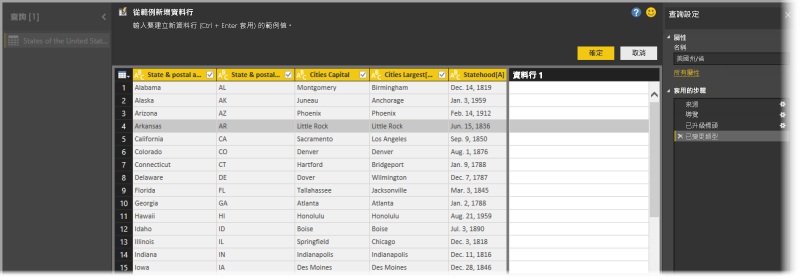
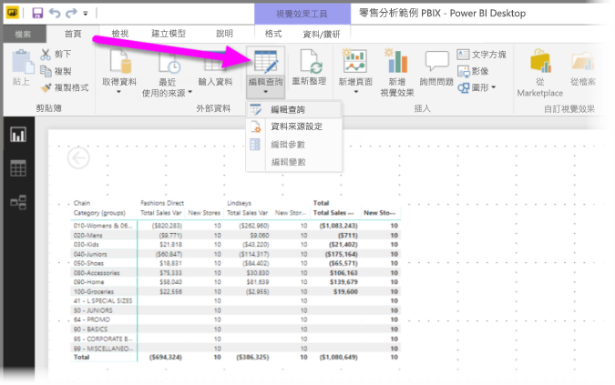
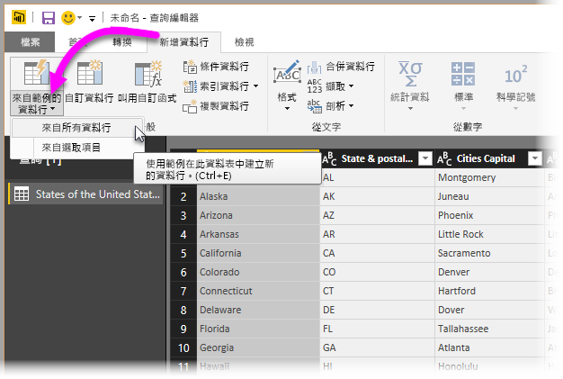
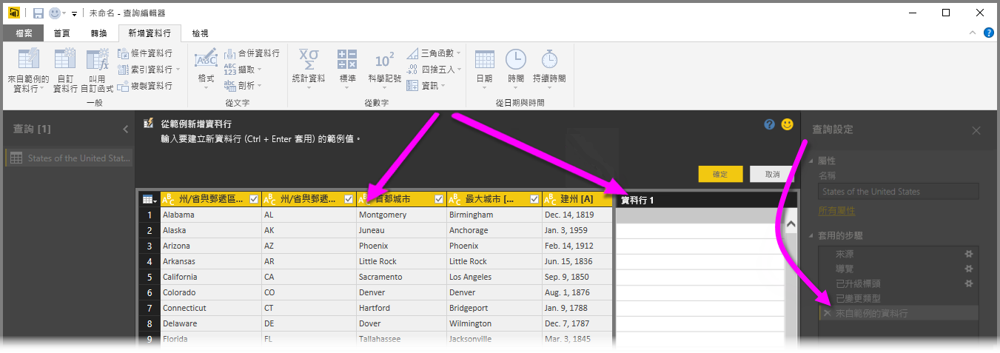
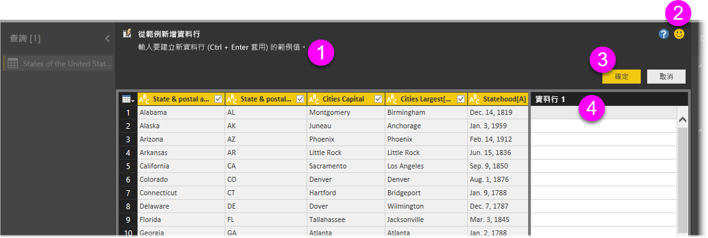
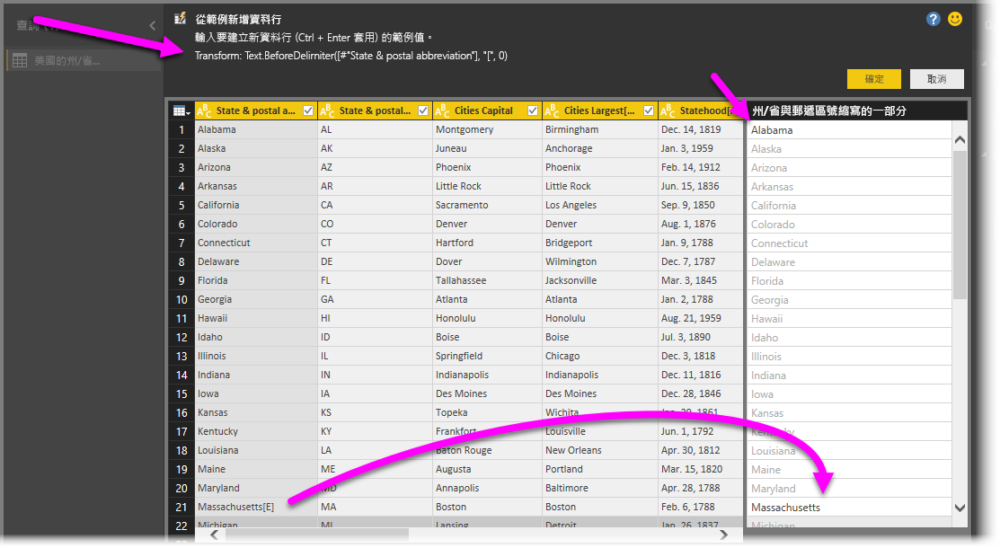

# 在 Power BI Desktop 中從範例新增資料行
自 **Power BI Desktop** 的 2017 年 4 月版本起，您只要為新資料行提供一或個範例值，就可以使用**查詢編輯器**將資料的新資料行新增到模型。 您可以從目前選取範圍建立新的資料行範例，也可以依據指定資料表中的所有 (或所選) 資料行提供輸入。

這個方法可協助您快速且輕鬆地建立新資料行，也很適合用於下列情況：

* 您知道想要的新資料行資料結果，但不確定哪種轉換 (或轉換的集合) 能得出該結果。
* 您已經知道需要哪種轉換，但不確定在 UI 中點擊或選取哪裡可以進行轉換。
* 您完全了解在 **M** 中使用 *Custom Column* 運算式所需要的轉換，但其中一個 (或多個) 運算式在 UI 中無法點選或新增。

[從範例新增資料行] 功能易用也易懂。 從接下來幾節，您會知道有多麼簡單。

## 使用查詢編輯器從範例新增新資料行
若要從範例建立新資料行，請啟動 [查詢編輯器]。 您也可以從 **Power BI Desktop** 的 [常用] 功能區選取 [編輯查詢] 以完成這個動作。

若要從網頁取得資料，請移至 [首頁] 索引標籤，按一下 [取得資料] > [Web]，然後將 URL 貼入出現的對話方塊。 本文使用 Wikipedia 文章中的資料。 您可以按一下下列連結為您自己取得資料，並遵循指示：

* [**美國州份和領地列表**](https://wikipedia.org/wiki/List_of_states_and_territories_of_the_United_States)

在**查詢編輯器**已啟動，而您也載入一些資料後，即可開始從範例新增資料行。 若要新增新資料行，請在 [查詢編輯器] 的功能區選取 [新增資料行] 索引標籤，再選取 [來自範例的資料行]。 如果您選擇下拉式清單，可以選取 [來自所有資料行]\ (如果您直接選取按鈕而非下拉式清單，這會是預設選項) 或選取 [來自選取項目]。 在本文中，我們會逐步執行選取 [來自所有資料行] 的步驟。

## [從範例新增資料行] 窗格
在您進行選取，以從範例新增新資料行後，新的窗格隨即出現，顯示目前資料表中的資料行 (您可能必須捲動才能看到全部)。 新的 **Column1** 也會顯示在右側，這是 **Power BI Desktop** 依據您的範例所建立的資料行。 在新的 **Column1** 標頭下為空白儲存格，您可以在其中鍵入範例，讓 Power BI 用以建立規則及轉換，以符合您的範例。

請注意，這是 [查詢設定] 窗格中的 [Applied Step] \(套用的步驟\)。 一如往常，**查詢編輯器**會記錄您的轉換步驟，並依序將其套用到查詢。

這稱作 [從範例新增資料行] 窗格，其中包含四個主要區域：

1. 包含功能或轉換之簡短描述的**命令列**。
2. [傳送意見反應] 選項可協助 Power BI 改進這項功能。
3. [確定] 和 [取消] 按鈕，可讓您認可轉換及新增資料行，或取消作業。
4. 新資料行區域，您可以在這裡鍵入任何資料列中的範例值 (向 Power BI 提供您的範例)，與該資料列中的其他資料行相關。

當您在新資料行中鍵入範例時，Power BI 會依據偵測到的轉換，供您預覽其建立的資料行外觀。 例如，如果您在第一個資料列中鍵入 *Alabama*，它會對應到資料表第一個資料行中的 *Alabama* 值。 當您按下 *Enter* 時，Power BI 就會立即依據該值填入資料行。

但是，假設您移至包含 *Massachusetts[E]* 的資料列並刪除它最後的 *[E]* (因為您不再需要它)。 Power BI 會偵測到變更，並使用此範例建立轉換。 請注意中間上方窗格中的轉換說明。

**查詢編輯器**會在您持續提供範例的同時，新增到轉換。 當您完成時，可以選取 [確定] 認可變更。

## 查看 [從範例新增資料行] 實際運作情形
想要看這項功能實際運作嗎？ 下方影片使用本範例稍早提供的資料來源，示範這項功能的實際運用情形。 請觀看，並自己跟著操作！

<iframe width="560" height="315" src="https://www.youtube.com/embed/-ykbVW9wQfw" frameborder="0" allowfullscreen></iframe>

## 考量與限制
使用 [從範例新增資料行] 時有多種轉換可用，但並非所有轉換都包含在內。 以下清單提供所有受支援的轉換。

* **參考**
  
  * 特定資料行的參考 (包括修剪、清除及大小寫轉換)

* **文字轉換**
  
  * 合併 (支援結合常值字串與整個資料行值)
  * 取代
  * 長度
  * 擷取   
    * 前幾個字元
    * 後幾個字元
    * 範圍
    * 分隔符號前的文字
    * 分隔符號後的文字
    * 分隔符號之間的文字
    * 長度

* 從 **Power BI Desktop** 的 2017 年 11 月版本開始支援下列**文字轉換**：
    
  * 移除字元
  * 保留字元

> [!NOTE]
> 所有「文字」轉換皆考量到欄位值可能需要的修剪、清除或套用大小寫轉換。
> 
> 

* **日期轉換**
  
  * 日
  * 週中的日
  * 星期幾名稱
  * 年中的日
  * 月
  * 月份名稱
  * 年中的季度
  * 月中的週
  * 年中的週
  * 年份
  * 存留期
  * 年初
  * 年底
  * 月初
  * 月底
  * 季初
  * 月中日數
  * 季末
  * 一週開始
  * 一週結束
  * 月中的日
  * 一日開始
  * 一日結束

* **時間轉換**
  
  * 小時
  * 分鐘
  * 秒  
  * 當地時間

> [!NOTE]
> ：請留意，所有「日期」和「時間」轉換都可能必須將資料行值轉換為「日期」或「時間」，或「日期時間」。
> 
> 

* **數字轉換** 

  * 絕對值
  * 反餘弦值
  * 反正弦值
  * 反正切值
  * 轉換成數字
  * 餘弦值
  * Cube
  * 除
  * 指數
  * 階乘
  * 整除
  * 是偶數
  * 是奇數
  * 自然對數
  * 以 10 為底數的對數
  * 模數
  * 乘
  * 向下四捨五入
  * 向上四捨五入
  * 符號
  * 正弦值
  * 平方根
  * 平方
  * 減
  * 加總
  * 正切值

* 從 **Power BI Desktop** 2017 年 11 月版本開始支援下列**數字轉換**：

  * 建立貯體/範圍

* **一般**
  
  * 條件資料行